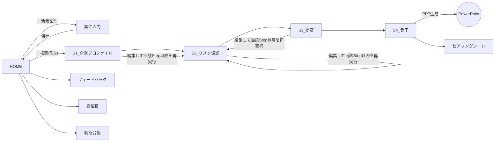

# 11. 画面設計（シート＝画面）v2.0

UserFormは使わない。シート上の図形ボタン＋ステータス表示で構成（PoC流儀・32bit互換・保守性）。シート名・列名の正は13章、enumの正は19章。

## 1. 画面（シート）一覧

### 本体ブック `リスク提案ナビ.xlsm`

| シート名 | 種別 | 表示 | 役割 | Phase |
|---|---|---|---|---|
| `HOME` | 画面 | 可視 | 操作パネル。案件選択・プレイ実行・進捗・ナレッジ状態 | 1 |
| `案件入力` | 画面 | 可視 | 企業名/業種/貼付欄（HP・有報・営業メモ・現契約・前回更新メモ）/案件コンテキスト | 1 |
| `S1_企業プロファイル` | 画面 | 可視 | Step1結果（renewal時は現契約の構造化を含む）表示・編集 | 1 |
| `S2_リスク仮説` | 画面 | 可視 | Step2結果＋（renewal時）付保ギャップ表示・編集 | 1 |
| `S3_提案` | 画面 | 可視 | 提案3本（種別タグつき）＋「該当なし」枠 表示・編集 | 1 |
| `S4_骨子` | 画面 | 可視 | スライド構成 表示・編集、PPT出力ボタン | 1 |
| `ヒアリングシート` | 画面 | 可視 | 質問リスト（A4印刷レイアウト） | 1 |
| `フィードバック` | 画面 | 可視 | 商談事実の記録（選択式中心） | 1 |
| `受信箱` | 画面 | 可視 | 投函一覧＋プリフライト診断結果＋判定（統制語彙） | 1 |
| `判断台帳` | 画面 | 可視 | UW判断の事実記録 | 1 |
| `案件一覧` | データ兼画面 | 可視 | 全案件のインデックス | 1 |
| `case_data` | データ | 非表示 | 長文・JSON原文の分割保管 | 1 |
| `config` | データ | 非表示 | 設定（name/value） | 1 |
| `err_log` / `usage_log` / `run_log` | データ | 非表示 | ログ | 1 |

### ナレッジブック `ナレッジブック.xlsx`（マクロなし・共有・管理者編集。本体からは参照＋2シートのみ追記）

| シート名 | 役割 | Phase |
|---|---|---|
| `業種マスタ` / `リスクライブラリ` / `メニュー一覧` / `種目マスタ` / `メニュー種目対応` / `成功事例` | v1.0と同じ（13章） | 1 |
| `判断基準` | 保険原理・生存文法・棄却類型のルール行（docs/05） | 1 |
| `パターンマスタ` | 汎用座組パターン P1〜P15（docs/07） | 1 |
| `型ライブラリ` | 具体の型（実績・候補・他社実績） | 1 |
| `機構ライブラリ` | 掛け合わせ用の部品（第3弾795件） | 1.5 |
| `適用先候補` | 裏受け・バンドル先企業（第2弾8社ほか） | 1 |
| `巡回リスト` | ウォッチの収集先URL一覧 | 1.5 |
| `ウォッチログ` | 月次ウォッチの仕分け結果 | 1.5 |
| `新サービス候補` | 本体から自動追記（該当メニュー・型なし） | 1 |

本体からナレッジブックへの**書込は「新サービス候補」「関心度集計（受信箱→任意）」のみ**。他は参照専用（排他は16章 E-13）。

## 2. ワイヤーフレーム

### HOME
```
┌────────────────────────────────────────────────────────────┐
│ リスク提案ナビ v2.0                    [❓使い方] [⚙設定]     │
│ ┌ 案件 ─────────────────────────────────────────────┐      │
│ │ 対象: [C-20260901-001 ○○食品(更新) ▼] [＋新規案件]  │      │
│ │ 状態: ●S2まで完了                                   │      │
│ │ [▶ 一括実行]  Step個別: [S1][S2][S3][S4]            │      │
│ │ 出力: [📊 提案書PPT] [📋 ヒアリングシート]           │      │
│ └────────────────────────────────────────────────────┘      │
│ ┌ 受信箱 ────────────────────────────┐ ┌ 記録 ──────────┐  │
│ │ 未診断 3件  [🔍 プリフライト診断]    │ │ [📝 商談の記録]  │  │
│ │ 診断済 5件 / 条件付き保留 2件        │ │ [⚖ 判断台帳]    │  │
│ └────────────────────────────────────┘ └────────────────┘  │
│ 進捗: Step2 リスク仮説を生成中…（最大3分）  ■■■□           │
│ ナレッジ: 読込OK（メニュー42/型22/事例8） [🔄再読込]          │
│ （transport=mock/direct時はここに赤帯を常時表示）             │
└────────────────────────────────────────────────────────────┘
```

### 案件入力
```
┌──────────────────────────────────────────────────────┐
│ 案件ID: C-20260901-001（自動）  種別: (○新規 ●更新)     │
│ 企業名* [○○食品株式会社]   業種* [食料品製造業 ▼]       │
│ ┌ 案件コンテキスト（選択式）─────────────────────────┐  │
│ │ 取引 [ホール▼] 幹事 [非幹事▼] BID [なし▼]           │  │
│ │ 再保・キャプ [なし▼] 他社付保メモ [任意入力]          │  │
│ └──────────────────────────────────────────────────┘  │
│ ┌ 収集レシピ(何をどこから貼るか。15章§2.0)────────────┐  │
│ │ □会社概要 □事業・製品 □拠点・設備 □沿革            │  │
│ │ □直近1年ニュース □採用情報 □有報リスク章 □営業情報  │  │
│ │ 目安: 合計5,000〜20,000字（現在 8,234字）             │  │
│ └──────────────────────────────────────────────────┘  │
│ HPテキスト*       [貼付欄]                8,234字       │
│ 現契約サマリ*(更新時)[貼付欄] ※匿名化ボタン→16章E-31    │
│ 有報リスク章(任意) [貼付欄]  営業メモ(任意)[貼付欄]      │
│ 前回更新メモ(任意) [貼付欄]                [保存して戻る]│
└──────────────────────────────────────────────────────┘
```
※チェックは利用者の自己確認用（保存条件にしない）。実行後はS1の入力充足度診断（input_quality）が
HOME・S1シート上部に表示される: 「充足度: 中 ｜ 不足: 採用情報・直近ニュース ｜ 助言: …」。
充足度low時は警告バナー（続行可・15章CheckS1の充足度ゲート参照）。

### S2_リスク仮説（renewal時はギャップ表を上段に併置）
```
┌──────────────────────────────────────────────────────────────┐
│ [S2から再実行] [S3へ進む]（編集はS3へ進むと下流に反映）          │
│ ▼付保ギャップ（更新のみ）                                       │
│  種別      │対象リスク/種目 │現契約の状態      │根拠            │
│  無保険    │サイバー       │該当契約なし      │EC事業の記述↔契約│
│  過小      │利益(BI)       │限度額が売上比…   │…               │
│ ▼リスク仮説                                                    │
│  No│カテゴリ│リスク名│シナリオ│頻度│影響│根拠(出所)│確認点        │
│  （編集可・行追加削除可・enum列はドロップダウン）                 │
└──────────────────────────────────────────────────────────────┘
```

### S3_提案
```
┌──────────────────────────────────────────────────────────┐
│ [S3から再実行] [S4へ進む]                                  │
│ #│種別       │見出し│問いかけ│対象リスク│メニュー│種目│型   │
│ 1│cross_sell │…    │…      │R2,R5    │M-0012 │L-03│―   │
│ 2│upsell     │…    │…      │R1       │M-0003 │L-01│―   │
│ 3│scheme     │…    │…      │R7       │―     │L-09│K型12│
│ ▼該当メニュー・型なし（新サービス候補として記録済み）        │
└──────────────────────────────────────────────────────────┘
```

### 受信箱
```
┌────────────────────────────────────────────────────────────┐
│ [＋投函] [🔍未診断を一括診断]     関心度: 熊対策12件 雹災5件  │
│ ID│出所        │テーマ    │診断: 生存見込み│予測類型│状態      │
│ 45│member_post │…       │中(組替でP9へ) │T4,T9  │diagnosed │
│ 46│field_voice │顧客が…  │高            │―     │adopted   │
│ 47│watch      │STUDIO…  │高(P4)        │―     │adopted   │
│ （行選択→詳細ペイン: 診断全文・組み替え案・判定入力(T0-T10)）  │
└────────────────────────────────────────────────────────────┘
```

### 判断台帳
```
│ 日付│種目│案件参照│状況要約│選択(raise/close/restrict/keep/improve)│
│ 係数・安全率メモ│決め手(1行)│結果(won/lost)│事後ロス│記録者│
```

## 3. 画面遷移図



## 4. 状態遷移

### 案件（案件一覧.status）
`draft → s1_done → s2_done → s3_done → s4_done → exported → feedback_done`、任意時点から `error`（入力修正で draft へ）。
ルール: Step N 再実行時は N+1 以降の結果・状態を必ず無効化（確認ダイアログつき。16章 E-10）。

### 受信箱（受信箱.status）
`undiagnosed → diagnosed → (adopted | conditional_hold | rejected | merged)`。
conditional_hold は `revive_tag`＋見直し期日必須。年次棚卸しで再診断キューへ。

## 5. UI実装規約（PoC踏襲）

- ボタンは図形＋OnAction。UI操作コードは ui 層のみ（R4）
- 実行中: `modUIProgress.SetStage` を必ず更新、ui_lock で多重実行と案件切替をブロック、完了/失敗で必ず解除
- enum列はデータの入力規則（リスト）。源泉はナレッジブック/19章レジストリから起動時にコピーした隠しレンジ（ナレッジ未接続でも開ける）
- 日本語ラベル⇔enumの変換は modUICase の共通変換表（19章と一致必須）のみで行う
- 全シート保護。編集可能セルのみロック解除。長文セルは先頭2,000字表示＋全文はcase_data（E-22）
