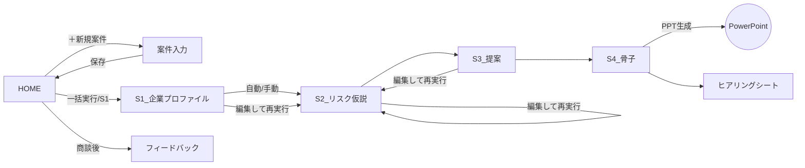
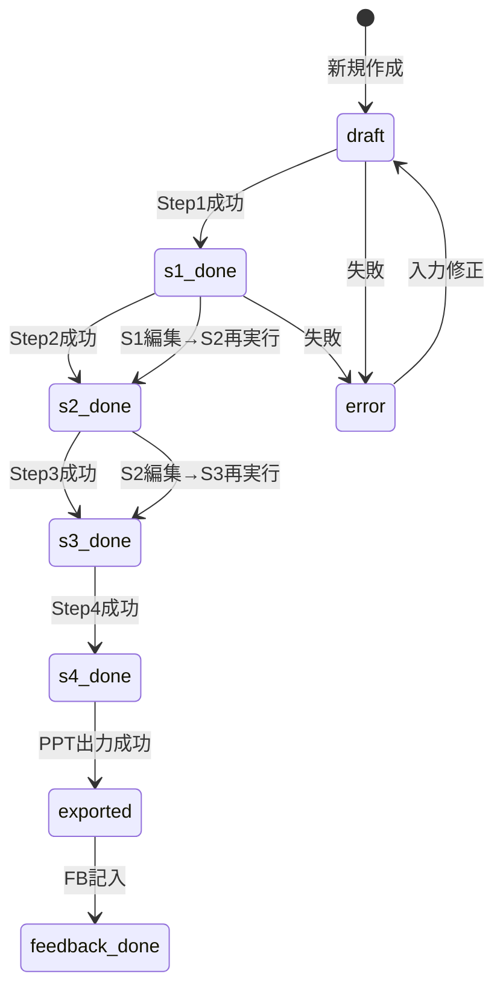

# 11. 画面設計（シート＝画面）

Excel製品のため「画面」= ワークシート。UserFormは使わない（PoC同様、シート上の図形ボタン＋ステータス表示で構成。保守性と32bit互換のため）。

## 1. 画面（シート）一覧

### 本体ブック `リスク提案ナビ.xlsm`

| シート名 | 種別 | 表示 | 役割 |
|---|---|---|---|
| `HOME` | 画面 | 可視 | 操作パネル。案件選択・実行ボタン・進捗表示 |
| `案件入力` | 画面 | 可視 | 対象案件の入力フォーム（企業名/業種/貼付テキスト） |
| `S1_企業プロファイル` | 画面 | 可視 | Step1結果の表示・編集 |
| `S2_リスク仮説` | 画面 | 可視 | Step2結果の表示・編集 |
| `S3_提案` | 画面 | 可視 | Step3結果の表示・編集＋「該当メニューなし」枠 |
| `S4_骨子` | 画面 | 可視 | Step4スライド構成の表示・編集、PPT出力ボタン |
| `ヒアリングシート` | 画面 | 可視 | 質問リスト表示・印刷用レイアウト |
| `フィードバック` | 画面 | 可視 | 商談結果の記入 |
| `案件一覧` | データ兼画面 | 可視 | 全案件のインデックス（1行=1案件） |
| `case_data` | データ | 非表示 | 案件ごとの入力全文・中間JSON原文の保管（13章） |
| `config` | データ | 非表示 | 設定（PoC modConfig 互換の name/value 形式） |
| `err_log` / `usage_log` / `run_log` | データ | 非表示 | ログ（13章） |

### ナレッジブック `ナレッジブック.xlsx`（マクロなし・共有フォルダ・参照専用で開く）

| シート名 | 役割 |
|---|---|
| `業種マスタ` | 業種コード・名称（案件入力のドロップダウン源泉） |
| `リスクライブラリ` | 業種×リスクの知識行 |
| `メニュー一覧` | 実在リスクコンサルメニュー（menu_id） |
| `種目マスタ` / `メニュー種目対応` | 保険種目とメニューの対応 |
| `成功事例` | 勝ち提案ライブラリ（80→100点の器） |
| `新サービス候補` | S3「該当なし」の自動記録先（本体から追記する唯一の書込先。排他は16章E-13） |

## 2. ワイヤーフレーム

### HOME
```
┌──────────────────────────────────────────────────────────┐
│  リスク提案ナビ                       [❓使い方] [⚙設定]   │
│                                                          │
│  対象案件: [C-20260901-001 春華堂 ▼]   [＋新規案件]       │
│  状態: ●S2まで完了                                       │
│                                                          │
│  ┌────────────┐  ┌─────────────────────────────┐        │
│  │ ▶ 一括実行   │  │ Step個別: [S1][S2][S3][S4]  │        │
│  └────────────┘  └─────────────────────────────┘        │
│                                                          │
│  ┌ 進捗 ─────────────────────────────────────────┐      │
│  │ Step2 リスク仮説を生成中…（最大3分）  ■■■□    │      │
│  └───────────────────────────────────────────────┘      │
│                                                          │
│  出力: [📊 提案書PPTを開く] [📋 ヒアリングシートへ]        │
│  ナレッジ: 読込OK（メニュー42件/事例8件） [🔄再読込]       │
└──────────────────────────────────────────────────────────┘
```

### 案件入力
```
┌──────────────────────────────────────────────┐
│ 案件ID: C-20260901-001（自動）                 │
│ 企業名*   [有限会社 春華堂            ]        │
│ 業種*     [食料品製造業 ▼]（業種マスタ）        │
│ ── 貼り付け欄（結合セル・折返し表示） ──        │
│ HPテキスト*   [                       ] 8,234字│
│ 有報リスク章  [                       ] 0字    │
│ 営業メモ      [                       ] 120字  │
│                                    [保存して戻る]│
└──────────────────────────────────────────────┘
```

### S2_リスク仮説（S1/S3も同型: ヘッダ行＋データ行＋操作ボタン）
```
┌────────────────────────────────────────────────────────────────┐
│ [S2から再実行] [S3へ進む]     編集したら「S2から再実行」ではなく │
│                              「S3へ進む」で編集内容が下流に反映  │
│ No│カテゴリ    │リスク名   │シナリオ│頻度│影響│根拠      │確認点│
│ 1 │製造・品質  │アレルゲン…│…      │中  │大  │HP:主力商品…│…    │
│ 2 │財物・自然  │工場火災   │…      │低  │大  │HP:浜松工場…│…    │
│  (編集可。行追加・削除可。カテゴリ/頻度/影響はドロップダウン)     │
└────────────────────────────────────────────────────────────────┘
```

### S4_骨子
```
┌──────────────────────────────────────────────┐
│ [PPTを生成して開く]  保存先: config ppt_out_dir│
│ スライド1 タイトル [貴社の事業環境の理解]       │
│   箇条書き(編集可)  ・…                        │
│ スライド2〜5 …（同型）                         │
└──────────────────────────────────────────────┘
```

## 3. 画面遷移図


（実体はシートのActivate。遷移=シート切替＋対象案件のロード）

## 4. 案件の状態遷移

状態は `案件一覧.status` に保持。enum: `draft → s1_done → s2_done → s3_done → s4_done → exported → feedback_done`、任意時点から `error`。


ルール: Step N を再実行したら N+1 以降の結果と状態は無効化（クリア）する（stale結果の防止、16章 E-10）。

## 5. UI実装規約（PoC踏襲）

- ボタンは図形（Shape）＋`OnAction`。UI操作コードは ui 層モジュールのみ（R4）
- 実行中は `modUIProgress.SetStage "Step2 リスク仮説を生成中…（最大3分）"` を必ず更新。完了/失敗時に必ず消す
- 実行中の多重クリックは ui_lock（PoC modUiLock 方式）で抑止
- ドロップダウンはデータの入力規則（リスト）で実装。源泉はナレッジブックから起動時にコピーした隠しレンジ（ナレッジブック未接続でも開ける、16章 E-08）
- 全シート `保護（UI以外の誤編集防止）`。編集可能セルのみロック解除
