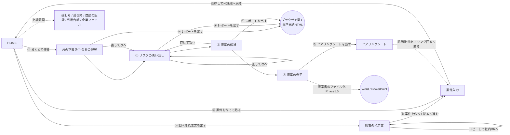

# 11. 画面設計（体験設計）v3.0

v3.0（裁定書17 裁定B: W6「体験設計のやり直し」）: 本章を**列定義中心のワイヤー集**から**体験設計書**へ全面改訂した。実機第2報の事実「開いた瞬間に手が止まる」は、個々のボタンの不具合ではなく**「何が見えて・何を押して・次に何をするか」が設計されていなかったこと**が原因である。よって §0 に体験原則を、§2 に利用者の1日を、§4 にフィードバック規約を、§5 に「利用者に選ばせない判断」の一覧を新設し、§3 のワイヤーをこの4つに従属させた。旧 v2.5.1 の §3 画面遷移図・§4 状態遷移・§5 UI実装規約は §6・§7 として内容を維持したうえで v3 の追加規約を書き足している。**13章参照による列定義の分業（本章＝配置と操作の正／13章＝列の物理名・物理順の正／19章＝enumの正）は v2.5.1 から不変**である。

旧版の改訂履歴（v2.4〜v2.5.1）は docs/20 と各裁定書に残す。本章はここから体験設計を先に読ませる構成にするため、冒頭の履歴列挙をやめた。

UserFormは使わない。シート上の図形ボタン＋セル表示で構成する（PoC流儀・32bit互換・保守性）。

---

## 0. 体験原則（この章のすべてがここに従属する）

### 0.1 六原則（裁定書17 裁定B①〜⑥。姉妹製品の憲章§3を採用）

| # | 原則 | 本製品での意味 |
|---|---|---|
| ① | **押せるものは必ず反応する** | 無反応は故障と同義。押した結果が画面外・スクロール外にしか出ないものは「反応していない」と数える。**セルがA1へ動くだけ**は反応ではない |
| ② | **待ち時間は進捗を見せる** | 「止まっているのか動いているのか分からない」状態を作らない。LLM呼び出しは最長20分あるため、呼び出しの**前に**進捗4行を書き切る（E-50a） |
| ③ | **失敗は「何が起きたか。次に何をするか。」の2文** | エラーコードだけの表示・専門用語だけの案内は失敗の隠蔽と同じ。利用者向けの文にコード（E0302等）を出さない。コードは err_log にだけ残す |
| ④ | **OS/Officeの生ダイアログに晒さない** | VBAの実行時エラーダイアログ・OLE待ちダイアログ・「〜が応答していません」に到達させない。どうしても出るものは事前に説明を出す |
| ⑤ | **データは失わせない** | 貼った文章・手で直した下書きを、失敗や再実行で黙って消さない。消える可能性のある操作は必ず事前に告げる |
| ⑥ | **開いた瞬間に、次の一手が1つだけ見える** | HOMEの最上段は**次に押すべきボタンを1つだけ名指しする1行**（`hm_next_action`）で始まる。この1行を読めば、他を何も知らなくても前へ進める |

原則⑥は本改訂の中心である。v2.5.1 のHOMEは「案件」「進捗」「状態表示」「受信箱」「主要動線4本」「くわしい操作18本」を**同時に**見せていた。情報量として正しくても、利用者にとっては「どれを押すのかが分からない画面」だった。

### 0.2 初回に見せる3画面（これ以外は初回導線に出さない）

| 順 | 画面 | 利用者の言葉での役割 |
|---|---|---|
| **①調べる** | `調査の指示文`（新設） | 会社名を入れると、社内のディープリサーチにそのまま貼れる**調べる文**が出てくる。コピーして投げる |
| **②貼る** | `案件入力` | 調べて返ってきた文章を、縦長の貼付エリアへそのまま貼る |
| **③出す** | `HOME` | [③ まとめて作る]を押して待つ。終わったら[④ レポートを出す][⑤ ヒアリングシートを出す] |

`AIの下書き①〜④`・`ヒアリングシート`・`操作ガイド` は**結果として開く画面**（利用者が能動的に探しに行かなくてよい）。`壁打ち`・`受信箱`・`商談の記録`・`判断台帳`・企業ファイルは**上級**（§3.7）へ隔離し、既定では折りたたむ。

### 0.3 利用者像（これを外すと設計が壊れる）

- **ITに詳しくない営業所員**（50代を含む）。エラーコードもフォルダ構成も知らない。**「わけの分からない表示」が一度出たら、その機能は二度と使われない**。
- 自分のPCではなく**会社の管理端末**（Excel 32bit・EDR・ネットワーク共有・ダウンロード制限）。開発者が横にいない。
- 社内ディープリサーチは**直列でしか使えない**（1本が終わるまで次を投げられない・1本あたり約10分）。「まとめて投げて放置」は**誤り**であり、この表現を製品と文書から除去する（裁定書17 裁定A H5）。
- 期待している成果は1つだけ:「**調べたことを貼る → ボタンを押す → お客様に見せられるレポートと、訪問で聞くことの紙が出る**」。
- 判断を求められると止まる。**選択肢は「意味が分かるもの」だけを残し、残りは製品が決める**（§5）。

---

## 1. 画面（シート）一覧

### 1.1 本体ブック `リスク提案ナビ.xlsm`

「初回導線」列: **初回**＝初めて使う人の一本道に出す／**上級**＝既定では折りたたむ（`ui_advanced`）／**裏方**＝利用者が普段は見ない。
「1行目に必ず出す説明文」は**そのまま実装に使う完成文**である（実装は本表の文言を逐語で書く。推測で言い換えない）。

| シート名 | 役割 | 初回導線 | 1行目に必ず出す説明文（逐語） |
|---|---|---|---|
| `はじめにお読みください` | マクロ有効化の案内（ガードシート）。配布時のみ可視。起動時に modBoot 手順①が非表示化する | 裏方 | （本シートは全文が案内文。文面の正は `build/sheets_main.json` の `guard_sheet`。13章§2.9） |
| `HOME` | 操作の入口。次の一手・5つの手順・進捗・いまの状態 | **初回** | 「上のボタンを、①から順に押していけば終わります。いま何を押せばよいかは、すぐ下の1行に出ています。」 |
| `調査の指示文` **（新設）** | 会社名などを入れると、社内のディープリサーチにそのまま貼れる調べる文を作る | **初回** | 「会社名と本社の場所を入れて、下の[コピー]を押してください。コピーした文を、社内のディープリサーチに貼って投げます。」 |
| `案件入力` | 調べた文章を貼る。貼付エリア方式（§3.3） | **初回** | 「調べて返ってきた文章を、下の白い枠の中へそのまま貼ってください。長くても分けなくて大丈夫です。」 |
| `AIの下書き① 会社の理解` | 旧 `S1_企業プロファイル`。会社の姿の構造化（7ブロック。13章§2.12） | **初回**（結果） | 「AIの下書きです。直したら[次へ]を押すと、この先の段だけ作り直します。」 |
| `AIの下書き② リスクの洗い出し` | 旧 `S2_リスク仮説`（4ブロック。13章§2.13） | **初回**（結果） | 「AIの下書きです。直したら[次へ]を押すと、この先の段だけ作り直します。」 |
| `AIの下書き③ 提案の候補` | 旧 `S3_提案`（3ブロック。13章§2.14） | **初回**（結果） | 「AIの下書きです。直したら[次へ]を押すと、この先の段だけ作り直します。」 |
| `AIの下書き④ 提案の骨子` | 旧 `S4_骨子`（3ブロック。13章§2.15）。Word/PowerPoint出力（Phase 1.5）の素材でもある | **初回**（結果） | 「AIの下書きです。直したら[次へ]を押すと、この先の段だけ作り直します。提案書のファイルにするのは次の版からです。」 |
| `ヒアリングシート` | 訪問で聞くことの一覧（A4縦印刷用。13章§2.16） | **初回**（結果） | 「訪問のときに持っていく紙です。このまま印刷して、右の欄に手書きで書き込んでください。」 |
| `操作ガイド` | ブックの中だけで操作を学べる案内（13章§2.18）。⑦章に調べる指示文の全文（裁定書17 裁定A H5） | **初回** | 「困ったときはこのタブを読んでください。上の目次から、知りたいところへ飛べます。」 |
| `壁打ち` | AIと対話で座組・提案を詰める（FR-33） | 上級 | 「③まで下書きが出来てから、提案の前の予行演習に使います。ふだんの案件では使いません。」 |
| `受信箱` | 部内の気づき・現場の声の投函と診断 | 上級 | 「思いついた新しいサービスの案を、部で持ち寄って診断する場所です。日々の案件づくりには使いません。」 |
| `商談の記録`（旧 `フィードバック`） | 商談で起きた事実の記録（選択式中心） | 上級 | 「商談のあとで、起きたことだけを記録します。次アポ・見積依頼・成約などを選ぶだけです。」 |
| `判断台帳` | 引受判断の事実記録（商品部向け） | 上級 | 「引受の判断を記録する台帳です。商品部で使います。営業所では使いません。」 |
| `案件一覧` | 全案件のインデックス（可視） | 裏方 | 「これまでに作った案件の一覧です。ふだんは見なくて大丈夫です。」 |
| `err_log` / `run_log` / `usage_log` | ログ（**可視**。裁定書17 裁定A H4） | 裏方 | 「うまくいかないときに、開発担当へ送るための記録です。いちばん下の行をコピーして送ってください。」 |
| `case_data` / `config` | 長文・JSON原文の保管／設定 | 裏方（非表示） | （非表示のため説明文なし） |

**シート名の変更**（v3.0）: `S1_企業プロファイル`〜`S4_骨子` → `AIの下書き① 会社の理解` / `② リスクの洗い出し` / `③ 提案の候補` / `④ 提案の骨子`、`フィードバック` → `商談の記録`。**シート名は利用者が読む唯一の常設ラベル**であり、`S1`〜`S4` は開発側の呼び方でしかない（「S1」が何かを利用者は最後まで知らない）。丸数字①〜④は CP932 に存在し（0x8740〜）、シート名（31字上限）にも収まる。**機械値・data_key・JSONのキーは一切変えない**（`s1_json` 等は不変）。移行の影響一覧は §8.2。

### 1.2 ナレッジブック `ナレッジブック.xlsx`（マクロなし・共有・管理者編集）

v2.5.1 から変更なし。`業種マスタ` / `リスクライブラリ` / `メニュー一覧` / `種目マスタ` / `メニュー種目対応` / `成功事例` / `判断基準` / `パターンマスタ` / `型ライブラリ` / `機構ライブラリ`(1.5) / `適用先候補` / `巡回リスト`(1.5) / `ウォッチログ`(1.5) / `新サービス候補`。本体からの**書込は「新サービス候補」「関心度集計」のみ**（排他は16章 E-13）。

**v3.0 の追加規定**: ナレッジブックは**本体と同じフォルダに置く**ことを唯一の推奨配置とし、起動時に自動発見する（裁定書17 裁定A H1）。利用者に `kb_path` を編集させない。見つからないときの文言は §4.4 が正。

---

## 2. 利用者の1日（ユーザージャーニー）

対象: 更新案件1件の準備。**人が手を動かすのは合計30分ほど**、待ち時間を含めて半日。時刻は目安である。

各ステップは「**画面 / 押すもの / 見えるフィードバック / 失敗したときの案内**」の4点で書く。フィードバック欄の文はトースト（§4）の**逐語の完成文**である。

### 2.1 全体像

```
09:00 ①調べる指示文をコピー  →  社内DR 1本目(D-1 基本)          約10分待ち
09:15 2本目をコピー          →  社内DR 2本目(D-3 リスク兆候)     約10分待ち
09:30 3本目をコピー          →  社内DR 3本目(D-9 調達・供給網)   約10分待ち
09:45 会社HPと有価証券報告書のリスクの章をブラウザからコピー
10:00 ②案件入力へ すべて貼る（貼付エリア。分ける作業なし）＋ 自分の見聞きを自由記入
10:15 ③HOMEで[③ まとめて作る] を押す                            10〜20分待ち
10:35 下書き①〜④を読んで、違うところを手で直す
10:50 [④ レポートを出す] → HTMLがブラウザで開く
10:55 [⑤ ヒアリングシートを出す] → 印刷して訪問へ
（訪問後）聞いてきたことを⑨ヒアリング回答へ貼って、もう一度[③ まとめて作る]
```

### 2.2 ステップ表

| # | 時刻 | 画面 | 押すもの | 見えるフィードバック（トースト逐語） | 失敗したときの案内（2文・逐語） |
|---|---|---|---|---|---|
| 1 | 09:00 | HOME | ― （開くだけ） | 次の一手の1行: 「まず [① 調べる指示文を出す] を押してください。会社名を入れると、社内のディープリサーチに貼る文ができます。」 | ナレッジ未読込のとき: 「ナレッジブックを読めていません。ナレッジブック.xlsx を、この本体と同じフォルダに置いて[ナレッジを読み直す]を押してください。」 |
| 2 | 09:00 | HOME | [① 調べる指示文を出す] | 「調査の指示文の画面を開きました。会社名と本社の場所を入れてください。」 | 「画面を開けませんでした。Excelをいったん閉じて、開き直してください。」 |
| 3 | 09:02 | 調査の指示文 | 企業名・本社所在地・業種名を入力 → [文を作る] | 「8本の調べる文ができました。上から順に1本ずつ、[コピー]で写して投げてください。」 | 「会社名が空です。会社名を入れてから[文を作る]を押してください。」 |
| 4 | 09:03 | 調査の指示文 | 1本目 D-1 の[コピー] | 「1本目（会社の基本）を写しました。社内のディープリサーチに貼って投げてください。返ってくるまで10分ほどかかります。」 | 「文を写せませんでした。枠の中の文をマウスで選んで、Ctrl+C で写してください。」 |
| 5 | 09:15 | （社内DR） | ― | ― （本製品の外） | 10分で返らない: 操作ガイド⑦の注意「1本ずつ・各10分。同時に2本は投げられません」を読む |
| 6 | 09:15 | 調査の指示文 | 2本目 D-3 の[コピー] | 「2本目（リスクの兆候）を写しました。1本目が返ってから投げてください。同時には投げられません。」 | 同上 |
| 7 | 09:30 | 調査の指示文 | 3本目 D-9 の[コピー] | 「3本目（調達・仕入れ）を写しました。これで標準の3本は終わりです。もっと調べたいときは下の5本を使ってください。」 | 同上 |
| 8 | 09:45 | （ブラウザ） | 会社HP・有価証券報告書のリスクの章を選択してコピー | ― （本製品の外） | ― |
| 9 | 10:00 | HOME | [② 案件を作って貼る] | 「案件入力の画面を開きました。上から順に、調べた文章を白い枠へ貼ってください。」 | 「前の画面を正しく読めませんでした。HOMEへ戻って、もう一度[② 案件を作って貼る]を押してください。」 |
| 10 | 10:00 | 案件入力 | 会社名・業種を選ぶ | （トーストなし。入力中は黙る） | 業種の一覧が出ない: 「業種の一覧を出せませんでした。手で入力しても先へ進めます。」 |
| 11 | 10:03 | 案件入力 | 各欄の白い枠の**いちばん上のセル**をクリックして Ctrl+V | 「HPテキストに 8,234字 入りました。」（貼付エリアの字数は自動で数え直します） | 「HPテキストが枠に入りきりませんでした。いちばん下の余った行を切り取って、⑦現場メモの枠へ貼ってください。」 |
| 12 | 10:12 | 案件入力 | ⑦現場メモへ自由に書く | （トーストなし） | ― |
| 13 | 10:14 | 案件入力 | [保存してHOMEへ戻る] | 「案件 C-20260901-001 を保存しました。次はHOMEの[③ まとめて作る]を押してください。」 | 「会社名が空のため保存しませんでした。会社名を入れてから、もう一度[保存してHOMEへ戻る]を押してください。」／「個人のお名前らしい記述が見つかったため保存しませんでした。該当の行を消してから、もう一度保存してください。」 |
| 14 | 10:15 | HOME | [③ まとめて作る] | 押した直後: 「下書きを作りはじめました。10〜20分かかります。画面が白くなっても動いていますので、そのままお待ちください。」／進捗4行が更新される | 「途中で止まりました。もう一度[③ まとめて作る]を押してください。それでも止まるときは、err_logタブのいちばん下の行を開発担当へ送ってください。」 |
| 15 | 10:35 | HOME | ― | 完了時: 「下書きが4枚できました。タブの「AIの下書き①」から順に読んで、違うところは手で直してください。」 | 充足度low: 「材料が少なめでした。このまま進めますが、調査の指示文タブの補助の5本も投げると内容が濃くなります。」 |
| 16 | 10:35 | AIの下書き①〜④ | 手で直す → [次へ] | 「直した内容を保存して、この先の段だけ作り直します。数分かかります。」 | 「画面の案件と保存先が合いません。HOMEへ戻って、案件を選び直してください。」 |
| 17 | 10:50 | HOME | [④ レポートを出す] | 「レポートを作りました。ブラウザで開いています。お客様に見せる前に、中身を必ずご確認ください。」 | 「先に[③ まとめて作る]を押してください。会社の理解の下書きがまだありません。」 |
| 18 | 10:55 | HOME | [⑤ ヒアリングシートを出す] | 「ヒアリングシートを作りました。ヒアリングシートのタブを開いて、そのまま印刷してください。」 | 「先に[③ まとめて作る]を押してください。提案の骨子の下書きがまだありません。」 |
| 19 | 訪問後 | 案件入力 | ⑨ヒアリング回答へ貼る → [保存してHOMEへ戻る] → [③ まとめて作る] | 「聞いてきたことを保存しました。もう一度[③ まとめて作る]を押すと、提案が深まります。」 | 同 #13 |

### 2.3 このジャーニーが壊れる条件（設計上の見張り）

1. **どこか1つでも「押しても何も見えない」ボタンがあると、そこで一日が止まる**（§4 のトースト必須はこのため）。
2. **待ち時間に画面が固まったように見えると、二度と押されない**（§4.2 の進捗4行）。
3. **貼る作業に「分ける」判断が入ると止まる**（§3.3 の貼付エリア方式＝続き欄の撤去）。
4. **意味の分からない選択肢が1つでもあると、その画面全体が「難しい画面」に見える**（§5 の自動化）。

---

## 3. ワイヤーフレーム（v3）

本節のワイヤーは**配置と操作の正**であり、**列の物理名・物理順の正は13章**、**enumの正は19章**である（v2.5.1 から不変）。ワイヤー中の絵文字・記号は視覚的な意図表示であり、`.bas` ソースに絵文字リテラルを書いてはならない（§7）。

### 3.1 HOME

```
┌────────────────────────────────────────────────────────────────┐
│ リスク提案ナビ                                                    │
│ 上のボタンを、①から順に押していけば終わります。                     │
│ いま何を押せばよいかは、すぐ下の1行に出ています。                    │
│ ┌ 次の一手 (hm_next_action・太字・常に1文だけ) ────────────┐ │
│ │ ▶ [② 案件を作って貼る] を押して、調べた文章を貼ってください。   │ │
│ └──────────────────────────────────────────┘ │
│                                                                  │
│ ┌ 手順（左上から順に押します。primary＝濃緑地・白の太字）──────┐ │
│ │ [① 調べる指示文を出す]      [② 案件を作って貼る]              │ │
│ │ [③ まとめて作る]            [④ レポートを出す]                │ │
│ │ [⑤ ヒアリングシートを出す]                                     │ │
│ └──────────────────────────────────────────┘ │
│                                                                  │
│ ┌ いまの状態 ───────────────────────────────────┐ │
│ │ 対象の案件: [C-20260901-001 ○○食品(更新) ▼]                 │ │
│ │ どこまで進んだか: ●リスクの洗い出しまで完了   何巡目: 1巡目     │ │
│ │ 調べる深さ: しっかり調査（貼った内容から自動で決まります）        │ │
│ │ 社内ナレッジ: 読込OK（メニュー42/型22/事例8）                   │ │
│ │ お知らせ: （ここに直近の警告が出ます。無いときは空です）           │ │
│ └──────────────────────────────────────────┘ │
│                                                                  │
│ ┌ 実行中の進捗（4行。押した直後に必ず書き切る）───────────┐ │
│ │ いま動いている段: リスクの洗い出しを作っています                 │ │
│ │ 始めた時刻: 14:03:11                                          │ │
│ │ 最大の待ち時間: 20分（1つの段あたり）                          │ │
│ │ 案内: 画面が白くなっても処理は続いています                       │ │
│ └──────────────────────────────────────────┘ │
│ （transport=mock/direct のときはここに赤帯を常時表示）             │
│                                                                  │
│ ┌ 上級の操作 ─────────────────────────────────┐ │
│ │ [＋ 上級の操作を表示する]  （既定は閉じたまま。§3.7）            │ │
│ └──────────────────────────────────────────┘ │
│ [ナレッジを読み直す]  [操作ガイドを開く]                            │
└────────────────────────────────────────────────────────────────┘
```

#### 3.1.1 次の一手（`hm_next_action`。原則⑥の実体）

**HOMEを描くたびに必ず1文だけ書く**。優先順位は上から順に評価し、最初に当たったものを書く（複数を並べない）。文はすべて**逐語の完成文**である。

| 優先 | 条件 | `hm_next_action` の文（逐語） |
|---|---|---|
| 1 | 社内ナレッジが読めていない | 「ナレッジブック.xlsx を、この本体と同じフォルダに置いて[ナレッジを読み直す]を押してください。置いてあるのに出ないときは、ファイル名が違わないかご確認ください。」 |
| 2 | 実行中（`ui_lock` 保持中） | 「いま作っています。終わるまでボタンを押さずにお待ちください。」 |
| 3 | 案件が1件も無い | 「まず [① 調べる指示文を出す] を押してください。会社名を入れると、社内のディープリサーチに貼る文ができます。」 |
| 4 | 選択中の案件が `error` | 「前回が途中で止まりました。もう一度[③ まとめて作る]を押してください。直らないときは err_log タブのいちばん下の行を開発担当へ送ってください。」 |
| 5 | `draft` かつ貼付が全欄空 | 「[② 案件を作って貼る] を押して、調べた文章を貼ってください。」 |
| 6 | `draft` かつ貼付あり | 「[③ まとめて作る] を押してください。10〜20分で下書きが4枚そろいます。」 |
| 7 | `s1_done` / `s2_done` / `s3_done` | 「途中まで出来ています。もう一度[③ まとめて作る]を押すと、最後まで作ります。」 |
| 8 | `s4_done` | 「[④ レポートを出す] を押すと、お客様に見せるレポートができます。」 |
| 9 | `exported` | 「[⑤ ヒアリングシートを出す] を押して、訪問に持っていく紙を印刷してください。」 |
| 10 | `feedback_done` | 「訪問おつかれさまでした。聞いてきたことを[② 案件を作って貼る]の「⑨ヒアリング回答」へ貼ると、提案が深まります。」 |

#### 3.1.2 手順ボタン5本（配置の正は13章§2.10の配置表）

| 図形キー | キャプション（逐語） | OnAction | 意味 |
|---|---|---|---|
| `btn_hm_step1`（旧 `btn_hm_newcase` 系の命名に合わせる） | `① 調べる指示文を出す` | `modUIResearch.OpenResearch` | `調査の指示文` を開く |
| `btn_hm_step2` | `② 案件を作って貼る` | `modUIHome.HomeNewCase`（案件未選択時）／`modUIHome.HomeOpenCaseInput`（選択中の案件があるとき） | 案件入力を開く |
| `btn_hm_step3` | `③ まとめて作る` | `modUIHome.HomeRunAll` | 一括実行 |
| `btn_hm_step4` | `④ レポートを出す` | `modUIHome.HomeExportHtml` | HTMLリスクレポート |
| `btn_hm_step5` | `⑤ ヒアリングシートを出す` | `modUIHome.HomeBuildHearing` | ヒアリングシート |

- 配置は**2列×3行**（幅200pt・高さ30pt・1行に2本まで）。5本目は3行目の左に置く。**横は列アンカーの実測左端（`modUISheet.CellLeft`）から求め、直前のボタンの右端＋8pt より右の列だけをアンカーにする**（列幅を仮定しない）。縦は1行に1段だけ置き、行高を `EnsureButtonEx` が広げる。これで①〜⑤が**必ず1画面に収まる**（実機で④が画面外に出た件の構造的な解）。
- **[② 案件を作って貼る] は状況で2つの意味を持つ**。案件が選ばれていないときは新規作成（画面を全クリアしてから `(新規)` マーカー）、選ばれているときはその案件を開く。どちらの場合もトーストで「新しい案件を作ります」か「案件 C-… を開きます」と**どちらをしたのかを必ず告げる**（原則①）。
- v2.5.5（裁定書14 追補1）の4本キャプション（[① 案件を作る]/[② 一括実行]/[③ レポートを出す]/[④ ヒアリングシート]）は**本表で置き換わる**。同期先の一覧は §8.2。

#### 3.1.3 撤去・移設（HOME）

| v2.5.1 の要素 | v3での扱い |
|---|---|
| `hm_quality_mode`（品質のプルダウン） | **撤去**。§5 で自動化（案件一覧の `dossier_tier` から決める） |
| くわしい操作 1段目 [企業ファイルを開く][企業ファイルへ保存][第2ラウンド開始] | **上級区画へ移設**（§3.7） |
| くわしい操作 2段目 [S1][S2][S3][S4][プリフライト診断] | **上級区画へ移設**。個別実行は「下書き①〜④の[次へ]」で足りる |
| くわしい操作 3段目 [受信箱を開く][商談の記録][判断台帳][壁打ち] | **上級区画へ移設** |
| くわしい操作 4段目 [ナレッジ再読込] | **HOME最下段に残す**（キャプションを[ナレッジを読み直す]へ）。ナレッジ欠落は初回に必ず起きうるため上級へは置かない |
| `hm_inbox_undiagnosed` / `_diagnosed` / `_hold` | **上級区画へ移設**（受信箱を使う人にしか意味がない） |

### 3.2 調査の指示文（新設）

```
┌────────────────────────────────────────────────────────────────┐
│ 会社名と本社の場所を入れて、下の[コピー]を押してください。            │
│ コピーした文を、社内のディープリサーチに貼って投げます。               │
│ ┌ 調べる会社のこと ──────────────────────────────┐ │
│ │ 会社名（必須）   [○○食品株式会社            ]                │ │
│ │ 本社の場所（必須）[静岡県浜松市              ]                │ │
│ │ 業種（必須）     [食料品製造業            ▼]                │ │
│ │ 証券コード（上場していれば）[2222        ]                     │ │
│ │ 調べたい拠点（あれば・名称と住所）[浜松第一工場 静岡県浜松市…]  │ │
│ │                                   [文を作る]                  │ │
│ └──────────────────────────────────────────┘ │
│ ⚠ 社内のディープリサーチは、1本ずつしか投げられません。               │
│    1本あたり10分ほどかかります。返ってきてから次を投げてください。      │
│                                                                  │
│ ┌ まず投げる3本（この順番で） ────────────────────┐ │
│ │ 1本目 会社の基本                                    [コピー] │ │
│ │  「○○食品株式会社」(静岡県浜松市・食料品製造業)について、…  │ │
│ │ 2本目 リスクの兆候                                  [コピー] │ │
│ │  「○○食品株式会社」について、リスクの兆候となりうる…         │ │
│ │ 3本目 調達・仕入れの構造                            [コピー] │ │
│ │  「○○食品株式会社」の調達・供給網について、…                │ │
│ └──────────────────────────────────────────┘ │
│ ┌ もっと調べたいときの5本（必要な分だけ） ────────────┐ │
│ │ 業界と競合                                          [コピー] │ │
│ │ 世の中の動きとの関係                                [コピー] │ │
│ │ 前回の更新からの変化（更新の案件のとき）            [コピー] │ │
│ │ 拠点の災害リスク（工場・倉庫・店舗があるとき）      [コピー] │ │
│ │ 決算のハイライト（上場している会社のとき）          [コピー] │ │
│ └──────────────────────────────────────────┘ │
│ 返ってきた文章は、[② 案件を作って貼る]の「⑥追加調査の結果」へ貼ります。│
│                                    [② 案件を作って貼るへ進む]      │
└────────────────────────────────────────────────────────────────┘
```

**名前付きレンジ**（帳票型・接頭辞 `dr_`。13章へ §2.19 として新設を要請）

| 名前付きレンジ | 内容・検証 |
|---|---|
| `dr_company` | 会社名。必須。空のまま[文を作る]を押したら作らずに案内する |
| `dr_address` | 本社の場所。必須（類似社名の別会社の混入を入口で防ぐ。docs/08 1z） |
| `dr_industry_name` | 業種名。入力規則＝業種マスタ由来の隠しレンジ（`ci_industry_name` と同じ源泉）。ナレッジ未接続なら手入力のまま続行 |
| `dr_sec_code` | 証券コード（任意）。上場している会社のときだけ |
| `dr_sites` | 調べたい拠点（任意・名称と住所） |
| `dr_body_01` 〜 `dr_body_08` | 生成した8本の本文セル。**書込専用**（利用者は直接編集しない。編集したければセルの文をそのまま選んでコピーしてよい） |

**プロンプトの雛形と差し込み**（本文の正は docs/08。転載先は `操作ガイド`⑦章＝裁定書17 裁定A H5）

| 枠 | 出典 | 差し込む `{{ }}` | 差し込めない `{{ }}` の扱い |
|---|---|---|---|
| 1本目 会社の基本 | D-1 | `{{企業名}}`＝`dr_company` / `{{本社所在地・業種}}`＝`dr_address`＋`dr_industry_name` | なし（3入力で完全に埋まる） |
| 2本目 リスクの兆候 | D-3 | `{{企業名}}` | なし |
| 3本目 調達・仕入れ | D-9 | `{{企業名}}` / `{{本社所在地}}` | なし |
| 業界と競合 | D-2 | `{{企業名}}` / `{{業界名}}`＝`dr_industry_name` | なし |
| 世の中の動き | D-4 | `{{企業名}}` / `{{業種名}}` | `{{リスク/課題}}` → `〔ここに気になっていることを書いてください〕` |
| 前回からの変化 | D-6 | `{{企業名}}` | `{{前回更新からの期間}}` → `〔ここに前回の更新からの期間を書いてください〕` |
| 拠点の災害リスク | D-7 | `{{企業名}}` / `{{拠点リスト（名称・住所）}}`＝`dr_sites` | `dr_sites` が空なら `〔ここに拠点の名前と住所を書いてください〕` |
| 決算のハイライト | D-8 | `{{企業名}}` / `{{コード}}`＝`dr_sec_code` / `{{本社所在地}}` | `{{直近決算期}}` → `〔ここに決算期を書いてください（例: 2026年3月期）〕` / `{{公式ドメイン}}` → `〔ここに会社の公式サイトのURLを書いてください〕` |

- **埋まらない `{{ }}` は必ず `〔ここに〜を書いてください〕` の日本語の穴に置き換える**。`{{ }}` を画面に出してはならない（利用者は `{{ }}` の意味を知らない）。
- 生成した本文は**セル1つに収める**（各プロンプトは2,000字以内で設計されている。docs/08 1x）。
- **[コピー] は `DataObject` ではなく既存の追加収集ブロックと同じ経路**を使う（`modUICase4.CopyResearchRow` と同作法）。コピーに失敗したら §2.2 #4 の失敗文を出す。
- **[コピー]を押した本数を覚えて、次に押すべき枠を太枠で示す**（`dr_copied_seq`。config ではなく画面上の表示のみ。ブックを閉じれば消える）。1本目を押したら2本目の枠が太くなる。これが「1本ずつ・直列」を体で覚えさせる仕掛けである。
- **Hyperlinks.Add は使わない**（§7）。枠から枠への移動は図形ボタンの `Application.Goto` で行う。

### 3.3 案件入力（貼付エリア方式）

```
┌────────────────────────────────────────────────────────────────┐
│ 調べて返ってきた文章を、下の白い枠の中へそのまま貼ってください。       │
│ 長くても分けなくて大丈夫です。                                     │
│ 案件ID: C-20260901-001   種別: [更新 ▼]                          │
│ 会社名* [○○食品株式会社]   業種* [食料品製造業 ▼]                │
│ 調べる深さ: しっかり調査（貼った内容から自動で決まります）           │
│ 全部で 47,394字 / 目安 100,000字  ●余裕あります                   │
│ 欄へ飛ぶ: [①HP][②有報][③営業メモ][④現契約][⑤前回][⑥調査結果][⑦現場][⑧付保][⑨回答] │
│ ────────────────────────────────────────────────────────────── │
│ ① HPテキスト（必須）                                    8,234字  │
│    会社のホームページの文章を、いちばん上の白いセルをクリックして     │
│    Ctrl+V で貼ってください。行ごとに下へ入っていきます。             │
│  ┌──────────────────────────────────────────┐ │
│  │ 当社は1952年の創業以来、静岡県浜松市を拠点に…                 │ │
│  │ 主力商品は焼菓子・和菓子で、直営店12店舗と…                   │ │
│  │ （以下 400行まで貼れます）                                    │ │
│  └──────────────────────────────────────────┘ │
│  ▲ ここまでが「① HPテキスト」です                                │
│ ────────────────────────────────────────────────────────────── │
│ ② 有報リスク章（任意）                                 12,900字  │
│    …（以下、同じ形で ⑨ まで）                                     │
│ ────────────────────────────────────────────────────────────── │
│ ⑦ 現場メモ（何でも欄・書式自由）                          640字  │
│    きれいに書かなくて大丈夫です。思い出した順で書いてください。       │
│    例: 社長はワンマン・決裁は即断 / 工場の裏の川が気になる           │
│        / ◯◯損保の営業が最近よく来てるらしい                       │
│ ────────────────────────────────────────────────────────────── │
│ ┌ もっと調べるとよいこと（作ったあとに出ます）───────────┐ │
│ │ # │ 何のために              │ そのまま使える文  │ 操作     │ │
│ │ 1 │ 主要拠点の水災ハザード  │ 「○○食品の…」  │ [コピー] │ │
│ └──────────────────────────────────────────┘ │
│                                          [保存してHOMEへ戻る]     │
└────────────────────────────────────────────────────────────────┘
```

#### 3.3.1 貼付エリアの構造（v3の中核）

- **1欄＝1本の縦長レンジ**（1列 × 予約行数）。利用者は**いちばん上のセルをクリックして Ctrl+V を1回押すだけ**。Excelはクリップボードの改行を行に割り、上から順に埋める。**利用者は「分ける」判断をしない**（続き欄の撤去）。
- セルの物理上限32,767字にぶつかるのは「**改行の無い1段落が32,767字を超えるとき**」だけになる。実文書では起きにくく、起きたときは §3.3.4 の1件だけを案内する。
- **列幅は広く（既定100）・折り返しはOFF（`WrapText = False`）・行高は15pt固定**。折り返しをONにすると800行が縦に伸びて画面が使い物にならない。セルの表示が途中で切れても、中身は全部入っている（保存時に全文を読む）。
- 欄と欄のあいだに**境界行**「▲ ここまでが「〈欄名〉」です」を1行置く（灰色地・`Locked = True`）。
- 境界行の下に**見張り行（sentinel）を1行**置く。ここは常に空でなければならない。

| # | 欄 | 貼付エリアの名前付きレンジ | 予約行 | 見張り行 | 保存先 data_key |
|---|---|---|---|---|---|
| 1 | HPテキスト（必須） | `ci_area_hp` | 400 | `ci_sent_hp` | `input_hp` |
| 2 | 有報リスク章（任意） | `ci_area_yuho` | 800 | `ci_sent_yuho` | `input_yuho` |
| 3 | 営業メモ（任意） | `ci_area_memo` | 80 | `ci_sent_memo` | `input_memo` |
| 4 | 現契約サマリ（更新時必須） | `ci_area_contract` | 200 | `ci_sent_contract` | `input_contract` |
| 5 | 前回更新メモ（任意） | `ci_area_prev_renewal` | 80 | `ci_sent_prev_renewal` | `input_prev_renewal` |
| 6 | 追加調査の結果 | `ci_area_dossier` | 800 | `ci_sent_dossier` | `input_dossier` |
| 7 | 現場メモ（何でも欄） | `ci_area_field_notes` | 120 | `ci_sent_field_notes` | `input_field_notes` |
| 8 | 付保の見立て | `ci_area_coverage_note` | 80 | `ci_sent_coverage_note` | `input_coverage_note` |
| 9 | ヒアリング回答 | `ci_area_hearing_answers` | 200 | `ci_sent_hearing_answers` | `input_hearing_answers` |

予約行の合計は2,760行。⑥が800行なのはディープリサーチ3本分（各10分・1本あたり数千字）を1欄で受けるためである。並び順は**15章 `BuildS1User` の9ブロック出現順**と一致させる（v2.5.1 から不変）。

#### 3.3.2 読み書きの規約（§7 へ規約本文、ここは要点）

- **読み（画面→保存）**: 予約範囲を上から走査し、末尾の空行を落として、**行を `vbLf` で連結**して1本のテキストにする。これが `input_*` の値である。
- **書き（保存→画面）**: 保存されたテキストを `vbLf` で分割し、上から1行1セルへ書く。**読み→書き→読みで1字も変わらない**（`vbLf` 連結と `vbLf` 分割は完全可逆）。
- **case_data への保存は既存契約のまま**。連結後のテキストを `modUtil.SplitForCells(content, U3_CHUNK=32,000)` で分割して `case_data` の複数行へ入れる（13章§2.2）。**貼付エリアは画面側の入力方式の変更であって、保存形式は一切変えない**。旧 `ci_paste_*_1/_2/_3` に入っている既存案件も、読み出し側（`JoinField` の区切りなし連結）を残せばそのまま読める（§8.3 移行）。
- **1セルが32,000字を超えていたら**、その欄は保存をブロックする（§3.3.4）。
- **`=` `+` `-` `@` で始まる行**は数式として解釈されうるため、**書き戻し時は必ず `SetCellSafe` を通す**（16章 E-46）。貼付は利用者の直接操作なので防げないが、保存時に読む値は文字列として扱い、**画面に数式を作らない**（`ci_count_*` も数式にしない。§7）。

#### 3.3.3 字数の自動表示

- 各欄の見出し行に「〈欄名〉 8,234字」、画面上部に「全部で 47,394字 / 目安 100,000字 ●余裕あります」を出す。
- **数え直す仕掛け（採用案）**: `案件入力` がアクティブな間だけ、`Application.OnTime` で**3秒ごと**に数え直す自己再予約タイマー（`modUICase6.TickCounts`）。他シートへ移った時・ブックを閉じる時・`ui_lock` 保持中は予約しない。**利用者は[字数を数える]を押さない**（裁定書17 裁定B: 撤去）。
- **上限の色分け**: 目安以内＝黒／目安の9割超＝橙「もう少しで目安です」／目安超＝赤「目安を超えています。作るときに後ろが切られることがあります」。目安は `dossier_tier` から決まる（`max_context_chars` 40,000 / `t2_max_context_chars` 100,000。§5）。**超えていても保存も実行も止めない**（打切り規則は16章 E-03 のまま。現場メモ・付保の見立て・ヒアリング回答・現契約サマリは打切らない）。
- 代案（タイマーが実機で不安定な場合）は §9-3。

#### 3.3.4 貼付エリアで起きうる失敗と、そのときの2文（逐語）

| 起きること | 検知の仕方 | 画面に出す文（2文・逐語） | 保存 |
|---|---|---|---|
| 予約行からはみ出した | 見張り行が空でない | 「〈欄名〉が枠に入りきりませんでした。いちばん下の余った行を切り取って、⑦現場メモの枠へ貼ってください。」 | **その欄だけブロック**。他の欄は保存する。保存成功のトーストに欄名を必ず含める |
| 1行が長すぎる | いずれかのセルが32,000字超 | 「〈欄名〉に、1行が長すぎて入りきらない文章があります。その段落を2つに分けて貼り直してください。」 | **その欄だけブロック** |
| 画面を描き切れなかった | `DrawCaseInput` の失敗（既存 B15） | 「画面を正しく開けませんでした。HOMEへ戻って、もう一度[② 案件を作って貼る]を押してください。」 | **全欄ブロック** |
| 画面の案件と保存先が違う | `ci_case_id` の3値判定（13章§2.11） | 「画面の案件と保存先が合いません。HOMEへ戻って、案件を選び直してください。」 | **全欄ブロック**・1欄も書かない |
| 会社名が空 | `MissingRequired` | 「会社名が空のため保存しませんでした。会社名を入れてから、もう一度[保存してHOMEへ戻る]を押してください。」 | 全欄ブロック |
| 個人情報らしき記述 | `ScanPasteFields`（16章 E-05） | 「個人のお名前らしい記述が見つかったため保存しませんでした。該当の行を消してから、もう一度保存してください。」 | 全欄ブロック |

**「保存の成功案内で警告を消さない」規約（v2.5.1 M4）は v3 でも生きる**。1欄でもブロックしたら、成功トーストは「案件を保存しました。ただし〈欄名〉は入りきらなかったため保存していません。」の形にする。

#### 3.3.5 撤去した選択肢・欄（案件入力）

| v2.5.1 の要素 | v3での扱い | 根拠 |
|---|---|---|
| 続き欄 `ci_paste_*_2` / `_3`（8本） | **撤去**。貼付エリアが代替 | 裁定B②。「分ける」判断が止まりの原因 |
| `ci_dossier_tier`（調査の深さプルダウン） | **表示のみに変更**（入力不可）。値は自動判定 | §5 |
| `ci_quality_mode`（品質） | **撤去** | §5 |
| `ci_s4_variant`（提案書の種類） | **撤去**（`proposal` 固定。協業提案書は Phase 1.5） | §5 |
| `ci_anonymize`（匿名化トグル） | **撤去**（常時ON） | §5 |
| `ci_recipe_01`〜`ci_recipe_14`（収集レシピのチェック14個） | **撤去** | 裁定B。自己確認用で保存条件でもなく、意味が伝わらない |
| `ci_channel` / `ci_kanji` / `ci_bid` / `ci_reins` / `ci_other_insurers` | **上級区画の「くわしい案件の情報」へ折りたたむ**（既定は閉じたまま・空でも保存できる） | 意味が分かる人だけが開けばよい |
| [字数を数える]ボタン | **撤去**（自動表示。§3.3.3） | 裁定B |
| `ci_case_type`（種別 新規/更新） | **残す**（意味が分かる・下流の必須欄が変わる） | ― |
| `ci_company` / `ci_industry_code` / `ci_industry_name` | **残す**（プルダウン） | 裁定B②「選択肢は種別と企業名と業種名プルダウンだけ」 |

残る入力は **種別・会社名・業種コード・業種名の4つと、9つの貼付エリア**だけになる。

### 3.4 AIの下書き①〜④（旧 S1〜S4）

4シートに共通する**1行目の説明文**（逐語・§1.1 と同一）:

> 「AIの下書きです。直したら[次へ]を押すと、この先の段だけ作り直します。」

```
┌──────────────────────────────────────────────────────────────┐
│ AIの下書きです。直したら[次へ]を押すと、この先の段だけ作り直します。   │
│ この案件: C-20260901-001（この表示は自動で書かれます）               │
│ [この段を作り直す]  [次へ（この先の段を作り直す）]                    │
│ 入力の充足度: 中 ｜ 足りないもの: 直近の動き・採用・人員 ｜ 助言: …   │
│ ▼基本 s1_basic（データ1行）… （以下、列の正は13章§2.12）           │
└──────────────────────────────────────────────────────────────┘
```

- **ボタン名を平易語へ**: `[S1から再実行]` → **`[この段を作り直す]`**、`[S2へ進む]` → **`[次へ（この先の段を作り直す）]`**。`S1`〜`S4` の語を画面から消す。
- **[次へ]が何をするのかを、押す前に文で言う**（原則③の予防）。ボタンの右に灰色の小さな文で「この先の段の下書きは作り直されます。手で直した内容は消えます。」を常設する。
- **④のシートには「提案書のファイル（Word・PowerPoint）にするのは次の版からです」を1行目の説明文に含める**（Phase 1.5 の素材であることを明示。10章FR-07）。
- 各ブロックの列・行数・enum入力規則・切捨て規約（B6/m3）は v2.5.1 のまま。**ワイヤーの本体（各シートの7/4/3/3ブロック構成と代表列）は v2.5.1 の図をそのまま維持する**（列定義の正は13章§2.12〜§2.15）。本改訂で変えたのは**シート名・ボタン名・1行目の説明文・充足度バナーの日本語**だけである。
- 充足度バナー（図形ラベル `lbl_s1_quality`）の文言を平易語へ: 「入力の充足度: 中 ｜ 足りないもの: … ｜ 助言: …」。表示先が図形ラベル1点であること（A-5）は不変。

### 3.5 ヒアリングシート

v2.5.1 のワイヤーを維持し、**1行目の説明文とボタン名だけ**を差し替える。

- 1行目: 「訪問のときに持っていく紙です。このまま印刷して、右の欄に手書きで書き込んでください。」
- `[S4から再生成]` → **`[作り直す]`**。押す前の常設の注意文: 「手書きで書き込んだ回答は消えます。作り直す前に、紙に写しておいてください。」（既存の上書き確認 MsgBox は §4.3 の例外として残す）
- 末尾の案内文を平易語へ: 「聞いてきた答えは、[② 案件を作って貼る]の「⑨ヒアリング回答」の枠へ貼ってください。もう一度[③ まとめて作る]を押すと、提案が深まります。」

### 3.6 操作ガイド

13章§2.18 の6章立てに、裁定書17 裁定A H5 の**⑦「AIに調べさせる指示文」章**を加えて**7章立て**にする。

| 章 | 内容 | v3での追記 |
|---|---|---|
| ① これは何？＋最初に1回だけやること | ― | ナレッジブックは本体と同じフォルダに置く、を明記 |
| ② 画面と流れ | ― | 「初回に見せる3画面」（§0.2）の図。[ツアーをもう一度見る] |
| ③ ボタン早見表 | ― | **HOMEの5本**（§3.1.2）へ同期。集約表記は許す |
| ④ 困ったとき | ― | 「err_logタブのいちばん下の行を開発担当へ送る」を先頭に |
| ⑤ 自己テスト | ― | 不変 |
| ⑥ 用語のミニ辞書 | ― | 「下書き①〜④」「貼付エリア」「調べる指示文」を追加 |
| **⑦ AIに調べさせる指示文（新設）** | 標準3本（D-1/D-3/D-9）全文＋補助5本（D-2/D-4/D-6/D-7/D-8）全文 | **直列運用（1本ずつ・各約10分）を章の冒頭に明記**。docs/08 の「まとめて投げて放置」表現は製品・文書から除去 |

ビルドが本文セルを全部書き切る（マクロが無効でも読める）方式は不変。**⑦章の本文は `調査の指示文` タブが生成する雛形と同一の文字列を出典にする**（2箇所で違う文を出さない）。

### 3.7 上級区画

**HOMEの下部に1本のトグルボタンだけを置く**。既定は閉じている。

```
┌ 上級の操作 ───────────────────────────────────────┐
│ [＋ 上級の操作を表示する]                                       │
│ （開いたとき）                                                  │
│ ここから先は、ふだんの案件づくりには使いません。                  │
│ 使う場面が分かっている人だけ開いてください。                      │
│  1段目 [案件入力を開く][企業ファイルを開く][企業ファイルへ保存]     │
│         [第2ラウンドを始める]                                    │
│  2段目 [下書き①だけ作る][②だけ][③だけ][④だけ][事前チェック]     │
│  3段目 [受信箱を開く][商談の記録][判断台帳][壁打ち]               │
│  受信箱: 未診断 3 / 診断済 12 / 条件付き保留 2                    │
│ [− 上級の操作を隠す]                                            │
└────────────────────────────────────────────────────────────┘
```

- **feature flag**: config キー `ui_advanced`（`FALSE`＝閉じたまま / `TRUE`＝開いたまま）。トグルを押すとこのキーを書き換えるので、次に開いたときも同じ状態になる。**`FALSE` のとき、上級側の図形は生成しない**（描いて隠すのではなく作らない。孤児図形と誤クリックの両方を消す）。
- 上級の各画面の**1行目の説明文（いつ使うか）**は §1.1 の表が正である。とくに:
  - `壁打ち`: 「③まで下書きが出来てから、提案の前の予行演習に使います。ふだんの案件では使いません。」
  - `判断台帳`: 「引受の判断を記録する台帳です。商品部で使います。営業所では使いません。」
- 上級区画のワイヤー本体（受信箱・壁打ち・判断台帳）は v2.5.1 の図と規約をそのまま維持する（受信箱の投函下書き行・`judge_to` 列の作法、壁打ちの追記型ログ、判断台帳の列）。**v3で変えたのは所在（HOME直下→上級区画）と1行目の説明文だけ**である。
- **`商談の記録`（旧 `フィードバック`）** も同様に、シート名と1行目の説明文だけを変える。

---

## 4. フィードバック規約（原則①〜④の実装規約）

### 4.1 全ボタンにトーストを出す（例外なし）

- **押した図形ボタンは、必ず 0.5秒以内に何かを画面へ返す**。返し方はトースト（`modUIToast`。図形カード＋`Application.OnTime` 自動消去・Shape接頭辞 `ts_`）。姉妹製品の技法を移植する（裁定書17 裁定A H2）。
- **セルを移動させるだけ・シートを切り替えるだけは「反応」に数えない**。シート切替でもトーストを出す（「〈画面名〉を開きました。〈次にやること〉。」）。
- **文の型**:
  - 成功: 「**〈何が起きたか〉。次は〈次の一手〉。**」 例:「案件 C-20260901-001 を保存しました。次はHOMEの[③ まとめて作る]を押してください。」
  - 失敗: 「**〈何が起きたか〉。〈次に何をするか〉。**」 例:「ヒアリングシートを作れませんでした。先に[③ まとめて作る]を押してください。」
- **禁止**: エラーコード（E0302 等）・英語・`enum` の機械値・モジュール名・「ドシエ」「ティア」「プレイ」「プリフライト」等の開発語を**利用者向けの文へ書かない**。コードとモジュール名は `err_log` にだけ残す（原則③・§7）。
- トーストは**成功＝緑・注意＝橙・失敗＝赤**の3色。文字量に応じて表示時間を伸ばす（短文3秒〜長文9秒）。**トーストの失敗が業務処理を壊してはならない**（`modUIToast` の全公開入口は `On Error Resume Next` で包み、失敗しても「トーストが出ない」に留める）。
- **HOMEの `hm_warning`（お知らせ欄）は残す**。トーストは消えるが、`hm_warning` は残って読み返せる。**警告は必ず両方に出す**（実機で「hm_warning が視認されない」事象が起きたため、片方だけにしない）。

### 4.2 待ち時間は進捗4行

- `modUIProgress.SetStage` が**リボン呼出の前に**4行（いま動いている段／始めた時刻／最大の待ち時間／「画面が白くなっても処理は続いています」）を書き切る。呼出中はVBAが制御を返さず画面更新できないため、後から書き足せない（16章 E-50a）。
- **押した直後のトースト**は進捗の書き込みと同時に出す（「下書きを作りはじめました。10〜20分かかります。画面が白くなっても動いていますので、そのままお待ちください。」）。
- 一括実行のStep間で必ず `DoEvents` を挟み、段が変わるたびに進捗1行目を書き換える（E-50c）。
- **段の名前を平易語にする**: 「Step2 リスク仮説を生成中」→「② リスクの洗い出しを作っています」。

### 4.3 生ダイアログを出さない

- `MsgBox` / `InputBox` を**案内の目的で使わない**。案内はトーストと `hm_warning` に一元化する。
- **例外は「押すと消えるもの」の確認2種だけ**（原則⑤のため、消える前に必ず止める）:
  1. 下流Stepの無効化を伴う再実行（16章 E-10）
  2. ヒアリングシートの上書き（手書きの回答が消える）
  加えて第2ラウンド開始の確認を残す。**これら3つの `vbYesNo` はダイアログの題名を日本語にし、本文も §4.1 の2文型で書く**。
- VBAの実行時エラーダイアログに到達させない: `modBoot.Boot` の各手順を個別のエラーハンドラで包む（B21）／全ての図形の `OnAction` 先の公開Subは冒頭に `On Error GoTo` を持つ／`ExitUiLock` で `ScreenUpdating = True` を必ず戻す（E-50d）。
- 「Excellent メッセージ E284」のような**社内の別アドインのダイアログ**は本製品と無関係である。区別できるように、**本製品が出すダイアログの題名は「リスク提案ナビ」で始める**（利用者が「これはこのアプリか」を題名で判別できる）。

### 4.4 失敗したら err_log の最後の行

- 全ての失敗経路は `err_log` へ痕跡を残す（工学原則）。**利用者に見せる文は §4.1 の2文のまま**で、コードは書かない。
- 直らないときの最終案内は**この1文に統一する**（画面・操作ガイド④・docs/24/25/26 で同一文）:
  > 「err_log タブのいちばん下の行をコピーして、開発担当へ送ってください。」
- そのために `err_log` / `run_log` / `usage_log` を**可視**にする（裁定書17 裁定A H4・13章§2.9の可視性同期・`tools/sheet_check.py` 緑）。可視シートには §1.1 の1行目の説明文を書く。

### 4.5 ナレッジが読めていないときの文（唯一の正）

| 状況 | 画面に出す文（逐語） |
|---|---|
| 自動発見で読めた | 「同じフォルダのナレッジブックを読み込みました。」（`hm_kb_status` に併記） |
| 見つからない | 「ナレッジブック.xlsx を、この本体と同じフォルダに置いて[ナレッジを読み直す]を押してください。置いてあるのに出ないときは、ファイル名が違わないかご確認ください。」 |
| 読めたが業種マスタが空 | 「業種の一覧を出せませんでした。業種は手で入力しても先へ進めます。」 |

---

## 5. 自動化する判断の一覧（利用者に選ばせない代わりに、どう決めるか）

**大原則: 既存のenum機械値は一切変えない**（19章§3が正）。変えるのは「**誰が決めるか**」だけである。自動で決めた結果は**必ず画面に表示する**（黙って決めない。原則③の予防）。

| # | 判断 | v2.5.1 | v3の決め方（実装規則） | 画面での見せ方 | 機械値 |
|---|---|---|---|---|---|
| 1 | **調査の深さ** | `ci_dossier_tier` のプルダウンで利用者が選ぶ | 保存時に自動決定: ⑥追加調査の結果が**非空**なら `t2_full`／空なら `t1_quick`／`壁打ち`を開始したら `t3_sparring` へ昇格（既存の自動昇格を維持） | HOMEと案件入力に**書込専用**で「調べる深さ: しっかり調査（貼った内容から自動で決まります）」 | `t1_quick` / `t2_full` / `t3_sparring` **不変** |
| 2 | **品質** | `hm_quality_mode` / `ci_quality_mode` の2箇所で上書きできた | **上書き口を両方撤去**。`dossier_tier` から決める（`t2_full` / `t3_sparring` → `deep`、`t1_quick` → `standard`）。既存の config ティア連動の既定そのもの | 画面に出さない（入念モードで批判をスキップ／改訂を破棄したときの警告は `hm_warning` に残す＝E-35/E-36） | `standard` / `deep` **不変**。`RunStep` / `RunAll` の `qualityOverride` は**常に空文字を渡す** |
| 3 | **提案書の種類** | `ci_s4_variant` のプルダウン（保険提案書/協業提案書） | **`proposal` 固定**。プルダウン撤去。協業提案書は Phase 1.5 で復活させる（FR-38 は仕様として残す） | 画面に出さない | `proposal` / `alliance` **不変**（保存値は常に `proposal`） |
| 4 | **匿名化** | `ci_anonymize` トグル（既定 config `anonymize_default`） | **常時ON**。トグル撤去。config `anonymize_default` は `TRUE` 固定で読むだけにする | 案件入力の下部に灰色の小さな1行「お名前などは、AIへ渡す前に自動で伏せ字にしています。」 | Boolean。**保存経路は不変**（16章 E-31） |
| 5 | **社内ナレッジの場所** | config `kb_path` を利用者が編集（既定が `\\...\` のプレースホルダ） | 起動時に `kb_path` が空／プレースホルダ／不在なら、`ThisWorkbook.Path` の `ナレッジブック.xlsx` を探して見つかれば `kb_path` へ書いて読む（裁定書17 裁定A H1） | `hm_kb_status` に §4.5 の文 | ― |
| 6 | **貼った字数** | [字数を数える]ボタンを押す | `案件入力` がアクティブな間、3秒ごとに自動で数え直す（§3.3.3） | 各欄の見出しと画面上部に「〈欄名〉 8,234字」「全部で 47,394字 / 目安 100,000字」 | ― |
| 7 | **入力の上限** | 「調査の深さ」の選択で上限が変わる（利用者が意識） | #1 の自動判定に連動（`max_context_chars` 40,000 / `t2_max_context_chars` 100,000） | 上限は「目安」と呼ぶ。超えても止めない（打切りは16章 E-03） | ― |
| 8 | **収集レシピの確認** | `ci_recipe_01`〜`14` のチェック14個 | **撤去**。何を集めればよいかは `調査の指示文` の8本が代わりに担う（投げる文そのものが収集レシピである） | ― | `input_quality.aspect` の14観点は**不変**（S1の診断側で使う） |

**この表の読み方**: 左の7つは「利用者が意味を理解できない」と実機で確認された選択肢である（裁定書17 事実）。**選択肢を消すのであって、機能を消すのではない**。ティア連動・入念モード・匿名化・打切りの仕組みは全て動き続ける。

---

## 6. 画面遷移

### 6.1 遷移図



※ HTMLリスクレポートは `AIの下書き①②③` のJSON（`sN_edited` 優先）から `modExportHtml` が生成する。④（骨子）を待たずに出せる主力出力であり、提案書のファイル化は Phase 1.5（点線）である（10章FR-37・FR-07）。
※ 点線は Phase 1.5 と、利用者が能動的に開かない経路である。

### 6.2 状態遷移（旧§4。内容は維持）

#### 案件（`案件一覧.status`）

`draft → s1_done → s2_done → s3_done → s4_done → exported → feedback_done`、任意時点から `error`。

- `error` からの復帰は **`failed_step` の再実行**が原則（完了済みStepの結果は保持する。10章NFR-R3）。`draft` へ戻すのは案件入力そのものを変更したときだけであり、`error` になっただけで自動的に `draft` へ落とさない。
- 起動時の `RepairStates` は `sN_json`（検証合格済みのみ）と `last_ok_step` の突合で status を再導出し、`failed_step` が非空の案件は `error` を維持する（16章 E-12）。
- ルール: Step N 再実行時は N+1 以降の結果・状態を必ず無効化（確認ダイアログつき。16章 E-10。§4.3 の例外1）。
- **後半2状態の結線**（v2.5・裁定書9 B16(b)）: `exported` は**リスクレポートHTMLの生成成功時**（`modUIHome.HomeExportHtml` の成功分岐）、`feedback_done` は**商談の記録の保存成功時**（`modUICase4.FeedbackSave` の成功分岐）に `modCaseStore.SetStatus` で立てる。
- **遷移検査の担い手**（同 B16(a)）: `SetStatus` は enum 検査のみを行い `CanTransition` を通さない（修復系が自由書込を要するため）。本図の整合は起動時の `RepairStates` が担い、`CanTransition` は遷移表の宣言＝層(a)から検査できる純核として置く（14章§6）。
- **v3の追加**: `status` は `hm_next_action`（§3.1.1）の入力である。**状態を1つ増やすたびに §3.1.1 の表へ1行足すこと**（状態が増えたのに次の一手が出ない画面を作らない）。

#### 受信箱（`受信箱.status`）

`undiagnosed → diagnosed → (adopted | conditional_hold | rejected | merged)`。`conditional_hold` は `revive_tag` ＋見直し期日必須。年次棚卸しで再診断キューへ。

---

## 7. UI実装規約

v2.5.1 の規約を全て維持し、v3で追加した4件を末尾に足す。

### 7.1 維持する規約（v2.5.1 から不変）

- ボタンは**図形＋OnAction**。UI操作コードは ui 層のみ（R4）。**`Hyperlinks.Add` は使わない**——図形にハイパーリンクを付けると `OnAction` が働かなくなる（同じ図形に両方は載らない）。シート内の移動は `Application.Goto` を呼ぶ図形ボタンで行う。
- **本章ワイヤー中の記号（▶▲●等）は視覚的な意図表示であり、`.bas` ソースに絵文字リテラルを書いてはならない**（VBEはCP932保持のため `?` 化する）。ボタンキャプション等でアイコンが必要な場合は ui 層で `ChrW` 組立か代替テキストを使う（15章§0原則7と同旨）。**丸数字①〜⑳は CP932 に存在するのでリテラルで書いてよい**（既存のHOMEボタン・ツアーカードで実証済み）。
- 実行中: `modUIProgress.SetStage` は**リボン呼出の前に**4行を書き切る（E-50a）。一括実行はStep間で必ず `DoEvents` を挟む（E-50c）。
- `ui_lock` で多重実行と案件切替をブロックし、完了/失敗で必ず解除する。**`ui_lock` はシート・configへ永続化しない**（`modUIProgress` のモジュール変数。Excelプロセスの終了で自然消滅）。`llm_wait_sec + 120` 秒を超えた保持は失効として自動解除する（E-11）。解除は `ExitUiLock` に一元化し、`Application.ScreenUpdating` の `True` 復帰もここで必ず行う（E-50d）。
- enum列はデータの入力規則（リスト）。源泉はナレッジブック/19章レジストリから起動時にコピーした隠しレンジ（ナレッジ未接続でも開ける）。
- 日本語ラベル⇔enumの変換は `modUICase` の共通変換表（19章と一致必須）のみで行う。
- **シート保護（`Worksheet.Protect`）は使わない**（16章 E-51）。代わりに**入力対象外セルの `Locked = True` ＋ `ws.EnableSelection = xlUnlockedCells` ＋ 全アクション完了時の `ParkFocus`**で構成する。実行開始時にも `ParkFocus` を通してから処理に入る。**残余リスクの注記**（M8）: `Locked` / `EnableSelection` は**誤操作低減であり強制ではない**。`sN_case_id` 等の表示セルは `DrawStep` が描画のたびに毎回上書きする自己修復方式で成立させている。
- 長文セルは先頭2,000字表示＋全文は `case_data`（E-22）。
- **クロス案件汚染を構造で塞ぐ**（B1）: 下書き①〜④は読取専用の案件ID表示セル `sN_case_id` を持ち、`DrawStep` が描画のたびに書く。`SaveEditedStep` は冒頭で引数の caseId と表示 case_id を突き合わせ、不一致なら**1セルも保存せず**中止する。`RefreshHome` は `hm_case_id` の変更を検知したら必ず `DrawAllSteps`（または全ブロックの `ClearBlock`）を通す。
- **切り捨てたまま保存しない**（B6・m3）: ブロックの `reserve_rows` を超える配列要素は描画できない。超過が起きたら案内し、**切捨てフラグが立っている間は当該Stepの `sN_edited` 保存をブロックする**（err_log は E0604）。保存ブロックの実体はセル状態で持つ（切捨てが発生した描画では `DrawStep` が `sN_case_id` を書かず空のままにする）。
- **描画に失敗した画面から保存しない**（B15）: `DrawCaseInput` の成否をモジュール変数で保持し、失敗直後の保存をブロックする。
- **下書き行は成功してから消す**（B3）: 判断台帳の起票は `modJudgeStore.NewJudgement` を**先に**呼び、`judge_id` が非空のときだけ下書き行を `Delete` する。
- **二次照合の警告**（B14）: `ValidateEdited` の後段でナレッジ本体との突合を行い、不一致は知らせる（保存は止めない）。
- **起動シーケンスは1手順の失敗で止めない**（B21）: `modBoot.Boot` の各手順を個別のエラーハンドラで包む（12章§2.1）。
- 外部由来テキスト（貼付・LLM出力）をセルへ書くのは `SetCellSafe` 経由のみ。**文字数カウンタ等も数式を書かずVBAが値で書く**（数式は16章 E-46 の対象になるため画面側に作らない）。

### 7.2 v3で追加する規約

#### (a) 貼付エリアの結合規約（§3.3.2 の実装契約）

- **読み**: `ReadArea(areaName)` は予約範囲を上から走査し、最終の非空行までを取り、**行を `vbLf` で連結**して返す。行の中の値は `CStr(cell.Value)` そのまま（トリムしない。原文を変えない）。
- **書き**: `WriteArea(areaName, content)` は `Split(content, vbLf)` の各要素を上から1セルずつ `SetCellSafe` で書き、予約範囲の残りをクリアする。**予約行数を超える分は書かず、見張り行へマーカーを書いて overflow を立てる**。
- **`ReadArea` → `WriteArea` → `ReadArea` は完全可逆**（1字も変わらない）。これは層(a)の純関数テストで検査できる形に切り出す（`JoinLines` / `SplitLines` を core へ置く）。
- **`case_data` への保存経路は不変**: `ReadArea` の結果を、既存どおり `modUtil.SplitForCells(content, U3_CHUNK = 32,000)` にかけて `case_data` の複数行へ入れる。**`U3_CHUNK` の値も、`SplitForCells` の契約も変えない**。
- **旧 `ci_paste_*` からの読み出し（`JoinField` の区切りなし連結）は当面残す**（§8.3 移行）。`JoinField` と `ReadArea` は**別の関数**であり、`JoinField` の「区切りなし連結」規約（M3）を `vbLf` へ変えてはならない（機械切断との可逆性が壊れる）。
- **1セル32,000字超の検出**は `ReadArea` の中で行い、欄名つきで呼出側へ返す（§3.3.4）。

#### (b) トーストの規約（`modUIToast`・接頭辞 `ts_`）

- 図形名は全て `ts_` 接頭辞。**描く前に既存の `ts_*` を全削除**する（孤児防止。名前を配列へ集めてから削除する）。
- **自ブックがアクティブなときだけ描く**（他の業務Excelを見ている間にShapeを生成して他人のブックを汚さない）。
- 位置は `ActiveWindow.VisibleRange` から中央上に寄せる（列幅・行高・DPIを仮定しない）。高さは文字量から実測して合わせる。
- 消去は `Application.OnTime` の予約。**予約時刻を必ず変数に保持し、Cancel は同時刻指定で行う**（Excel仕様）。ブックを閉じるときは予約を全て取り消す。
- **全公開入口の最上部に `On Error Resume Next`**（サーキットブレーカー）。トーストの失敗は「トーストが出ない」に留め、保存・実行へ絶対に波及させない。
- `modUIToast` は **ui層の他モジュールから一方向にだけ呼ばれる**（`modUIToast` からは業務モジュールを呼ばない。R1循環禁止）。

#### (c) 上級区画の feature flag

- config キー `ui_advanced`（既定 `FALSE`）。`FALSE` のとき、**上級側の図形を生成しない**（隠すのではなく作らない）。
- 上級側の公開Subは flag が `FALSE` でも**呼ばれれば動く**（`操作ガイド` から辿り着ける保険を残す）。flag は導線の有無だけを制御する。
- flag を切り替える口は HOME のトグルボタン1つだけ。切替のたびに `EnsureScreens` の HOME 部分を描き直す。

#### (d) OnTime タイマーの衛生（字数の自動表示・トーストの自動消去に共通）

- 予約は**必ず予約時刻を変数に保持**し、Cancel は同時刻指定で行う。
- **`案件入力` がアクティブでない／`ui_lock` 保持中／ブックを閉じるときは予約しない・予約を取り消す**。
- タイマーの本体は `On Error Resume Next` で包み、失敗しても次の予約だけは必ず入れ直す（1回の失敗でタイマーが死なない）。
- **タイマーの中でセルを書くときは `Application.EnableEvents` を触らない**（本製品はシートイベントを使わないため）。書くのは `ci_count_*` と合計セルだけで、貼付エリアには一切書かない（利用者が編集中のセルを奪わない）。

---

## 8. W6実装への申し送り

### 8.1 影響モジュールと30,000字契約

現状（`src/*/*.bas` の実測文字数。契約上限30,000字）。**本表は W5.2 ホットフィックス（裁定書17 裁定A H1〜H6）の作業中に測った値であり、W6着手時に測り直すこと**（H2 の `modUIToast` 新設・H3 のボタン配置変更・H1 の KB自動発見が `modBoot` / `modUIHome` / `modUISheet` / `modUIGuide` を動かしている）:

| モジュール | 現在 | 残 | v3での役割 | 判断 |
|---|---|---|---|---|
| `modUICase3` | 29,847 | **153** | 案件入力の中核。貼付エリア方式で `PasteTable` / `SplitPaste` / `DrawPasteField` / `JoinField` を丸ごと置き換える | **Z-5 分割が前提**。1行も足せない。分割せずに着手してはならない |
| `modUIHome` | 27,632 | 2,368 | 次の一手バナー・5本ボタン・トースト差込・上級トグル | Z-13 の帯。**HOME描画を `modUIHome2` へ切り出す**のが安全 |
| `modKnowledge` | 29,977 | 23 | KB自動発見（裁定A H1） | **触らない**。自動発見は `modBoot` 側に置く（裁定A の指示どおり） |
| `modCaseStore` | 29,997 | 3 | `dossier_tier` の自動決定を書く先 | **触らない**。自動決定は ui 層（保存時）で値を決め、既存の書込口へ渡す |
| `modPipeline` | 29,988 | 12 | `qualityOverride` を常に空にするだけ | **触らない**。呼出側（ui）で空を渡す |
| `modUICase2` | 22,343 | 7,657 | 下書き①〜④のシート名解決（`SheetNameOf`）・ボタン名 | 余裕あり |
| `modUISheet` | 20,557 | 9,443 | `EnsureButtonEx` / `CellLeft` / `WriteNamed` / `ReadNamed` | 余裕あり。範囲読み書き（`ReadArea` / `WriteArea`）の受け皿にもできる |
| `modUIGuide` | 16,656 | 13,344 | ツアー3枚の文言差替 | 余裕あり |
| `modBoot` | 23,584 | 6,416 | KB自動発見・新シートのボタン結線・OnTime衛生 | 余裕あり |

**新設が必要なモジュール**（14章§6への登記が要る）:

| 新設 | 中身 | 見積 |
|---|---|---|
| `modUIToast` | **W5.2ホットフィックスで既に実装済み**（9,564字。`ShowToast(messageText, kind)` / `ShowNext(stepNo)` / `HideToast` / `CancelToast` / `WarnLine`。Shape接頭辞 `ts_`・`Application.OnTime` 自動消去・全Publicの先頭で `On Error Resume Next`）。**§7.2(b) の規約は実装済みの本モジュールの追認であり、W6で作り直さない**。W6で足すのは呼出元の網羅（§4.1）と文言だけ | 追加分 約2,000字 |
| `modUIResearch` | `調査の指示文` の描画・[文を作る]・8本の[コピー]・`OpenResearch` | 約12,000字（プロンプト雛形8本の文字列が大半） |
| `modUICase6` | 貼付エリア（`AreaTable` / `ReadArea` / `WriteArea` / `CountArea` / `SentinelCheck` / `TickCounts`） | 約10,000字 |
| `modUIHome2`（Z-13の分割先） | HOME描画（次の一手・5本ボタン・上級トグル） | 約8,000字 |

**30,000字制約下での実装可能性の所見**:
- `modUIResearch` はプロンプト8本の全文（各2,000字以内）を持つと**それだけで16,000字を超える**。**プロンプト本文はVBAソースに埋め込まず、`操作ガイド`⑦章のセル（ビルドが焼く）を読んで組み立てる**のが唯一現実的な設計である。これなら `modUIResearch` は雛形の在処と `{{ }}` 置換だけを持てばよく、5,000字に収まる。**副次効果として「操作ガイド⑦の本文と、タブが作る文が同一である」ことが構造的に保証される**（§3.6の要請）。
- `modUICase6` の予約行走査は**配列一括読み込み**（`Range.Value` を Variant 配列で一度に取る）で書く。800行のセルを1つずつ触ると3秒タイマーが間に合わない。
- ビルド側（`build/build_rpn.py` / `sheets_main.json`）は、案件入力の `sections` を貼付エリア用の新しい形（縦長レンジ＋境界行＋見張り行）で書けるように**スキーマの拡張が要る**（`"paste_area": {"range": ..., "rows": ...}`）。ここは既存の `anchor_table` の作法を流用できる。

### 8.2 台帳（13章 / 19章 / 14章§6）で必要になる変更

| 文書 | 変更 |
|---|---|
| **13章§2.9** | 型表へ `調査の指示文` を**帳票型**として追加（接頭辞 `dr_`）。可視シート（err_log/run_log/usage_log）の可視性同期。Z-11（案内型の正式化）を本波で一緒に裁定するか判断 |
| **13章§2.10 `HOME`** | `hm_next_action`（新設・書込専用）を表へ追加。`hm_quality_mode` を**削除**。`hm_inbox_*` 3本を上級区画へ。**配置表を「手順5本＋上級区画」へ全面差替**（現在の18本の表は無効になる） |
| **13章§2.11 `案件入力`** | **全面改訂**。属性欄から `ci_dossier_tier`(→書込専用) / `ci_quality_mode` / `ci_anonymize` / `ci_s4_variant` を削除、`ci_channel` 等5本を上級へ。貼付欄17本（`ci_paste_*`）を**貼付エリア9本（`ci_area_*`）＋見張り行9本（`ci_sent_*`）**へ差替。`ci_recipe_01`〜`14` を削除。`ci_count_*` 10本は維持 |
| **13章§2.12〜§2.15** | シート名の変更（`S1_企業プロファイル` → `AIの下書き① 会社の理解` ほか3件）。`sN_case_id` の作法・ブロック定義・列は不変 |
| **13章§2.5** | `フィードバック` → `商談の記録` へシート名変更 |
| **13章§2.18 `操作ガイド`** | 6章立て → **7章立て**（⑦ AIに調べさせる指示文）。目次の予約行数の検査が章数と一致すること |
| **13章§2.19（新設）** | `調査の指示文` の名前付きレンジ表（`dr_company` / `dr_address` / `dr_industry_name` / `dr_sec_code` / `dr_sites` / `dr_body_01`〜`08`） |
| **19章§3** | **enum機械値は一切変更しない**。`dossier_tier` / `quality_mode` / `s4_variant` の日本語ラベルも不変。変わるのは「誰が選ぶか」だけ（§5） |
| **19章§5** | 13章と11章の照合手順へ、接頭辞 `dr_` を追加。シート名変更に伴う照合表の同期 |
| **14章§6** | 新設公開名の登記: `modUIToast.ShowToast` / `ClearToasts`、`modUIResearch.OpenResearch` / `BuildPrompts` / `CopyPrompt`、`modUICase6.ReadArea` / `WriteArea` / `CountArea` / `TickCounts`、`modUIHome2.DrawHomeChrome`、config キー `ui_advanced`、Shape接頭辞 `ts_` / `dr_`、名前付きレンジ `hm_next_action`。`modUICase3` の Z-5 分割で移設する名の一覧 |
| **17章§7** | Z-5（`modUICase3` 分割）・Z-7（`gOverBuf` の揮発残留）・Z-8（クリアの線引き）・Z-12（他画面のボタン重なり）を**本波で解消する**として消し込む。Z-13（`modUIHome` 残余）は分割で解消 |
| **16章** | 貼付エリアのはみ出し・1行32,000字超に対するエラーコードの登記（E-22 の系列に追加）。E-03（打切り）・E-31（匿名化）・E-46（数式）は不変 |
| **10章** | FR-31（収集レシピの常設表示）を「`調査の指示文` タブが担う」へ読み替える注記。FR-32（ティア）・FR-38（S4バリアント）は仕様として残し、**選択UIだけが Phase 1.5 へ後退**することを明記 |
| **18章** | HTMLレポートの生成元シート名の記述を同期 |
| **docs/24 / 25 / 26 / 08** | ボタン名・シート名・「まとめて投げて放置」表現の除去・「1本ずつ・各10分」への統一 |
| **build/sheets_main.json** | 案件入力 `sections` 全面差替、`調査の指示文` 追加、シート名4+1件のリネーム、タブ色、可視シート3件 |
| **tools/** | `sheet_check.py`（新シート・新接頭辞・削除レンジ）、`enum_check.py`（削除した入力規則）、`t48_check.py` / `gate.py`（期待本数） |

### 8.3 既存テストへの影響（純層612 ＋ 層(b)47）

| 層 | 現状 | v3の影響 | 対処 |
|---|---|---|---|
| **層(a) 純層 612本** | `src/test/modTestsPure*.bas`。Excel非依存 | **ほぼ無傷**。実測で画面名・レンジ名に触れているのは `modTestsPure7.bas` の表示用定数 `WHERE_NOTE = "案件入力:営業メモ"` 1点のみ | 1点の同期のみ。**新規に足すべき純層テスト**: `JoinLines` / `SplitLines` の可逆性（往復で1字も変わらない）を最低5本（空／1行／末尾改行／連続改行／CRLF混在） |
| **層(b) Excel層 47本** | `src/test/modTestsExcel.bas` / `modTestsExcel2.bas`。名前付きレンジを直接触る | **影響あり**。`modTestsExcel2.bas` が `ci_paste_hp_1` / `_2` / `_3` / `ci_paste_memo_1` を `NamedCell` / `ClearNamed` で参照している（少なくとも5箇所） | 貼付エリア（`ci_area_*`）へ書き換え。**本数47は維持できる**（同じ検査意図を新レンジで書ける）。`vba_src!E2` の期待本数はテストを増やしたら必ず同期する（裁定書14 裁定5・T-48） |
| **ブック内テスト T-48** | `modTestsRunnerUi.RunAllTestsFromBook` | シート名変更でシート存在検査が落ちる可能性 | `tools/t48_check.py` と `sheets_main.json` を同時に更新 |
| **検問 `tools/gate.py` 15本** | ― | `sheet_check` / `enum_check` / `vba_lint`（30,000字）が新設モジュールで赤化しうる | 分割（Z-5・Z-13）を**先に**通してから機能を足す |

### 8.4 段階的に出す順序（3弾）

**この順序は「利用者に早く効くもの」から並べてある**。各弾は単独で配布でき、途中で止めても壊れない。

| 弾 | 内容 | 触るモジュール | 台帳 | 前提 |
|---|---|---|---|---|
| **第1弾**<br>HOME＋指示文タブ＋トースト | ①`modUIToast` 新設と全ボタンへの差込（§4.1）<br>②HOMEの次の一手バナー＋手順5本＋上級区画トグル（§3.1・§3.7）<br>③`調査の指示文` タブ新設（§3.2）＋`操作ガイド`⑦章<br>④進捗4行の平易語化（§4.2）<br>⑤ログ3シート可視＋err_log案内文の統一（§4.4） | `modUIToast`(新) / `modUIResearch`(新) / `modUIHome`＋`modUIHome2`(分割) / `modBoot` / `modUIProgress` / `modUIGuide`(ツアー文言) | 13章§2.10・§2.19新設・§2.18／14章§6／build/sheets_main.json | **`modUIHome` の分割（Z-13）**。`modUICase3` は触らない |
| **第2弾**<br>案件入力の貼付エリア | ①`modUICase3` の Z-5 分割<br>②貼付エリア9本＋見張り行（§3.3）<br>③続き欄・収集レシピ・字数ボタンの撤去<br>④選択肢の自動化（§5 の #1〜#4・#6・#7）<br>⑤字数の自動表示（OnTime） | `modUICase3`→分割 / `modUICase6`(新) / `modUICase4` / `modUISheet` / `modBoot` | 13章§2.11全面改訂／16章／19章§5／build/sheets_main.json／層(b)テスト | **Z-5 分割が必須の前提**。第1弾のトーストが入っていること |
| **第3弾**<br>下書きタブ改名と上級区画の確定 | ①シート名5件のリネーム（`AIの下書き①`〜`④`・`商談の記録`）<br>②下書き4シートのボタン名・1行目説明文（§3.4）<br>③上級区画の feature flag 確定（§7.2c）<br>④ヒアリングシートの文言（§3.5）<br>⑤docs/24/25/26/08 の全面同期 | `modUICase2` / `modUICase4` / `modUISparring` / `modUIInbox` / `modBoot` / build | 13章§2.5・§2.12〜§2.16／18章／19章§5／docs 4本 | 第1弾・第2弾の実機確認が済んでいること（**名前を変えるのは体験が固まった後**） |

**旧データの移行**（第2弾で必要）: 既存案件の `input_*` は `case_data` にあり、貼付エリアはそれを `WriteArea` で描き直すだけなので**移行スクリプトは要らない**。旧 `ci_paste_*` の名前付きレンジは削除し、**もし残っていても読まない**（`JoinField` の呼出元を `ReadArea` へ差し替える）。ただし `JoinField` 本体と `SplitForCells` の契約は §7.2(a) のとおり不変で残す。

---

## 9. 代案・懸念（設計班から司令塔へ）

### 9-1. HOMEのボタン番号を①〜④から①〜⑤へ振り直すこと（**裁定Bの明文と1点だけずれる**）

裁定Bは「③出す（HOME: [② 一括実行]→進捗→[③④]）」と、裁定A H3 で決めた4本のキャプションを前提に書かれている。本章は**5本へ振り直した**（[① 調べる指示文を出す]／[② 案件を作って貼る]／[③ まとめて作る]／[④ レポートを出す]／[⑤ ヒアリングシートを出す]）。

- **理由**: 裁定B自身が「初回に見せる3画面」の1番目に `調査の指示文` を置いた。利用者の1日は**指示文のコピーから始まる**（§2）。ところが H3 の①は「案件を作る」であり、**一日の最初の行為に番号が無い**。番号の順に押せば終わる、という原則⑥の約束が最初の一手で破れる。
- **代案（振り直さない場合）**: H3 の4本を維持し、その左に**番号の無い**[調べる指示文を開く]を置く。実装量は同じ。ただし「番号どおりに押せばよい」という体験は成立せず、`hm_next_action` が唯一の道しるべになる。**代案を採る場合、§3.1.2・§3.6③・docs/25・26・ツアー文言はすべて H3 の4本のまま据え置く**。
- **司令塔の確認を要する点**: 振り直しを採るなら、裁定A H3 が今日入れたばかりのキャプション（実装済み: `modUIHome` の配置表に `btn_hm_newcase;① 案件を作る` / `btn_hm_runall;② 一括実行` / `btn_hm_html;③ レポートを出す` / `btn_hm_hearing;④ ヒアリングシート` として焼かれている）を1〜2週間で再度変えることになる。利用者に2度「ボタンの名前が変わった」を経験させる。**この1点は W6 の設計を承認する前に決めていただきたい**（第1弾の実装範囲がここで変わる）。

### 9-2. シート名の変更（`S1_企業プロファイル` → `AIの下書き① 会社の理解` ほか）を第3弾へ後置したこと

裁定Bは S1〜S4 の改名を体験改善の一項目として並列に挙げているが、本章は**第3弾**へ置いた。

- **理由**: シート名は 13章・19章・build・tools・層(b)テスト・docs 4本を横断する**最も広い影響**を持つのに、利用者に効く度合いは第1弾（何を押せばよいか分かる）・第2弾（貼るのが楽になる）より小さい。**先に体験を固め、名前は最後に一度だけ変える**のが安い。
- **懸念**: 第1弾・第2弾のあいだ、利用者は「S1」「S2」という開発語を見続ける。トーストと `hm_next_action` はその間も平易語で書けるため、実害は「タブの文字が難しい」に留まる見込み。

### 9-3. 字数の自動表示を `Application.OnTime` の3秒ポーリングで実現すること

- **本命は Application レベルのイベント**（`WithEvents Application` を持つクラスモジュールで `SheetChange` を受ける）だが、本製品のビルドは `ThisWorkbook` ストリームを**元と同じ圧縮後バイト長**で外科的に差し替える方式であり、`modules.json` も `type: std` の `.bas` しか `vba_src` へ載せない。**クラスモジュールを載せる機構が無い**。これを新設するのは W6 の主目的から外れた大工事になる。
- **採用案（OnTimeポーリング）の懸念**: ①`案件入力` を開いている間ずっと3秒タイマーが回る。②セル編集モード中は Excel が OnTime を保留するので、貼り付け直後の反映が数秒遅れうる。③強制終了で予約が残ると、次回起動時に存在しない手続きを呼ぼうとする（`modBoot` で起動時に一掃する規定が要る）。
- **代案（タイマーを持たない）**: 数え直しを**画面を開いたとき・[保存してHOMEへ戻る]を押したとき・HOMEへ戻ったとき**の3点に限り、見出しに「8,234字（14:03時点）」と時刻を添える。**実機で①〜③のどれかが問題になったら、迷わずこちらへ倒す**ことを推奨する。体験の損失は「貼った直後に数字が動かない」だけであり、貼付エリアは**行が埋まる様子が目で見える**ので、数字が無くても「入った」ことは分かる。

### 9-4. 予約行の固定（合計2,760行）と、はみ出しの検知が「保存時」であること

- 貼付エリアははみ出しを**貼った瞬間には止められない**（シート保護を使わない方針＝E-51 のため、`Locked` は物理的な障壁にならない）。検知は見張り行の走査＝**保存時**になる。その間、次の欄の先頭に他の欄の文章が乗っている状態が画面に見える。
- **緩和**: ①予約行を実運用の想定の2倍以上に取った（HP 400行・有報/追加調査 各800行）。②境界行を灰色地で明示した。③3秒タイマーが字数を数えるついでに**見張り行も見て、はみ出した瞬間にトーストを出す**（採用案。タイマーを捨てる場合〔9-3代案〕はこの即時検知も失う）。
- **代案**: 9欄を**縦ではなく横（9列）に並べる**と、はみ出しは構造的に起きない（列が違えば衝突しない）。ただし横スクロールの必要な帳票は、想定利用者にとって縦スクロールより難しい。本章は縦を採った。**実機で「はみ出しが頻発する」なら横並びへの転換を再検討すべき**である。

### 9-5. 「調査の深さ」を⑥追加調査の結果の有無だけで決めること

- §5 #1 は「⑥が非空なら `t2_full`」という単純規則である。**⑥が空でもHP・有報を大量に貼った案件は `t1_quick` 扱いになり、上限が 40,000字のまま**になる（超過分は E-03 で打切られる）。
- **代案**: 合計字数が `max_context_chars` を超えたら自動で `t2_full` へ上げる。ただし「深さ」の意味が2つ（材料の量／調査の手厚さ）に割れる。
- **推奨**: 本章の規則で第2弾を出し、**打切りが実機で起きるかを `run_log` で観測してから**決める。観測できるように、打切りの発生を `run_log` へ必ず1行残すこと（既存の E-03 の記録で足りるかを実装時に確認する）。

### 9-6. 「協業提案書（alliance）」を選べなくすること

- §5 #3 は `proposal` 固定である。**協業提案の案件を持つ人は、Phase 1.5 まで S4 の骨子が保険提案書向けになる**。
- FR-38 は仕様として残るので、Phase 1.5 で「HOMEの上級区画に[提案書の種類]を戻す」だけで復活できる形にしてある（`ci_s4_variant` の**データ列と enum は消さない**。消すのは画面の入力口だけ）。**この線引きを実装で守ること**（列ごと消すと復活が高くつく）。

### 9-7. トーストと `hm_warning` の二重表示

- §4.1 は「警告は必ずトーストと `hm_warning` の両方へ出す」と定めた。実機で `hm_warning` が視認されなかった事実への対処だが、**同じ文が2箇所に出るくどさ**と、`hm_warning` の上書き規約（M4: 成功案内で overflow 警告を消さない）との噛み合わせに注意が要る。
- **実装規則**: トーストは**押した直後の1回だけ**、`hm_warning` は**次の操作まで残る**。両者の文は同一にする（2箇所で違う答えを出さない）。`hm_warning` を空へ戻すのは、次の操作の冒頭（既存の作法）だけ。
