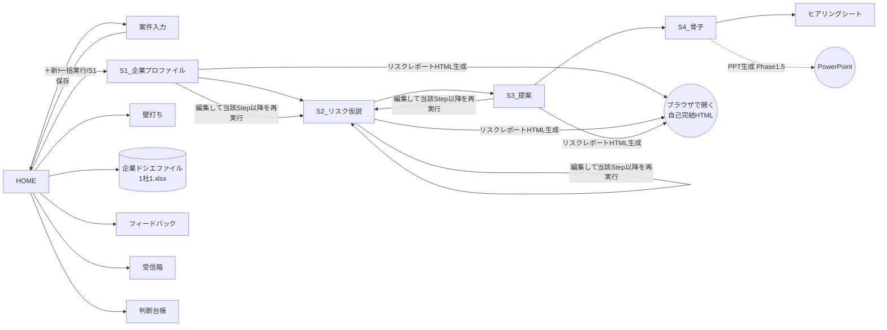

# 11. 画面設計（シート＝画面）v2.5

v2.5（裁定書9: W4.1 最終修正ウェーブ）: HOMEワイヤーに[第2ラウンド開始]ボタン（`btn_round_freeze`。A-2）を追加し、受信箱ワイヤーの判定入力を `status` 列から新設の `judge_to` 列へ改め（B2）、案件入力ワイヤーの業種欄を業種マスタ由来のドロップダウンと明記して収集レシピの項目名を実ラベルへ揃え、§4の状態遷移に `exported` / `feedback_done` の結線先を明記（B16(b)）、§5のUI実装規約へクロス案件汚染の防止・切捨て時の保存ブロック・下書き行の削除順序・起動シーケンスの個別エラーハンドラ・入念モード警告の表示経路を追加した。

v2.4（ニューリスク=エマージング確定）: S2ワイヤーに第4ブロック「ニューリスク（新種・新興）`s2_emerging`」を追加した（列の物理名・物理順の正は13章§2.13）。
v2.4変更概要: 実装前監査72件の裁定を反映。案件入力ワイヤーに収集ティア・追加ドシエ・付保の見立て・追加収集(research_requests)コピー欄・連番「続き」欄と文字数カウンタを追加、S2/S3ワイヤーをv2.3スキーマの全項目列へ改訂、HOMEの出力を[リスクレポートHTML][ヒアリングシート]に差し替えて企業ファイルの[開く][保存]を追加、§3遷移図のPPTノードをHTMLへ、§5の保護方針を16章E-51（Protect不使用）へ書き換え、§1にガードシートを追加した。（検証指摘の修正）S1_企業プロファイル・S4_骨子・ヒアリングシートの3ワイヤーを新設し、HOMEに[リスクレポートHTML]のS1未実行時の挙動注記を追加した。

UserFormは使わない。シート上の図形ボタン＋ステータス表示で構成（PoC流儀・32bit互換・保守性）。シート名・列名・名前付きレンジの正は13章（画面シートの定義は13章§2.9-§2.17）、enumの正は19章。**本章のワイヤーは配置と操作の正であり、列の物理名・物理順の正は13章**（ワイヤーに描く列名は13章の物理名と同名の日本語見出しで、代表列の抜粋を含む場合がある）。

## 1. 画面（シート）一覧

### 本体ブック `リスク提案ナビ.xlsm`

| シート名 | 種別 | 表示 | 役割 | Phase |
|---|---|---|---|---|
| `はじめにお読みください` | ガードシート | 配布時のみ可視 | マクロ有効化の案内。**可視・先頭・保護なし**の状態で配布ビルドに焼き込み、起動時に modBoot 手順①が非表示化する（12章§2.1）。マクロを無効化して開かれると `Workbook_Open` が発火せず本シートだけが見えるため、案内が必ず伝わる。ボタン・入力欄は持たない | 1 |
| `HOME` | 画面 | 可視 | 操作パネル。案件選択・プレイ実行・進捗・ナレッジ状態・企業ファイル入出力・警告表示（帳票型。名前付きレンジは13章§2.10） | 1 |
| `案件入力` | 画面 | 可視 | 企業名/業種/案件コンテキスト/収集ティア/貼付欄9欄＋連番「続き」欄/文字数カウンタ/収集レシピ/追加収集(research_requests)一覧（帳票型。名前付きレンジは13章§2.11） | 1 |
| `S1_企業プロファイル` | 画面 | 可視 | Step1結果（renewal時は現契約の構造化を含む）表示・編集（7ブロック。13章§2.12） | 1 |
| `S2_リスク仮説` | 画面 | 可視 | Step2結果＋（renewal時）付保ギャップ＋ニューリスク（新種・新興）の表示・編集（4ブロック。13章§2.13） | 1 |
| `S3_提案` | 画面 | 可視 | 提案3本（種別タグつき）＋「該当メニュー・型なし」枠＋「提案を控える」枠 表示・編集（3ブロック。13章§2.14） | 1 |
| `S4_骨子` | 画面 | 可視 | スライド構成 表示・編集、ヒアリングシート生成ボタン（**提案書PPT出力ボタンはPhase 1.5で追加**。10章FR-07）。HTMLリスクレポートはS1+S2+S3から作るためHOMEから出力する | 1 |
| `ヒアリングシート` | 画面 | 可視 | 質問リスト（A4印刷レイアウト） | 1 |
| `壁打ち` | 画面 | 可視 | PL-04対話シート（発話入力・履歴表示・気づき送信） | 1 |
| `フィードバック` | 画面 | 可視 | 商談事実の記録（選択式中心） | 1 |
| `受信箱` | 画面 | 可視 | 投函一覧＋プリフライト診断結果＋判定（統制語彙） | 1 |
| `判断台帳` | 画面 | 可視 | UW判断の事実記録 | 1 |
| `案件一覧` | データ兼画面 | 可視 | 全案件のインデックス | 1 |
| `case_data` | データ | 非表示 | 長文・JSON原文の分割保管 | 1 |
| `config` | データ | 非表示 | 設定（name/value） | 1 |
| `err_log` / `usage_log` / `run_log` | データ | 非表示 | ログ | 1 |

### ナレッジブック `ナレッジブック.xlsx`（マクロなし・共有・管理者編集。本体からは参照＋2シートのみ追記）

| シート名 | 役割 | Phase |
|---|---|---|
| `業種マスタ` / `リスクライブラリ` / `メニュー一覧` / `種目マスタ` / `メニュー種目対応` / `成功事例` | v1.0と同じ（13章） | 1 |
| `判断基準` | 保険原理・生存文法・棄却類型のルール行（docs/05） | 1 |
| `パターンマスタ` | 汎用座組パターン P1～P15（docs/07） | 1 |
| `型ライブラリ` | 具体の型（実績・候補・他社実績） | 1 |
| `機構ライブラリ` | 掛け合わせ用の部品（第3弾795件） | 1.5 |
| `適用先候補` | 裏受け・バンドル先企業（第2弾8社ほか） | 1 |
| `巡回リスト` | ウォッチの収集先URL一覧 | 1.5 |
| `ウォッチログ` | 月次ウォッチの仕分け結果 | 1.5 |
| `新サービス候補` | 本体から自動追記（該当メニュー・型なし） | 1 |

本体からナレッジブックへの**書込は「新サービス候補」「関心度集計（受信箱→任意）」のみ**。他は参照専用（排他は16章 E-13）。

## 2. ワイヤーフレーム

### HOME
```
┌────────────────────────────────────────────────────────────┐
│ リスク提案ナビ                          [❓使い方] [⚙設定]     │
│ ┌ 案件 ─────────────────────────────────────────────┐      │
│ │ 対象: [C-20260901-001 ○○食品(更新) ▼] [＋新規案件]  │      │
│ │ 状態: ●S2まで完了  ラウンド: 第1回 [第2ラウンド開始]  │      │
│ │ 品質: [標準 ▼]（入念=生成→批判→改訂。T2は既定で入念）  │      │
│ │ [▶ 一括実行]  Step個別: [S1][S2][S3][S4]            │      │
│ │ 出力: [リスクレポートHTML] [ヒアリングシート]         │      │
│ │ 企業ファイル: [開く] [保存]  ○○食品_1a2b3c4d_リスクドシエ.xlsx │
│ └────────────────────────────────────────────────────┘      │
│ ┌ 受信箱 ────────────────────────────┐ ┌ 記録 ──────────┐  │
│ │ 未診断 3件  [🔍 プリフライト診断]    │ │ [📝 商談の記録]  │  │
│ │ 診断済 5件 / 条件付き保留 2件        │ │ [⚖ 判断台帳]    │  │
│ └────────────────────────────────────┘ └────────────────┘  │
│ 進捗: Step2 リスク仮説を生成中  開始 14:03:11                  │
│       最大20分（1Stepあたり llm_wait_sec 秒）                  │
│       ※画面が白くなっても処理は続いています                    │
│ 警告: （入念モードの審査を省略しました／充足度: 低 等）        │
│ ナレッジ: 読込OK（メニュー42/型22/事例8） [🔄再読込]          │
│ （transport=mock/direct時はここに赤帯を常時表示）             │
└────────────────────────────────────────────────────────────┘
```
※進捗ブロックの4行（Step名／開始時刻／最大待ち時間／白画面の案内）は `modUIProgress.SetStage` が
**リボン呼出の前に**書き切る。呼出中はVBAが制御を返さず画面更新できないため、後から書き足せない（16章 E-50(a)）。
名前付きレンジは hm_progress_step / hm_progress_started_at / hm_progress_max_wait / hm_progress_note（13章§2.10）。
※「企業ファイル [開く]」は `modCompanyFile` が1社1ファイル（マクロ無し.xlsx）から前ラウンドのS1～S3 JSONと
notesを読み込み、[保存] は現ラウンドを追記書き出しする（10章FR-45・13章§2.8）。共有前にmodPii走査（16章 E-05）。
※出力ボタンは Phase 1 では[リスクレポートHTML][ヒアリングシート]の2つ。**提案書PPTボタンはPhase 1.5で追加**する
（10章FR-07・17章T-33b）。Phase 1のワイヤーにPPTボタンを作らない。
※**[第2ラウンド開始]**（ボタン名 `btn_round_freeze`・v2.5・裁定書9 A-2/N7）は FR-35 のマルチラウンドの起動口である。
押下すると確認ダイアログ「現在のS2を前ラウンドとして確定し、第2ラウンドを開始します。よろしいですか」（vbYesNo）を出し、
はいなら `modCaseStore.FreezeRound` を呼ぶ。成功したら `hm_round_no` を再描画し「第2ラウンドを開始しました」を Notice で知らせる。
確定した前ラウンドのS2は data_key `s2_prev_json` へ退避され、次のS2実行で15章の `{{prevS2Json}}` に注入される
（この口が無い間 `round_no` は常に1のままで、前ラウンド参照による品質向上が効かなかった）。
※**入念モード（deep）の警告**（16章 E-35/E-36）は、Step実行の成功分岐で `modPipeline2.LastDeepOutcome()` を読み、
非空なら `DeepWarningOf` の文言を `hm_warning` へ出す（v2.5・裁定書9 B9/N1）。実行冒頭の警告クリアより**後**に書く。
※**[リスクレポートHTML]はS1未実行時（S1のJSONが空）には生成せず**、`hm_warning` に「先にStep1を実行してください」と
案内して中止する（エラーコードは立てない。18章§1.1①）。S2・S3が空でも生成は続行する。

### 案件入力
```
┌────────────────────────────────────────────────────────────────┐
│ 案件ID: C-20260901-001（自動）  種別: (○新規 ●更新)               │
│ 企業名* [○○食品株式会社]   業種* [食料品製造業 ▼]                 │
│ 収集ティア* [フルドシエ ▼]（クイック/フルドシエ/壁打ち）           │
│ ┌ 案件コンテキスト（選択式）───────────────────────────────┐    │
│ │ 取引 [ホール▼] 幹事 [非幹事▼] BID [なし▼]                   │    │
│ │ 再保・キャプ [なし▼] 他社付保メモ [任意入力]                  │    │
│ │ S4出力 [提案書▼]  品質 [ティア連動 ▼]                        │    │
│ └────────────────────────────────────────────────────────┘    │
│ ┌ 収集レシピ(何をどこから貼るか。15章§2.0)──────────────────┐    │
│ │ T1(8項目) □会社概要 □事業・製品 □拠点・設備 □沿革           │    │
│ │           □直近の動き □採用・人員 □有報・財務リスク □営業情報│    │
│ │ T2追加(6観点・フルドシエ選択時のみ表示)                       │    │
│ │           □SNS評判 □競合・業界事故 □市況・マクロ            │    │
│ │           □財務状態 □付保・提案の経緯 □拠点ハザード         │    │
│ │ 目安: 合計5,000～20,000字（T1）／上限は下の合計欄で判定        │    │
│ └────────────────────────────────────────────────────────┘    │
│ ┌ 貼付欄（並び順＝15章 BuildS1User の9ブロック出現順）──────┐    │
│ │ ① HPテキスト*         [貼付欄]              8,234字        │    │
│ │      続き1 [貼付欄] 0字 / 続き2 [貼付欄] 0字               │    │
│ │ ② 有報リスク章(任意)  [貼付欄]             12,900字        │    │
│ │      続き1 [貼付欄] 0字 / 続き2 [貼付欄] 0字               │    │
│ │ ③ 営業メモ(任意)      [貼付欄]                420字        │    │
│ │ ④ 現契約サマリ*(更新時)[貼付欄] [匿名化]    3,110字        │    │
│ │      続き1 [貼付欄] 0字 / 続き2 [貼付欄] 0字               │    │
│ │ ⑤ 前回更新メモ(任意)  [貼付欄]                380字        │    │
│ │ ⑥ 追加ドシエ(T2・AI収集結果) [貼付欄]      21,500字        │    │
│ │      続き1 [貼付欄] 0字 / 続き2 [貼付欄] 0字               │    │
│ │ ⑦ 現場メモ(何でも欄・書式自由)[貼付欄]        640字        │    │
│ │      「きれいに書かない。思い出した順でいい」               │    │
│ │      例: 社長はワンマン・決裁は即断/工場の裏の川が気になる  │    │
│ │          /◯◯損保の営業が最近よく来てるらしい              │    │
│ │ ⑧ 付保の見立て(新規でも可・分かる範囲・伝聞可)[貼付欄] 210字│    │
│ │      例: たぶん火災は他社/PL は付いていないと聞いた         │    │
│ │ ⑨ ヒアリング回答(訪問後・第2ラウンド用)[貼付欄]     0字     │    │
│ │ ───────────────────────────────────────────────           │    │
│ │ 合計 47,394字 / 上限 100,000字（フルドシエ）  ●余裕あり     │    │
│ └────────────────────────────────────────────────────────┘    │
│ ┌ 追加収集（S1が生成した調査プロンプト。実行後に表示）──────┐    │
│ │ # │ 目的                    │ 調査プロンプト本文 │ 操作     │    │
│ │ 1 │ 主要拠点の水災ハザード  │ 「○○食品の…」   │ [コピー] │    │
│ │ 2 │ 直近の業界事故事例      │ 「食品製造業に…」 │ [コピー] │    │
│ └────────────────────────────────────────────────────────┘    │
│                                                  [保存して戻る]│
└────────────────────────────────────────────────────────────────┘
```

**欄と data_key の対応**（名前付きレンジ名の正は13章§2.11）

| ワイヤー上の欄 | 名前付きレンジ | 保存先 data_key | 続き欄 |
|---|---|---|---|
| 収集ティア | ci_dossier_tier | （案件一覧 dossier_tier） | なし |
| ① HPテキスト | ci_paste_hp_1 | input_hp | ci_paste_hp_2 / _3 |
| ② 有報リスク章 | ci_paste_yuho_1 | input_yuho | ci_paste_yuho_2 / _3 |
| ③ 営業メモ | ci_paste_memo_1 | input_memo | なし |
| ④ 現契約サマリ | ci_paste_contract_1 | input_contract | ci_paste_contract_2 / _3 |
| ⑤ 前回更新メモ | ci_paste_prev_renewal_1 | input_prev_renewal | なし |
| ⑥ 追加ドシエ | ci_paste_dossier_1 | input_dossier | ci_paste_dossier_2 / _3 |
| ⑦ 現場メモ | ci_paste_field_notes_1 | input_field_notes | なし |
| ⑧ 付保の見立て | ci_paste_coverage_note_1 | input_coverage_note | なし |
| ⑨ ヒアリング回答 | ci_paste_hearing_answers_1 | input_hearing_answers | なし |
| 各欄の字数 / 合計 | `ci_count_<欄>` / ci_count_total | （表示のみ・数式ではなくVBAが SetCellSafe で書く。16章 E-46） | (なし) |
| 追加収集の一覧 | ci_research_anchor 起点の2列N行 | （S1出力 research_requests。案件には保存しない） | (なし) |

※**連番「続き」欄**: 1セルの物理上限は32,767字。32,000字を超える資料は「続き1」「続き2」へ分けて貼る。
組立時に `modUICase` が本欄・続き1・続き2を**末尾番号の昇順に改行で連結**して1本にする（空欄はスキップ。16章 E-22）。
続き欄を持つのは長文になりうる4欄（HP・有報・現契約サマリ・追加ドシエ）のみ。続き欄のない5欄が超過した場合は
「続き欄のある欄へ移すか、要点を残して削る」旨を警告する。
※**文字数カウンタ**は各欄（本欄＋続き欄の合計）と全欄合計を常時表示し、合計はティア別上限
（クイック=max_context_chars 40,000字／フルドシエ・壁打ち=t2_max_context_chars 100,000字）に対する
超過を色で示す。上限超過時の打切り規則は16章 E-03（現場メモ・付保の見立て・ヒアリング回答・現契約サマリは打切らない）。
※**追加収集ブロック**は S1 の `research_requests` を「目的／プロンプト本文」の2列で行数分展開し、各行に[コピー]ボタンを
置く（営業はディープリサーチ社内アプリへ貼るだけ。10章FR-41・15章 CheckS1補足）。S1未実行時は非表示。
※**付保の見立て**は新規案件でも記入する（分かる範囲・伝聞可）。現契約サマリが無い新規先で、S2のギャップ推定と
S3の提案の当たりを決める一次情報になる（13章§2.2 input_coverage_note）。
※ヒアリング回答を貼ったら「S1から再実行」で第2ラウンドへ（充足度が上がり、提案が深まる）。
※**業種欄はドロップダウン**（v2.5・裁定書9 §4）。業種コード・業種名の2欄とも、起動時に `modBoot` が
ナレッジスナップショットの業種マスタ30行から複製した隠しレンジを参照する入力規則で選ばせる（13章§2.11）。
**ナレッジ未接続かつスナップショット無しのときは入力規則を張らず手入力のまま続行する**（16章 E-08 準拠・警告のみ）。
業種名に入れる値は業種マスタの `industry_name` そのもの（例: コード09は「食料品製造業」。「菓子製造」は `aliases` 側の別名）。
※収集レシピの14観点の項目名は19章§3 `input_quality.aspect` の日本語ラベルと同一である（v2.5で本ワイヤーを実ラベルへ揃えた）。
※収集レシピのチェックは利用者の自己確認用（保存条件にしない）。T2の6観点はティア=フルドシエ選択時のみ表示する。
実行後はS1の入力充足度診断（input_quality）が **`S1_企業プロファイル` シート上部の図形ラベル `lbl_s1_quality`** に表示される:
「充足度: 中 ｜ 不足: 直近の動き・採用・人員 ｜ 助言: …」。充足度low時は HOME の `hm_warning` にも警告を出す（続行可・15章CheckS1の充足度ゲート参照）。
表示先は図形ラベル1点が正であり、案件入力シート側に名前付きレンジを置かない（v2.5・裁定書9 A-5。13章§2.11）。
なお `high` のときの表示は「充足度: 高」である（19章§3のラベルを「高」に揃えたため語が重複しない。v2.5・裁定書9 A-6）。

### S1_企業プロファイル（7ブロックを上から縦に配置。列の物理名・物理順の正は13章§2.12）
```
┌──────────────────────────────────────────────────────────────────────────┐
│ [S1から再実行] [S2へ進む]（編集はS2へ進むと下流に反映）                       │
│ 充足度: 中 ｜ 不足: 直近の動き・採用・人員 ｜ 助言: …                        │
│ ▼基本 s1_basic（データ1行）                                                 │
│  会社名│事業概要│主力製品│製造・提供工程│主要調達品│調達メモ│顧客セグメント │
│        │顧客チャネル│人員メモ│経営メモ│MVV│ありたい姿│市場環境             │
│        │充足度│充足度の助言                                                 │
│ ▼拠点 s1_locations                                                          │
│  No│拠点名        │種別│住所              │ハザードメモ    │備考           │
│   1│浜松第一工場  │工場│静岡県浜松市…    │天竜川流域・浸水│24時間稼働     │
│ ▼現契約 s1_current_coverage（更新のみ・新規は0行）                           │
│  No│種目名      │補償概要        │限度額メモ      │特記                   │
│   1│火災(企業総合)│建物・什器・在庫│○○百万円      │水災は免責             │
│ ▼現場の気づき s1_field_insights                                             │
│  No│メモ(原文のまま)                        │タグ                          │
│   1│社長はワンマン・決裁は即断              │決裁・人間関係                 │
│ ▼足りない情報 s1_missing_info                                               │
│  No│項目              │なぜ必要か                                          │
│ ▼入力充足度 s1_input_quality（14行固定・行順は19章§3の定義順）              │
│  観点          │状態                                                        │
│  会社概要      │十分                                                        │
│  事業・製品    │断片的                                                      │
│  …（T1案件では上位8観点のみ表示。残り6観点は「無い」のまま畳む）             │
│ ▼追加収集 s1_research_requests（全観点okなら0行）                            │
│  No│目的                    │調査プロンプト本文  │操作                      │
│   1│主要拠点の水災ハザード  │「○○食品の…」    │[コピー]                  │
│ （編集可・行追加削除可・enum列はドロップダウン。紙面の都合で折り返して        │
│   描いているが、実装は各ブロック横1行）                                       │
└──────────────────────────────────────────────────────────────────────────┘
```
※ **列の物理名の正は13章§2.12**。本ワイヤーは代表列の日本語見出しによる抜粋であり、`s1_basic` の15列
（company_name / business_summary / main_products / processes / supply_chain_key_materials / supply_chain_notes /
customers_segments / customers_channels / workforce_notes / management_notes / mvv / aspirations / market_context /
input_quality_overall / input_quality_advice）はすべて画面上で編集できなければならない（FR-08）。
※ `s1_input_quality` は**常に14行**（データ側は行を削らない。13章§2.12）。T1案件で残り6観点を畳んで見せるのは
画面側の簡略表示であり、データの14行固定を変えない。
※ `s1_research_requests` の[コピー]は案件入力シートの追加収集ブロックと同じ動作（クリップボードへ当該行の
`prompt_text` を入れる）。

### S2_リスク仮説（4ブロックを上から縦に配置。列の物理名・物理順の正は13章§2.13）
```
┌──────────────────────────────────────────────────────────────────────────┐
│ [S2から再実行] [S3へ進む]（編集はS3へ進むと下流に反映）                       │
│ ▼付保ギャップ s2_gaps（更新のみ・新規は0行）                                 │
│  No│種別  │対象      │説明          │リスク側の根拠│現契約側の根拠            │
│   1│無保険│サイバー  │EC事業に対し…│HPのEC記述    │現契約サマリに該当なし     │
│   2│過小  │利益(BI)  │限度額が…    │売上規模      │限度額 ○○百万円          │
│ ▼リスク仮説 s2_risks（5～20行）                                             │
│  No│カテゴリ│リスク名│シナリオ│状態  │頻度│影響│頻度点│影響点│                │
│    │根拠(引用)│根拠(出所)│移転可能性│種目メモ│管理策メモ│損害規模メモ│         │
│    │確認点│未然防止策(対策(メニューID); …)                                    │
│   1│事業中断│主力工場の水災│…      │仮説  │中  │大  │  3   │  5   │           │
│    │「工場の裏に川」│現場メモ│一部可 │火災・利益│止水板・BCP│純資産比…│      │
│    │浸水想定; 復旧目標│止水板の設置(M-0012); BCP策定支援(M-0031)               │
│ ▼確認したい論点 s2_open_questions                                           │
│   1│主力工場の浸水想定区域と過去の被災履歴                                    │
│ ▼ニューリスク s2_emerging（新種・新興リスク・0～3行。0行もありうる）          │
│  No│リスク名│分類│時間軸│当てはまり│根拠(引用)│根拠(出所)│提案メモ            │
│   1│原料(果実)の調達難│施設・自然災害・BCP│3年超│温暖化で産地北上│HP│推定│…   │
│ （編集可・行追加削除可・enum列はドロップダウン。1リスク=1行。上の例は                │
│   1行を紙面の都合で3段に折り返して描いたもので、実装は横1行）                    │
└──────────────────────────────────────────────────────────────────────────┘
```
※ `s2_risks` の物理列は13章§2.13のとおり **risk_no / category / risk_name / scenario / status / frequency / impact /
frequency_score / impact_score / evidence_quote / evidence_source / transferability / line_note / control_note /
loss_scale_note / check_points / preventions** の17列（この全列が編集可能でなければFR-08・FR-37が新項目に効かない）。
`s2_gaps` は gap_no / gap_type / target / description / risk_evidence / coverage_evidence の6列。
`s2_open_questions` は seq / question の2列。
`s2_emerging`（ニューリスク＝新種・新興リスク）は emg_no / risk_name / category / horizon / scenario / evidence_quote / evidence_source / proposal_hint の8列（0～3行。該当が薄い企業では0行が正常であり、空でも画面から消さない）。`horizon` は既に顕在化 / 1～3年 / 3年超のドロップダウン（19章§3）。
配列列（check_points・preventions）のセル格納形式は13章§2.2の規約に従う。

### S3_提案（3ブロック。列の物理名・物理順の正は13章§2.14）
```
┌──────────────────────────────────────────────────────────────────────────┐
│ [S3から再実行] [S4へ進む]                                                   │
│ ▼提案ストーリー s3_stories（ちょうど3行）                                    │
│  #│種別      │見出し│問いかけ│対象リスクNo│対象ギャップNo│メニュー│種目│型   │
│   │刺さり方(pitch)│類似事例│想定反論│反論への応答                             │
│  1│クロスセル│…    │…      │2; 5       │1            │M-0012 │L-03│(空) │
│   │…            │K-0003 │「予算が…」│「まず○○から…」                       │
│  2│アップセル│…    │…      │1          │(空)         │M-0003 │L-01│(空) │
│  3│スキーム  │…    │…      │7          │(空)         │M-0044 │L-09│S-0012│
│ ▼該当メニュー・型なし s3_unmatched_risks（新サービス候補として記録済み）      │
│  リスクNo│リスク名          │なぜ該当がないか                                │
│        7│サプライヤ集中     │現行メニューに与信・代替調達支援がない            │
│ ▼提案を控える s3_do_not_propose（引受目線。FR-40）                           │
│  #│テーマ            │理由                                                  │
│  1│D&O（会社役員賠責）│会計不祥事の係争中。分析には残すが提案からは外す       │
└──────────────────────────────────────────────────────────────────────────┘
```
※ `s3_stories` の物理列は **story_no / proposal_kind / headline / hook_question / target_risk_nos / target_gap_nos /
menu_ids / line_ids / scheme_id / pitch / similar_case_id / expected_objection / objection_response** の13列。
`s3_unmatched_risks` は risk_no / risk_name / why_unmatched、`s3_do_not_propose` は seq / topic / reason。
menu_ids・line_ids・target_risk_nos・target_gap_nos は「; 」区切りの配列列（13章§2.2）。
ID列はナレッジブック実在チェックの対象であり、手編集で存在しないIDを入れると再実行時にE-07で止まる。

### S4_骨子（3ブロック。列の物理名・物理順の正は13章§2.15）
```
┌──────────────────────────────────────────────────────────────────────────┐
│ [S4から再実行] [ヒアリングシート生成]                                        │
│ （提案書PPT出力ボタンはPhase 1.5で追加。10章FR-07）                          │
│ ▼メタ s4_meta（データ1行）                                                  │
│  ファイルタイトル                                                            │
│  ○○食品株式会社さま リスクと備えのご提案                                    │
│ ▼スライド構成 s4_slides（T1=ちょうど5行 / T2=5～ppt_max_slides_t2 行）      │
│  枚│タイトル              │要点(1-8点・「; 」区切り)      │トークメモ        │
│   1│御社の事業とリスクの姿│主力は菓子製造; EC比率が上昇   │冒頭は事実確認から│
│   2│見落とされがちなリスク│水災; サイバー; 供給網         │…                │
│ ▼ヒアリング質問 s4_hearing_questions（1～10行・重要度順）                    │
│  No│質問文                              │何を確かめるか                     │
│   1│主力工場の浸水想定はご確認済みですか│水災リスクの認識度                 │
│ （編集可・行追加削除可。ここでの編集はヒアリングシート生成に反映される）       │
└──────────────────────────────────────────────────────────────────────────┘
```
※ **列の物理名の正は13章§2.15**（`s4_meta`=file_title、`s4_slides`=slide_no / title / bullets / notes、
`s4_hearing_questions`=seq / question / purpose）。本ワイヤーは日本語見出しによる代表列の抜粋である。
※ Phase 1のS4の出口は**本シートでの確認・人手編集とヒアリングシート生成**であり、提案書のファイル化（HTML/PPT）は
Phase 1.5（10章FR-07）。HTMLリスクレポートはS1+S2+S3から作る別成果物でHOMEから出力する（18章§1.1）。

### ヒアリングシート（テーブル型・A4縦印刷用。列の物理名の正は13章§2.16）
```
┌──────────────────────────────────────────────────────────┐
│ ヒアリングシート                          [S4から再生成]    │
│ 案件ID: C-20260901-001   会社名: ○○食品株式会社           │
│ 業種: 食料品製造業       訪問予定日: [2026/09/10]（手入力） │
│ 生成日時: 2026/09/01 14:20:05                              │
│ ──────────────────────────────────────────────────────    │
│  No│ご質問                        │回答メモ（訪問時に記入） │
│   1│主力工場の浸水想定はご確認済み│                         │
│    │ ※水災リスクの認識度を確かめる│                         │
│   2│サイバー保険のご検討状況は…  │                         │
│    │ ※既存対策と認識のギャップ    │                         │
│ ──────────────────────────────────────────────────────    │
│ ※回答は案件入力シートの「⑨ヒアリング回答」欄へ貼ると        │
│   第2ラウンドに反映されます（自動書き戻しはしません）        │
└──────────────────────────────────────────────────────────┘
```
※ **物理名の正は13章§2.16**。印刷ヘッダは名前付きレンジ `hs_case_id` / `hs_company` / `hs_industry_name` /
`hs_visit_date`（手入力・空可）/ `hs_printed_at`（書込専用）、ブロック `hearing_questions` の列は
q_no / question / purpose / answer_memo。`purpose` は印刷時に質問の下段へ小さめの補助文として置く。
※ `answer_memo` は生成直後は必ず空で、印刷して手書きする運用も想定するため列幅を広く取る。
本シートから case_data への自動書き戻しは行わない（回答の取捨は人が行う。13章§2.16）。
※ 生成は `modExportHearing.BuildHearingSheet(caseId)`（**LLMを呼ばない**整形のみ。参照優先は s4_edited > s4_json）。

### 受信箱
```
┌────────────────────────────────────────────────────────────┐
│ [＋投函] [🔍未診断を一括診断]     関心度: 熊対策12件 雹災5件  │
│ ID│出所        │テーマ  │生存見込み│状態      │判定(judge_to)│
│ 45│member_post │…     │中(P9へ) │diagnosed │[        ▼]  │
│ 46│field_voice │顧客が… │高       │adopted   │             │
│ 47│watch      │STUDIO… │高(P4)   │adopted   │             │
│ 本文の下書き: [ib_body_draft                    ] [投函]     │
│ （行選択→詳細ペイン: 診断全文・組み替え案・却下類型(T0-T10)） │
└────────────────────────────────────────────────────────────┘
```
※**判定は `judge_to` 列で選ぶ**（v2.5・裁定書9 B2/N5）。`status` 列は判定の結果を表す列であり、利用者は編集しない
（見出しに「この列は自動で更新されます。判定は judge_to 列で選んでください」を常設する。13章§2.6）。
[判定を保存]は `judge_to` と `drop_type` / `revive_tag` / `revive_due` を読んで `modInboxStore.SetInboxJudgement` へ渡し、
成功したら `status` を書き換えて `judge_to` を空へ戻す。`merged` は `judge_to` の選択肢に置かない（14章§6）。
※**[投函]の本文**は受信箱シート上の下書きセル `ib_body_draft`（名前付きレンジ・v2.5・裁定書9 B18/N6）から読む。
VBAの `InputBox` は既定フォントでの入力上限が255字前後で、13章§2.6・16章 E-22 が定める32,000字を物理的に投函できない。

### 壁打ち（PL-04）
```
┌────────────────────────────────────────────────────────────┐
│ 対象案件: C-20260901-001（S3まで完了・T2フルドシエ）          │
│ [🧠 壁打ちを開始/再開]  コンテキスト: ドシエ+S1-S3+型/機構 注入済│
│ ─ 履歴（新しい順・各発話に[💡受信箱へ]ボタン）─               │
│ AI : 御社の座組候補は3方向。①P2型でセンサー連携…             │
│ 自分: ②をヤモリ型の応用でいけない？パートナーは…             │
│ AI : 可能。成立条件は3つ…ただし逆選択が…                     │
│ ─ 入力 ─────────────────────────────  [送信]                │
│ ※結論はS2/S3シートに自分で反映（[S3を開く]）。               │
│   履歴は案件に保存され、次回「再開」で文脈が続く              │
└────────────────────────────────────────────────────────────┘
```

### 判断台帳
```
│ 日付│種目│案件参照│状況要約│選択(raise/close/restrict/keep/improve)│
│ 係数・安全率メモ│決め手(1行)│結果(won/lost)│事後ロス│記録者│
```

## 3. 画面遷移図


※HTMLリスクレポートは S1+S2+S3 のJSON（`sN_edited` 優先）から `modExportHtml` が生成する。S4（スライド骨子）を
待たずに出力できる主力出力であり、PPTはPhase 1.5（点線）である（10章FR-37・FR-07）。

## 4. 状態遷移

### 案件（案件一覧.status）
`draft → s1_done → s2_done → s3_done → s4_done → exported → feedback_done`、任意時点から `error`。
`error` からの復帰は **`failed_step` の再実行**が原則（完了済みStepの結果は保持する。10章NFR-R3）。`draft` へ戻すのは
案件入力そのものを変更したときだけであり、`error` になっただけで自動的に `draft` へ落とさない。
起動時の `RepairStates` は `sN_json`（検証合格済みのみ）と `last_ok_step` の突合で status を再導出し、`failed_step` が
非空の案件は `error` を維持する（16章 E-12）。
ルール: Step N 再実行時は N+1 以降の結果・状態を必ず無効化（確認ダイアログつき。16章 E-10）。
**後半2状態の結線**（v2.5・裁定書9 B16(b)）: `exported` は**リスクレポートHTMLの生成成功時**（`modUIHome.HomeExportHtml` の成功分岐）、`feedback_done` は**フィードバック保存の成功時**（`modUICase4.FeedbackSave` の成功分岐）に `modCaseStore.SetStatus` で立てる。この2値へ到達する経路が製品に無いと、本図の後半と `CS_STATUSES_ABOVE_S4` の降格抑止が到達不能になる。
**遷移検査の担い手**（同 B16(a)）: `SetStatus` は enum 検査のみを行い `CanTransition` を通さない（修復系が自由書込を要するため）。本図の整合は起動時の `RepairStates` が担い、`CanTransition` は遷移表の宣言＝層(a)から検査できる純核として置く（14章§6）。

### 受信箱（受信箱.status）
`undiagnosed → diagnosed → (adopted | conditional_hold | rejected | merged)`。
conditional_hold は `revive_tag`＋見直し期日必須。年次棚卸しで再診断キューへ。

## 5. UI実装規約（PoC踏襲）

- ボタンは図形＋OnAction。UI操作コードは ui 層のみ（R4）
- **本章ワイヤー中の絵文字（💡🔍等）は視覚的な意図表示であり、`.bas` ソースに絵文字リテラルを書いてはならない**（VBEはCP932保持のため `?` 化する）。ボタンキャプション等でアイコンが必要な場合は ui 層で `ChrW` 組立か代替テキスト（例:「『受信箱へ』送信」）を使う（15章§0原則7と同旨）
- 実行中: `modUIProgress.SetStage` は**リボン呼出の前に**Step名・開始時刻・最大待ち時間・白画面の案内を書き切る（呼出中はVBAが制御を返さないため後から更新できない。16章 E-50(a)）。一括実行はStep間で必ず `DoEvents` を挟む（E-50(c)）
- ui_lock で多重実行と案件切替をブロックし、完了/失敗で必ず解除する。**ui_lock はシート・configへ永続化しない**（`modUIProgress` のモジュール変数で保持し、Excelプロセスの終了で自然消滅する）。`llm_wait_sec + 120` 秒を超えた保持は失効として自動解除する（16章 E-11）。解除は `ExitUiLock` に一元化し、`Application.ScreenUpdating` の `True` 復帰もここで必ず行う（E-50(d)）
- enum列はデータの入力規則（リスト）。源泉はナレッジブック/19章レジストリから起動時にコピーした隠しレンジ（ナレッジ未接続でも開ける）
- 日本語ラベル⇔enumの変換は modUICase の共通変換表（19章と一致必須）のみで行う
- **シート保護（`Worksheet.Protect`）は使わない**（姉妹PoC裁定準拠。全面Protectは図形・表の再描画のたびにUnprotect/Protectが必要になり、描画失敗時に保護状態が壊れる）。代わりに **入力対象外セルの `Locked = True` ＋ `ws.EnableSelection = xlUnlockedCells` ＋ 全アクション完了時の `ParkFocus`**（フォーカスを編集不可の待避セルへ戻し、セル編集モードでVBAが止まるのを防ぐ）で構成する。実行開始時にも `ParkFocus` を通してから処理に入る（16章 E-51）
- 長文セルは先頭2,000字表示＋全文はcase_data（16章 E-22）。案件入力の貼付欄は32,000字超を連番「続き」欄へ分けて貼る（同）
- **クロス案件汚染を構造で塞ぐ**（v2.5・裁定書9 B1）: S1～S4は読取専用の案件ID表示セル `sN_case_id` を持ち、`DrawStep` が描画のたびに書く。`SaveEditedStep` は冒頭で引数の caseId と表示 case_id を突き合わせ、不一致なら**1セルも保存せず** `hm_warning` へ「画面の案件と保存先が一致しません。再描画してください」を出して中止する。あわせて `RefreshHome` は `hm_case_id` の変更を検知したら必ず `DrawAllSteps`（または全ブロックの `ClearBlock`）を通す（13章§2.12）
- **切り捨てたまま保存しない**（v2.5・裁定書9 B6）: ブロックの `reserve_rows` を超える配列要素は描画できない。超過が起きたら `hm_warning` へ「N件のうちM件しか表示できていません。編集を保存すると残りが失われます」を出し、**切捨てフラグが立っている間は当該Stepの `sN_edited` 保存をブロックする**（err_log は従来どおり E0604）。黙って捨てた画面を下流Step実行時の自動保存で確定させない
- **続き欄に収まらない貼付欄を保存しない**（v2.5・裁定書9 B22）: 貼付欄の描画で断片数が枠数（本欄＋続き欄）を超えたら `hm_warning` へ「この欄は続き欄に収まりません」を出し、当該欄の保存をブロックする。あわせて分割の chunk は連結時に挟む区切り分の余白を引いた値（32,000 - 8）とし、開く／保存のたびに末尾が削れ続ける経路を作らない
- **描画に失敗した画面から保存しない**（v2.5・裁定書9 B15）: 案件入力の `DrawCaseInput` の成否をモジュール変数（画面制御用。永続しないので状態保持の例外登録は不要だが、役割をコメントで明記する）で保持し、失敗直後の `SavePasteFields` はブロックして Notice を出す。白紙のまま[保存して戻る]を押して9欄の `input_*` が消える経路を塞ぐ
- **下書き行は成功してから消す**（v2.5・裁定書9 B3）: 判断台帳の起票は `modJudgeStore.NewJudgement` を**先に**呼び、`judge_id` が非空のときだけ下書き行を `Delete` する。失敗時は下書き行をそのまま残す（VBAの行削除は Undo できず、PII検知・enum不一致などの現実的な失敗で利用者の入力が復元不能になる）
- **二次照合の警告**（v2.5・裁定書9 B14）: 編集内容の再検証（`ValidateEdited`）の後段で `modKnowledge.MenuIdExists` 等5本によるナレッジ本体との突合を行い、不一致は `hm_warning` へ出す（保存は止めない。一次の fail-closed はそのまま）
- **起動シーケンスは1手順の失敗で止めない**（v2.5・裁定書9 B21）: `modBoot.Boot` の各手順を個別のエラーハンドラで包み、失敗しても err_log へ記録して次の手順へ進む（12章§2.1）。保護方針の適用・ボタン配線・`ParkFocus` が未実行のまま起動時にVBAエラーダイアログが出る状態を作らない
- 外部由来テキスト（貼付・LLM出力）をセルへ書くのは `SetCellSafe` 経由のみ。文字数カウンタ等も**数式を書かずVBAが値で書く**（数式は16章 E-46 の対象になるため画面側に作らない）
