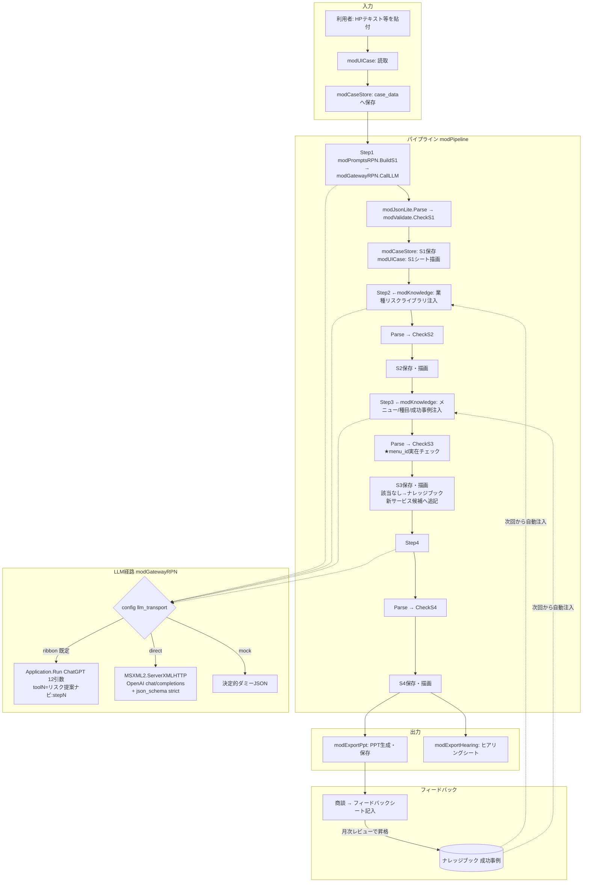

# 12. アーキテクチャとデータフロー

## 1. 技術スタック

| 層 | 技術 | 根拠 |
|---|---|---|
| 実行環境 | Excel VBA（**32bit前提**、Microsoft Office。PoC「MyBookshelf」と同一環境で稼働実績あり） | 社内でPython/ターミナル不可。VBAのみ許可 |
| LLM | 社内AIリボン「リボンちゃん」アドイン（Azure OpenAIラッパー、全社配布、四半期更新） | キー配布不要・全社員が利用可能・利用ログが管理側に残る（ガバナンス） |
| LLM代替経路 | OpenAI API直叩き（`MSXML2.ServerXMLHTTP.6.0`）/ mock（決定的ダミー） | 開発・検証用。PoC modGatewayDirect / mock_llm 方式 |
| 出力 | PowerPoint（COMオートメーション `PowerPoint.Application`） | 提案書の最終形 |
| データ | Excelシート（本体=案件データ、別ブック=ナレッジ） | 追加インフラ不要。IT部門承認不要で開始できる |
| 外部ライブラリ | **使用禁止**（JsonConverter等も不可。全て自前実装） | PoC規約 §7.2。配布物の自己完結性 |

## 2. レイヤ構成とモジュール一覧

PoCの規約を踏襲: **R3**=`Application.Run`（リボン呼出）は gateway モジュール内のみ。**R4**=UI層以外のモジュールに Excelオブジェクトトークン（Worksheets/Range/MsgBox等）を書かない（config/store経由に限定）。1モジュール30,000字以内。

```
┌ ui 層 ─────────────────────────────────────────────┐
│ modUIHome        HOME画面の描画・ボタンハンドラ        │
│ modUICase        案件入力・S1〜S4シートの描画/読取      │
│ modUIProgress    ステータス表示・ui_lock               │
└──────────────┬─────────────────────────────────────┘
┌ app 層 ───────▼────────────────────────────────────┐
│ modPipeline      オーケストレータ（Step1→4、状態遷移） │
│ modCaseStore     案件データの永続化（case_data/案件一覧）│
│ modKnowledge     ナレッジブック読込・業種フィルタ・      │
│                  メニューID実在チェック                │
│ modPromptsRPN    Step1〜4プロンプト組立（純文字列・R4） │
│ modValidate      JSON後検証（スキーマ準拠・enum・ID）   │
│ modExportPpt     スライド構成JSON→PPT生成（固定ロジック）│
│ modExportHearing ヒアリングシート生成                   │
└──────────────┬─────────────────────────────────────┘
┌ core 層（PoCから移植・改名最小限）────────────────────┐
│ modGatewayRPN    LLM唯一の窓口（ribbon/direct/mock分岐）│ ←PoC modGateway
│ modGatewayDirect OpenAI API直叩き経路                  │ ←PoC modGatewayDirect
│ modJsonLite      軽量JSONパース/エスケープ/抽出         │ ←PoC ParseEnrichJson系を一般化
│ modConfig        configシート読取（name/value）         │ ←PoC移植（ほぼ無改修）
│ modLog           err_log/usage_log 構造化ログ+ローテ    │ ←PoC移植（ほぼ無改修）
│ modUtil/modUtilText  文字列・ハッシュ・打切り等         │ ←PoC移植（必要関数のみ）
└────────────────────────────────────────────────────┘
┌ test 層 ──────────────────────────────────────────┐
│ modTestsPure1..n  純ロジックのユニットテスト            │
│ wintest/mock_ribbon/modMockRibbon.bas  リボン偽物       │ ←PoC移植
└────────────────────────────────────────────────────┘
```

### PoCから移植するファイル（コピー元: /home/user/kojima1459/notebook）

| PoCファイル | 移植先 | 改修 |
|---|---|---|
| `src/core/modConfig.bas` | modConfig | 既定値表のみ差替 |
| `src/core/modLog.bas` | modLog | ログ種別追加（run_log） |
| `src/core/modGateway.bas` | modGatewayRPN | toolN を `"リスク提案ナビ:" & step_name` に変更。CallLLM/RibbonAvailable/LimitCheck/mock分岐を維持。RAG検索系関数は削除 |
| `src/core/modGatewayDirect.bas` | modGatewayDirect | embed用→chat/completions用に書換（14章の仕様で）。ServerXMLHTTP+setTimeouts・フォールバック・E02xx系ログの骨格は維持 |
| `src/core/modUtil.bas` `modUtilText.bas` | 同名 | 必要関数のみ抜粋（SafeLeft/NormalizeForHash/ElapsedMsSince/EscapeJsonStr等） |
| `src/ingest/modEnrich.bas` の JSON抽出関数群 | modJsonLite | ExtractJsonStringValue 等を一般化して移植 |
| `wintest/mock_ribbon/modMockRibbon.bas` | 同 | RPN用の決定的ダミー応答（各StepのサンプルJSON）を返すよう改修 |
| `tools/vba_lint.py` `wintest/run_excel_tests.ps1` | 同 | ほぼ無改修（開発機のみで使用） |

## 3. データフロー



### 各Stepの入出力契約（詳細は15章）

| Step | 入力（プロンプトに埋込） | 出力 | 検証 |
|---|---|---|---|
| S1 | 企業名/業種/HPテキスト/有報章/営業メモ | Schema-S1 JSON | 必須キー・型 |
| S2 | S1のJSON（人の編集後）＋リスクライブラリ該当業種行（最大 `kb_risk_rows`=20行） | Schema-S2 JSON | 必須キー・enum（カテゴリ/頻度/影響度）・根拠非空 |
| S3 | S2のJSON＋メニュー一覧（全件 or 業種タグ該当、最大 `kb_menu_rows`=60行）＋種目対応＋成功事例（該当業種、最大 `kb_case_rows`=5件） | Schema-S3 JSON | **menu_id がナレッジに実在**・種目コード実在・ストーリー数=3 |
| S4 | S1サマリ＋S2上位リスク＋S3提案 | Schema-S4 JSON（スライド5枚） | スライド数=5・箇条書き各3〜6点 |

### ナレッジ注入の方式（RAGの代替）
- ベクトル検索は使わない。`業種コード` の完全一致 ＋ `共通`（全業種）行、の**決定的フィルタ**で注入行を選ぶ
- 行数上限は config 駆動。超過時は `優先度` 列の昇順で切る（ライブラリに優先度列を持たせる。13章）
- 将来、業種の粒度が細かくなり不足したら Phase 2 でPoCの embedding 基盤（modEmbed/リボンGetEmbeddings）を移植する

## 4. モジュール間の依存規則

- 依存方向は ui → app → core の一方向のみ。core は app/ui を参照しない
- `Application.Run` は modGatewayRPN 内のみ（R3）
- ナレッジブックへの参照は modKnowledge のみが持つ。書込は「新サービス候補」シートへの追記のみ（16章 E-13 の排他制御）
- PowerPoint COM は modExportPpt のみが触る。生成失敗時も本体状態を壊さない（生成物はファイルとして外に出すだけ）

## 5. 配置・配布

```
共有フォルダ \\...\リスク提案ナビ\
 ├ リスク提案ナビ_v1.0.xlsm     ← 利用者は自分のPCにコピーして使用
 ├ ナレッジブック.xlsx          ← 共有の1本（管理者のみ編集。利用者は参照）
 └ 出力\                        ← PPT既定保存先(config ppt_out_dir。個人フォルダも可)
```
- 本体はローカルコピー実行（共有フォルダ直接実行によるロック競合を避ける）
- config `kb_path` にナレッジブックのUNCパスを保持。起動時に読み込み、切断時はキャッシュで続行（16章 E-08）
- バージョンは config `app_version` とHOME画面に表示。配布・更新手順は17章
