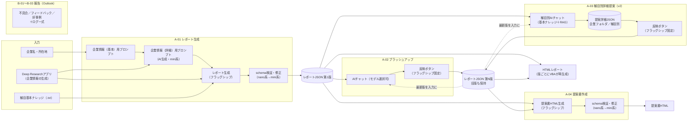
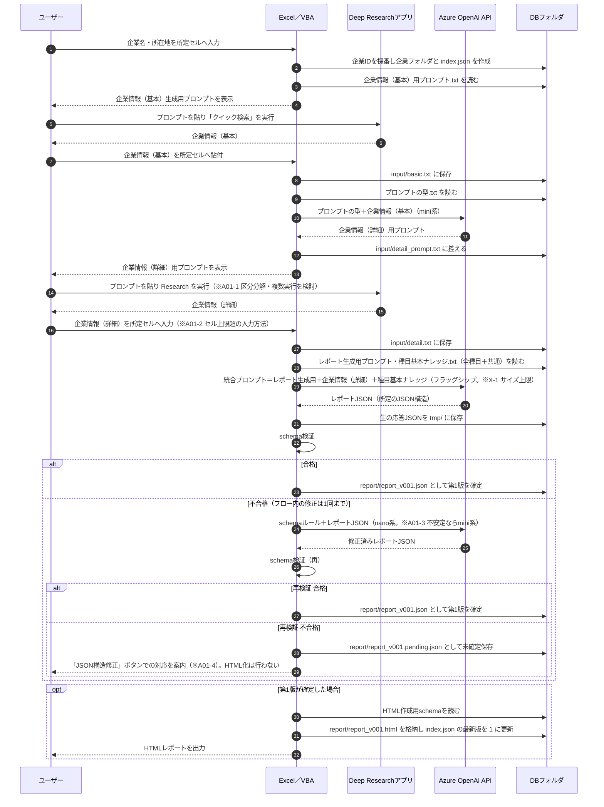
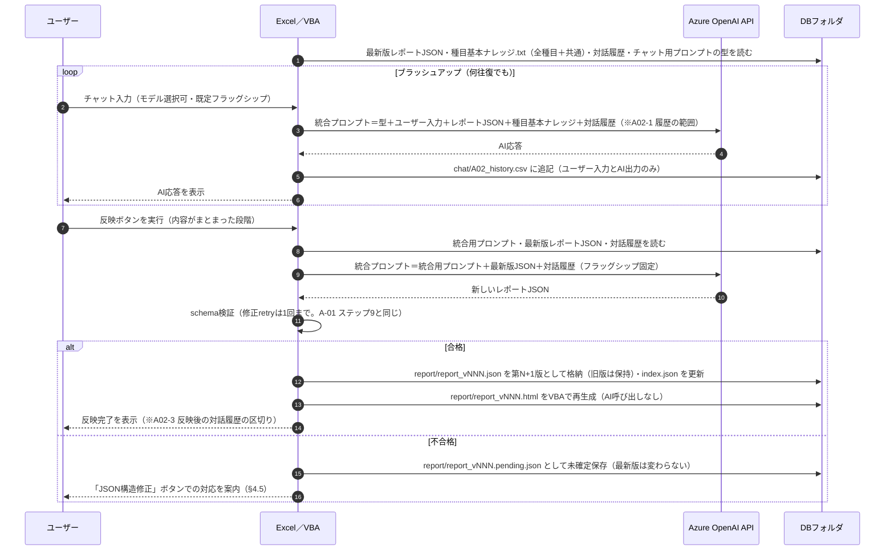
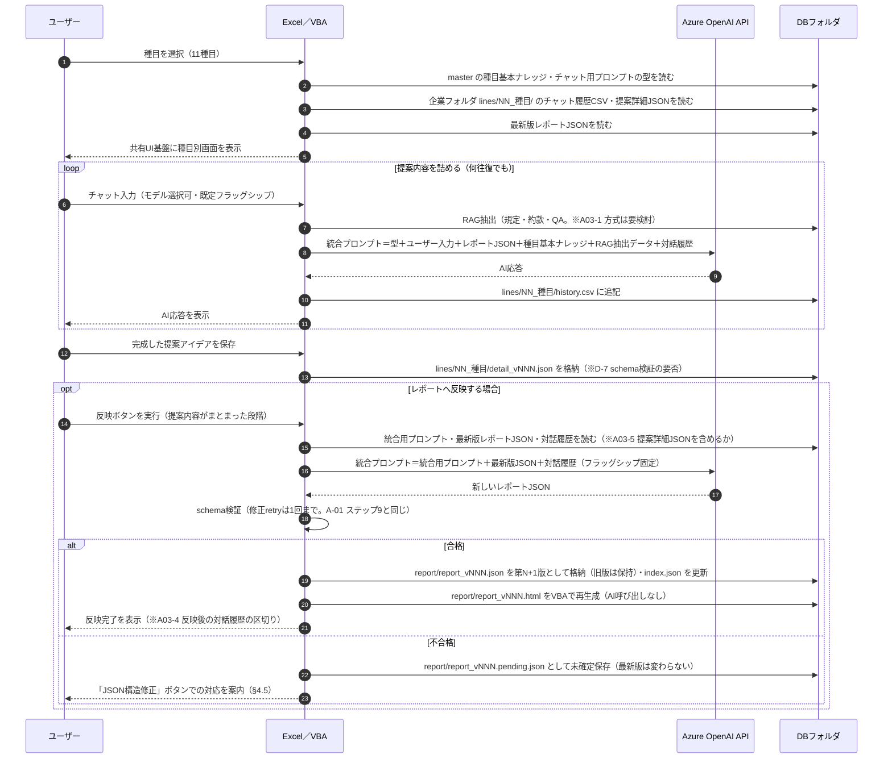
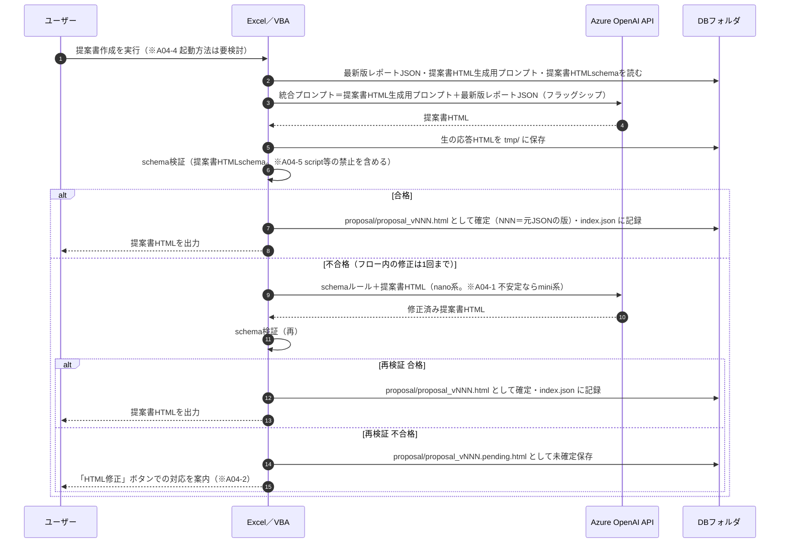
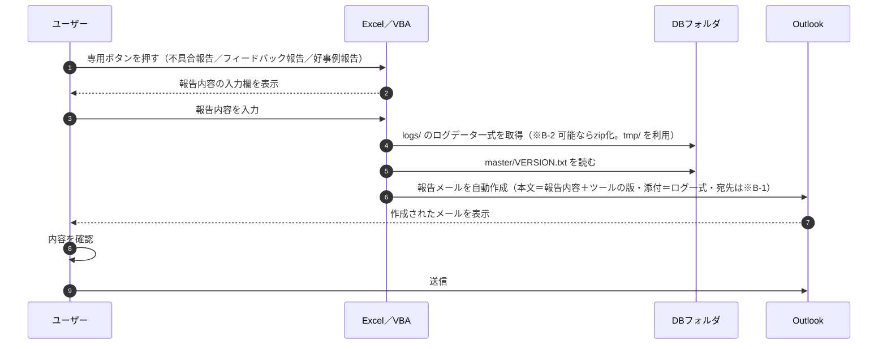

# 企業リスク分析・総合提案ツール 実行フロー解説資料 v1.0（構想・完成版）

- 位置づけ: 作成者（N.Takahashi）が考える実行フローを機能ごとに整理した構想文書。**v1.0 は構想の完成版であり、以降の PoC・実装の基準とする**。実装済みの仕様を記述したものではなく、PoC の結果で改めた場合は v1.1 … と版を上げて改訂する。
- 版の表記（本書で使う4種類を区別する）:
  - **文書の版**: v0.1 … v1.0。内容を変更するたびに上げ、§11 に1行足し、ファイル名の版も合わせる。
  - **ツールのリリース版**: **v1＝初版としてリリース、v2＝改訂版として別途配布予定**（§3.1）。各機能見出しの「ver.N」は、その機能を収載するリリース版を示す（ver.1＝v1 で提供、ver.2＝v2 で提供）。
  - **レポートJSONの版**: 「第N版」と書き、ファイル名は `report_vNNN.json`（§9.3）。機能の ver.N とは無関係である。
  - **配布データ（`DB/master/`）の版**: `VERSION.txt` に持ち、ツールのリリース版と対にする（§9.2.4）。
- 関連文書: 『【解説】リスク提案ナビ_リポジトリ解説資料_v1.0.md』（既存リポジトリの解説）／『【REVIEW】リスク提案ナビ_レビュー記録.md』
- 本版（v1.0）の範囲: 機能一覧とリリース計画（§3）、A-01〜A-04・B-01〜B-03 のステップとシーケンス図（§4〜§8）、横断事項（AI呼び出し一覧・配布データのフォルダ構造・版管理、§9）、要検討事項一覧と検証記録（§10）。詳細（プロンプト本文・JSONスキーマ本文・UI設計）は本書の範囲外であり、別文書で定める。

---

## 目次

1. [全体像](#1-全体像)
2. [用語と前提](#2-用語と前提)
3. [機能一覧](#3-機能一覧)
4. [A-01. メイン機能1: 企業リスク分析・総合提案レポート生成（ver.1）](#4-a-01-メイン機能1-企業リスク分析総合提案レポート生成ver1)
5. [A-02. メイン機能2: 企業リスク分析・総合提案レポートブラッシュアップ（ver.1）](#5-a-02-メイン機能2-企業リスク分析総合提案レポートブラッシュアップver1)
6. [A-03. メイン機能3: 種目別詳細提案支援（ver.2）](#6-a-03-メイン機能3-種目別詳細提案支援ver2)
7. [A-04. メイン機能4: 提案書作成（ver.1）](#7-a-04-メイン機能4-提案書作成ver1)
8. [B-01〜B-03. サブ機能: 不具合報告・フィードバック報告・好事例報告](#8-b-01b-03-サブ機能-不具合報告フィードバック報告好事例報告)
9. [横断事項](#9-横断事項)
10. [要検討事項一覧と検証記録](#10-要検討事項一覧と検証記録)
11. [改訂履歴](#11-改訂履歴)

---

## 1. 全体像

4つのメイン機能は「**企業リスク分析・総合提案レポートJSON**」（以下「レポートJSON」）を中心に連結する。A-01 が第1版のレポートJSONを作り、A-02（チャットによるブラッシュアップ）と A-03（種目別の詳細提案）がそれぞれの成果を同じレポートJSONへ反映して新しい版を作る。**版が増えるたびに、VBAが新版からHTMLレポートを再生成する**（A-01 ステップ10と同じ処理。AI呼び出しなし）。A-04（提案書作成）は最新版のレポートJSONから顧客提出を想定した提案書HTMLを作る。旧版のレポートJSONは削除せず保持する。

A-01 が出力するHTMLレポートはVBAがレポートJSONから「HTML作成用schema」に沿って組み立てるのに対し、A-04 の提案書HTMLはAI（フラッグシップ）が生成し、「提案書HTMLschema」による検証を経る点が異なる。サブ機能（B-01〜B-03）はツール利用全般に対する報告経路で、メイン機能のデータには関与しない。

リリースは2段階で、**v1（初版）で A-01・A-02・A-04 とサブ機能を、v2（改訂版・別途配布）で A-03 を提供する**（§3.1）。



---

## 2. 用語と前提

| 用語 | 本書での意味 |
|---|---|
| ユーザー | 営業担当者。Excelシート（UI）を操作し、Deep Researchアプリとの間をコピー＆ペーストで往復する |
| Excelシート／VBA | 本ツールのUIと処理の実行基盤。所定のセルへの入力、プロンプトの表示、API呼び出し、JSON・HTMLの入出力を担う。**セルは入力・表示の口であり、データの保存先は `DB/` である** |
| Deep Researchアプリ | 社内の調査AIアプリ。「クイック検索」（軽量）と通常のResearch（詳細）を使い分ける。本ツールからは直接呼ばず、ユーザーがプロンプトを貼って実行し、結果を持ち帰る |
| Azure OpenAI API | VBAから直接呼び出すAI。用途に応じてモデルの系統を使い分ける（下表） |
| プロンプトの型（.txt） | 固定のプロンプト雛形をテキストファイルで保持したもの（`DB/master/prompts/`）。VBAが読み込み、企業情報等と結合して送信する。チャット機能（A-02／A-03）のシステムプロンプトも含む |
| 種目基本ナレッジ（.txt） | 保険種目ごとに1本（11本）用意する基本知識のテキスト（`DB/master/knowledge/lines/NN_種目/basic.txt`）。**A-01 レポート生成と A-02 チャットには全種目分を、A-03 チャットには該当種目分を投入する**。種目横断の共通知識（保険提案の一般知識・用語等）は `knowledge/common/` に置き、A-01／A-02 で全種目分と合わせて投入する |
| レポートJSON | 「企業リスク分析・総合提案レポートJSON」の略。本ツールの中心データ。AIに所定のJSON構造で出力させ、企業フォルダに版番号付きで保存する（第N版＝`report_vNNN.json`） |
| HTMLレポート | レポートJSONからVBAが「HTML作成用schema」に沿って組み立てる分析・社内検討用のHTML（`report_vNNN.html`）。AIは呼ばない |
| 提案書HTML | 最新版レポートJSONからAIが生成する顧客提出用のHTML（A-04・`proposal_vNNN.html`） |
| schema検証 | レポートJSON（A-01）または提案書HTML（A-04）が所定の構造を満たすかの機械検査。不合格時はAIに修正させる |
| 未確定ファイル（`.pending`） | フロー内の修正1回で schema検証に合格しなかったJSON／HTML。`report_vNNN.pending.json`／`proposal_vNNN.pending.html` として保存し、フロー外の修正ボタンの対象にする（§4.5・§7.5） |
| 統合プロンプト | 複数の材料（プロンプトの型・企業情報・ナレッジ・対話履歴等）をVBAが1本に結合してAPIへ送るプロンプト |
| 対話履歴 | チャットのユーザー入力とAI出力のみを保持したもの（CSV）。API送信プロンプト全文は含めない |
| RAG抽出データ | 規定・約款・QA等から、入力に関連する箇所を抽出して統合プロンプトに含めるデータ（A-03で使用。方式は A03-1） |
| 提案書HTMLschema | 提案書HTMLが満たすべき所定の構造。A-04 の生成指示と検証に使う。「HTML作成用schema」（A-01 のVBA組立の型）とは別物 |
| 作業ディレクトリ／DBフォルダ | 本ツールが配布データと生成物を保存するフォルダ。配布フォルダ直下の `DB/` を指し、階層は §9.2 で定める。各機能の記述にある「作業ディレクトリ内の所定ディレクトリ」は `DB/data/` 配下、未検証の生データは `DB/tmp/` を指す |

### モデル系統の使い分け（方針）

| 系統 | 位置づけ | 本書での使用箇所 |
|---|---|---|
| フラッグシップ | 性能重視。mini・nano系は不可 | A-01 レポート生成、A-02／A-03 のチャット既定と反映処理（固定）、A-04 提案書HTML作成 |
| mini系 | バランス重視 | A-01 企業情報（詳細）用プロンプトの生成、schema修正の代替（nano系で品質が安定しない場合） |
| nano系 | 軽量 | A-01 schema検証後のJSON構造修正、A-04 schema検証後のHTML構造修正（いずれも第一候補） |

モデルの実名（デプロイ名）は `DB/master/config/settings.txt` に持ち、本文には系統名だけを書く。

---

## 3. 機能一覧

| ID | 区分 | 機能名 | 収載版 | 概要 | 主な入力 | 主な出力 |
|---|---|---|---|---|---|---|
| A-01 | メイン | 企業リスク分析・総合提案レポート生成 | ver.1 | 企業名・所在地から、Deep Researchアプリとの往復2回を経て企業情報を集め、フラッグシップモデルでレポートJSONを生成し、schema検証のうえHTML化する | 企業名・所在地、Deep Research結果、種目基本ナレッジ（全種目） | レポートJSON 第1版、HTMLレポート |
| A-02 | メイン | 企業リスク分析・総合提案レポートブラッシュアップ | ver.1 | 最新版レポートJSONをAIチャットで磨き、まとまった段階で専用ボタンによりレポートJSONへ反映して新しい版を作る | 最新版レポートJSON、種目基本ナレッジ（全種目）、対話履歴 | レポートJSON 第N+1版、HTMLレポート（再生成） |
| A-03 | メイン | 種目別詳細提案支援 | ver.2 | 11種目ごとのUIで、該当種目の基本ナレッジとRAG抽出データを使ったAIチャットにより提案内容をトークスクリプトレベルまで詰め、提案詳細JSONとして保持。専用ボタンでレポートJSONへ反映する | 最新版レポートJSON、種目基本ナレッジ（該当種目）、RAG抽出データ、対話履歴 | 提案詳細JSON（種目別）、チャット履歴CSV、レポートJSON 第N+1版、HTMLレポート（再生成） |
| A-04 | メイン | 提案書作成 | ver.1 | 最新版レポートJSONと所定の提案書HTMLschemaを基に、フラッグシップモデルで提案書HTMLを作成し、schema検証・修正（1回まで）を経て出力する | 最新版レポートJSON、提案書HTML生成用プロンプト、提案書HTMLschema | 提案書HTML |
| B-01 | サブ | 不具合報告 | ver.1（要確認） | 不具合内容とログ一式をOutlookメールで報告 | ユーザー入力、ログ一式 | 報告メール（下書き） |
| B-02 | サブ | フィードバック報告 | ver.1（要確認） | 改善要望等とログ一式をOutlookメールで報告 | 同上 | 同上 |
| B-03 | サブ | 好事例報告 | ver.1（要確認） | 好事例とログ一式をOutlookメールで報告 | 同上 | 同上 |

### 3.1 リリース計画

| リリース版 | 位置づけ | 配布 | 収載する機能 |
|---|---|---|---|
| **v1** | 初版としてリリース | 初回配布（起動bat・実行Excelブック・`DB/master/`） | A-01 レポート生成（ver.1）／A-02 ブラッシュアップ（ver.1）／A-04 提案書作成（ver.1）／B-01〜B-03 報告（版の指定なし。不具合・フィードバックの収集は初版から必要なため v1 に置く。要確認 R-1） |
| **v2** | 改訂版として別途配布予定 | 更新配布（§9.2.4 の上書き展開。`DB/data/` は保持） | A-03 種目別詳細提案支援（ver.2）。あわせて v1 の利用で得たフィードバック（B-02）・不具合（B-01）を反映した A-01／A-02／A-04 の改訂 |

- **v1 の時点で `DB/master/knowledge/lines/NN_種目/basic.txt`（種目基本ナレッジ11本）を同梱する**。A-01／A-02 が全種目分を使うためであり、A-03 専用ではない。
- v2 で追加するのは、各種目フォルダの `rag/`（RAG対象の原本）と、企業フォルダ側の `data/companies/<企業>/lines/`（チャット履歴CSV・提案詳細JSON）である。いずれも v1 の利用データを壊さずに追加できる（§9.2.4）。
- v2 で機能の考え方そのものを改めた場合は、該当機能の見出しの ver を上げ、本表を更新する。

---

## 4. A-01. メイン機能1: 企業リスク分析・総合提案レポート生成（ver.1）

### 4.1 概要

企業名と所在地の2情報を起点に、Deep Researchアプリとの往復を2段階（基本 → 詳細）で行って企業情報を集め、種目基本ナレッジ（全種目）と合わせてフラッグシップモデルでレポートJSONを生成する。レポートJSONはschema検証と1回までの自動修正を経て第1版として確定し、VBAがHTMLレポートを組み立てて出力する。

### 4.2 ステップ

| # | 実行者 | 内容 | 入力 | 出力 | 使用モデル・ツール |
|---|---|---|---|---|---|
| 1 | ユーザー → VBA | Excelシートの所定のセルに「企業名、所在地（VIEW（帝国データバンク）情報や企業HP上の本社所在地）」を入力する。VBAは入力確定時に企業IDを採番し、企業フォルダ（§9.2.3）と `index.json` を作る | ― | 企業名・所在地（セル・`index.json`）、企業フォルダ | Excel／VBA |
| 2 | VBA | 上記2情報を取り込むことを前提として用意された企業情報（基本）用プロンプトテキスト（.txt）を処理し、ユーザーに企業情報（基本）生成用プロンプトを表示する | 企業名・所在地、プロンプト.txt | 企業情報（基本）生成用プロンプト（表示） | VBA |
| 3 | ユーザー | 2で表示されたプロンプトを使用して、「Deep Researchアプリ」の“クイック検索”で企業情報（基本）をAI生成する | 企業情報（基本）生成用プロンプト | 企業情報（基本） | Deep Researchアプリ（クイック検索） |
| 4 | ユーザー → VBA | 3で得られた企業情報（基本）をコピーペーストでExcelシート上の所定のセルに入力する。VBAは `input/basic.txt` へ保存する | 企業情報（基本） | 企業情報（基本）（セル・`input/basic.txt`） | Excel／VBA |
| 5 | VBA＋AI | 所定のプロンプト構造を基に「プロンプトの型（.txt）」と「4で取り込んだ企業情報（基本）」を統合し、Azure OpenAI APIで企業情報（詳細）用プロンプトをAI生成する。固定プロンプトを使用しないのは、それぞれの事業内容・モデルに応じた最適なResearch用プロンプトを作成するため。生成したプロンプトは `input/detail_prompt.txt` に控える | プロンプトの型.txt、企業情報（基本） | 企業情報（詳細）用プロンプト | Azure OpenAI API・GPT mini系（バランス重視） |
| 6 | ユーザー | 5で得られた企業情報（詳細）用プロンプトを、「Deep Researchアプリ」を使用し企業情報（詳細）をAI生成する | 企業情報（詳細）用プロンプト | 企業情報（詳細） | Deep Researchアプリ |
| 7 | ユーザー → VBA | 6で得られた企業情報（詳細）をExcelシートの所定のセルに入力する。VBAは `input/detail.txt` へ保存する（セルの文字数上限を超える場合の入力方法は A01-2） | 企業情報（詳細） | 企業情報（詳細）（セル・`input/detail.txt`） | Excel／VBA |
| 8 | VBA＋AI | 所定の企業リスク分析・総合提案レポート生成用プロンプトに、7で登録された企業情報（詳細）と所定の種目基本ナレッジデータ（.txt・全種目分＋共通）を統合プロンプトとして結合し、Azure OpenAI APIでレポートを作成する。AIの出力は所定のJSON構造で出させ、JSON構造はプロンプトで指示する。生の応答JSONは `DB/tmp/` に保存する | レポート生成用プロンプト、企業情報（詳細）、種目基本ナレッジ.txt | レポートJSON（未検証・`tmp/`） | Azure OpenAI API・GPTフラッグシップ（性能重視、mini・nano系不可） |
| 9 | VBA＋AI | 8のJSONをVBAで取り込み、schema検証する。不合格の場合、schemaルールとレポートJSONをAzure OpenAI APIに渡してJSON構造を修正し、再検証する。メイン機能のフローの中ではschema検証と修正retryは1回までとし、再検証でも不合格なら未確定ファイル（`report/report_v001.pending.json`）として保存して案内を出し、ステップ10へは進まない（以降はフロー外の「JSON構造修正」ボタン §4.5 で対応） | レポートJSON、schemaルール | 検証済みレポートJSON、または未確定ファイル | Azure OpenAI API・GPT nano系（PoCで品質が安定しない場合はmini系へ変更） |
| 10 | VBA | 9で検証に合格したレポートJSONを第1版（`report/report_v001.json`）として確定し、所定のHTML作成用schemaにVBAで取り込んでHTML形式のレポート（`report/report_v001.html`）を出力する。`index.json` の最新版番号を 1 にする | 検証済みレポートJSON、HTML作成用schema | レポートJSON 第1版、HTMLレポート | VBA |

### 4.3 シーケンス図

以降、各機能の実行の流れはシーケンス図で示す。参加者は「ユーザー／Excel・VBA／Deep Researchアプリ／Azure OpenAI API／DBフォルダ（B機能は Outlook）」。実線の矢印＝要求・操作、点線の矢印＝応答・出力、番号＝実行順。※印は要検討事項（§10.1）。



### 4.4 要検討事項（本機能）

| # | 事項 | 状態・備考 |
|---|---|---|
| A01-1 | 「Deep Researchアプリ」の性能を踏まえ、企業情報（詳細）のResearch区分を分解し、複数のResearch実行を前提とすることも検討する。分解する場合、`input/detail.txt` は区分ごとの結果を結合して保存する | PoCの中で検討 |
| A01-2 | 企業情報（詳細）が1セルの文字数上限（32,767字）に抵触する場合の入力方法。保存先は `input/detail.txt` で確定しており（セルは入力口）、上限を超える文章を**どう受け取るか**（複数セルへ分割貼付／ユーザーが `.txt` を `input/` に置く／テキストボックス等）を PoC で決める | 保存先は決定・入力方法は未検討 |
| A01-3 | schema修正に使うモデルは nano系を第一候補とし、PoCで品質が安定しない場合は mini系へ変更する | PoCで判断 |
| A01-4 | フロー内の schema検証・修正retry は1回までとし、それ以上はUI上の「JSON構造修正」ボタン（§4.5）で対応する | 方針決定済み |
| A01-5 | 同一企業で A-01 を再実行するときの扱い（同じ企業フォルダで第1版を作り直すのか、新しい企業ID＝新しい案件フォルダにするのか。第2版以降がある企業で再実行した場合の版の扱い） | 未検討（検証で追加） |
| A01-6 | フロー外ボタンでも合格しない場合の手動経路（ユーザーがJSONを直接編集して再検証する機能を設けるか） | 未検討（検証で追加） |

### 4.5 フロー外の操作: 「JSON構造修正」ボタン

- 対象: `report/report_vNNN.pending.json`（フロー内の修正1回で合格しなかった未確定JSON）。
- 処理: schemaルールと未確定JSONを Azure OpenAI API へ渡して修正し、schema検証する。合格したら `report_vNNN.json` として確定し、ステップ10と同じ処理でHTMLレポートを生成する。
- モデル: nano系（A01-3 と同じ。不安定なら mini系）。ボタンからの実行回数は制限しない（ユーザーが判断して繰り返す）。
- 合格しない場合の手動経路は A01-6。

---

## 5. A-02. メイン機能2: 企業リスク分析・総合提案レポートブラッシュアップ（ver.1）

### 5.1 概要

メイン機能1で作成されたレポートJSON（後続バージョンがある場合は最新バージョン）を、AIチャット形式でブラッシュアップできる機能。対話でまとまった内容は、専用ボタンにより新しい版のレポートJSONとして反映し、VBAが新版のHTMLレポートを再生成する。

### 5.2 ステップ

| # | 実行者 | 内容 | 入力 | 出力 | 使用モデル・ツール |
|---|---|---|---|---|---|
| 1 | ユーザー | 最新バージョンのレポートJSONを対象に、AIチャット形式でブラッシュアップを行う | 最新版レポートJSON | ― | Excel（チャットUI） |
| 2 | VBA＋AI | 「チャット用プロンプトの型、送信されたユーザー入力文、レポートJSONファイル、所定の種目基本ナレッジデータ（.txt・全種目分＋共通）、対話履歴（ユーザー応答とAIのoutputのみ。API送信プロンプト全文ではない）」を統合プロンプトとして送信する。モデルはフラッグシップを既定とし、ユーザーが任意で選択できるようにする。ユーザー入力とAI応答は `chat/A02_history.csv` に追記する | チャット用プロンプトの型、ユーザー入力、最新版レポートJSON、種目基本ナレッジ.txt、対話履歴 | AI応答（対話履歴に追記） | Azure OpenAI API・フラッグシップ既定（選択可） |
| 3 | ユーザー → VBA＋AI | 対話でブラッシュアップされた内容を最新のレポートJSONに反映する。UI上の専用ボタンを内容がまとまった段階で実行し、「所定の統合用プロンプト、最新のレポートJSON、対話履歴（ユーザー応答とAIのoutput）」を統合プロンプトとして送信し、新たなレポートJSONとして出力する。モデルはフラッグシップに固定する。レポートJSONはバージョン番号を振り（第N+1版）、旧バージョンファイルも保持する。新版はschema検証を通し（不合格時の扱いは A-01 ステップ9と同じ）、確定後にVBAがHTMLレポート（`report_vNNN.html`）を再生成する | 統合用プロンプト、最新版レポートJSON、対話履歴 | レポートJSON 第N+1版（旧版は保持）、HTMLレポート | Azure OpenAI API・フラッグシップ（固定）／HTML再生成はVBA |

### 5.3 シーケンス図



### 5.4 要検討事項（本機能）

| # | 事項 | 状態・備考 |
|---|---|---|
| A02-1 | 統合プロンプトに含める対話履歴の範囲（全件か直近N往復か）。保持形式はCSV（§9.2.3）で決定済み | 形式は決定・範囲は未検討 |
| A02-2 | 版番号の付与規則と旧版の保管場所 | 決着（§9.2.3・§9.3: `report_vNNN.json`、企業フォルダの `report/` に全版保持） |
| A02-3 | 反映後の対話履歴の扱い。履歴を継続して次の反映にも送ると、反映済みの内容を二重に取り込むおそれがある。反映時点で履歴に「反映済み」の区切りを入れ、次回の反映では区切り以降だけを送る、等 | 未検討（検証で追加） |

---

## 6. A-03. メイン機能3: 種目別詳細提案支援（ver.2）

### 6.1 概要

メイン機能1および2で得られた最新版レポートJSONを使用し、ExcelシートをUIとして種目別に提案内容を詳細に詰める。トークスクリプトレベルの提案手法も含めてAIチャット対話形式で提案アイデアをブラッシュアップし、完成アイデアを提案詳細JSONとして保持する。対話ログは実行Excelブックではなく別途CSVで保持する。v2（改訂版）で提供する。

### 6.2 種目区分（11種目）

| # | 種目 | フォルダ名（§9.2.3） |
|---|---|---|
| ① | 自動車 | `01_自動車` |
| ② | 火災 | `02_火災` |
| ③ | 傷害 | `03_傷害` |
| ④ | 賠償（一般） | `04_賠償一般` |
| ⑤ | 工事・組立 | `05_工事組立` |
| ⑥ | 労災 | `06_労災` |
| ⑦ | 賠償（特殊） | `07_賠償特殊` |
| ⑧ | 瑕疵保証 | `08_瑕疵保証` |
| ⑨ | 費用・利益 | `09_費用利益` |
| ⑩ | 保証・信用 | `10_保証信用` |
| ⑪ | マリン | `11_マリン` |

### 6.3 ステップ

| # | 実行者 | 内容 | 入力 | 出力 | 使用モデル・ツール |
|---|---|---|---|---|---|
| 1 | ユーザー → VBA | 種目を選び、種目別UI画面を開く。UI表示基盤は全種目で共有し、当該種目のチャット履歴CSVと提案詳細JSON（企業フォルダの `lines/NN_種目/`）と、該当種目の基本ナレッジ（`master/knowledge/lines/NN_種目/`）を取り込んでUI上に各種情報を表示する | 種目、チャット履歴CSV、提案詳細JSON、種目基本ナレッジ | 種目別UI画面 | Excel／VBA |
| 2 | VBA＋AI | AIチャットで提案内容を詰める。送信内容は「チャット用プロンプトの型、送信されたユーザー入力文、レポートJSONファイル、該当種目の基本ナレッジ、RAG抽出データ（規定・約款・QA）、対話履歴（ユーザー応答とAIのoutputのみ。API送信プロンプト全文ではない）」。モデルはフラッグシップを既定とし、ユーザーが任意で選択できるようにする。ユーザー入力とAI応答は `lines/NN_種目/history.csv` に追記する | チャット用プロンプトの型、ユーザー入力、最新版レポートJSON、種目基本ナレッジ（該当種目）、RAG抽出データ、対話履歴 | AI応答（チャット履歴CSVに追記） | Azure OpenAI API・フラッグシップ既定（選択可）、RAG |
| 3 | ユーザー → VBA | 完成した提案アイデアを提案詳細JSON（`lines/NN_種目/detail_vNNN.json`）として保持する。schema検証の要否は D-7 | 対話内容 | 提案詳細JSON（種目別） | VBA |
| 4 | ユーザー → VBA＋AI | 種目別詳細提案内容をメイン機能1のレポートJSONに反映する。UI上の専用ボタンを提案内容がまとまった段階で実行し、「所定の統合用プロンプト、最新のレポートJSON、対話履歴（ユーザー応答とAIのoutput）」を統合プロンプトとして送信し、新たなレポートJSONとして出力する（提案詳細JSONを材料に含めるかは A03-5）。モデルはフラッグシップに固定する。レポートJSONはバージョン番号を振り（第N+1版）、旧バージョンファイルも保持する。新版はschema検証を通し、確定後にVBAがHTMLレポートを再生成する | 統合用プロンプト、最新版レポートJSON、対話履歴 | レポートJSON 第N+1版（旧版は保持）、HTMLレポート | Azure OpenAI API・フラッグシップ（固定）／HTML再生成はVBA |

### 6.4 種目別の置き場所

種目ごとに次を保持する。**事前に登録するナレッジは配布データ（`master/`）に、ツールの利用中に生成されるものは企業フォルダ（`data/`）に置く**（D-2。詳細は §9.2.2）。

| 内容 | 生成者 | 置き場所 | 備考 |
|---|---|---|---|
| 種目基本ナレッジ | 管理者（事前登録） | `DB/master/knowledge/lines/NN_種目/basic.txt` | v1 から同梱（A-01／A-02 も使う） |
| RAG対象の規定・約款・QA | 管理者（事前登録） | `DB/master/knowledge/lines/NN_種目/rag/` | v2 で追加 |
| チャット履歴CSV | 本ツール（利用中に生成） | `DB/data/companies/<企業>/lines/NN_種目/history.csv` | 実行Excelブックには持たない |
| 提案詳細JSON | 本ツール（利用中に生成） | `DB/data/companies/<企業>/lines/NN_種目/detail_vNNN.json` | 完成アイデアの保持先 |

### 6.5 シーケンス図



### 6.6 要検討事項（本機能）

| # | 事項 | 状態・備考 |
|---|---|---|
| A03-1 | RAG抽出の方式（対象文書の形式、抽出の粒度、VBAからの実現方法、`rag/` 配下の索引の持ち方） | 未検討 |
| A03-2 | 共有UI基盤の具体構成（種目切替時の読込タイミング、表示項目）。フォルダ・ファイル名規則は §9.2.3 で決着 | UIは未検討・フォルダは決着 |
| A03-3 | 提案詳細JSONの構造（レポートJSONとの対応関係。版は種目フォルダ内で独立採番と決定 §9.2.3） | 構造は未検討・版は決着 |
| A03-4 | 反映後の対話履歴の扱い（A02-3 と同じ論点） | 未検討（検証で追加） |
| A03-5 | 反映の材料に提案詳細JSON（完成アイデア）を含めるか。対話履歴だけを送ると、完成アイデアが途中の試行に埋もれるおそれがある | 未検討（検証で追加） |

---

## 7. A-04. メイン機能4: 提案書作成（ver.1）

### 7.1 概要

最新版のレポートJSONを基に、所定の提案書HTMLschemaに沿った提案書をHTML形式で作成する。生成はフラッグシップモデルが行い、得られたHTMLはschema検証と1回までの自動修正を経て出力する。A-01 のHTMLレポート（VBAがJSONから組み立てる分析・社内検討用）とは別の、顧客提出を想定した成果物である。

### 7.2 ステップ

| # | 実行者 | 内容 | 入力 | 出力 | 使用モデル・ツール |
|---|---|---|---|---|---|
| 1 | ユーザー → VBA | 最新の企業リスク分析・総合提案レポートJSONファイルを基に、所定の提案書HTMLschemaを使用して提案書をHTML形式で作成する（起動方法は A04-4） | 最新版レポートJSON、提案書HTMLschema | ― | Excel／VBA |
| 2 | VBA＋AI | 「所定の提案書HTML生成用プロンプト、最新の企業リスク分析・総合提案レポートJSONファイル」を統合プロンプトとし、Azure OpenAI APIで提案書HTMLを作成する。生の応答は `DB/tmp/` に保存する | 提案書HTML生成用プロンプト、最新版レポートJSON | 提案書HTML（未検証・`tmp/`） | Azure OpenAI API・GPTフラッグシップ（性能重視、mini・nano系不可） |
| 3 | VBA＋AI | 2で得られた提案書HTMLをVBAで取り込み、schema検証する。不合格の場合、schemaルールと提案書HTMLをAzure OpenAI APIに渡してHTML構造を修正し、再検証する。メイン機能のフローの中ではschema検証と修正retryは1回までとし、再検証でも不合格なら未確定ファイル（`proposal/proposal_vNNN.pending.html`）として保存して案内を出す（以降はフロー外の「HTML修正」ボタン §7.5 で対応）。合格したら `proposal/proposal_vNNN.html`（NNN＝元にしたレポートJSONの版）として確定し、`index.json` に記録する | 提案書HTML、schemaルール（提案書HTMLschema） | 検証済み提案書HTML、または未確定ファイル | Azure OpenAI API・GPT nano系（PoCで品質が安定しない場合はmini系へ変更） |

### 7.3 シーケンス図



### 7.4 要検討事項（本機能）

| # | 事項 | 状態・備考 |
|---|---|---|
| A04-1 | HTML構造修正に使うモデルは nano系を第一候補とし、PoCで品質が安定しない場合は mini系へ変更する | PoCで判断 |
| A04-2 | フロー内の schema検証・修正retry は1回までとし、それ以上はUI上の「HTML修正」ボタン（§7.5）で対応する | 方針決定済み |
| A04-3 | 提案書HTMLの版管理 | 版の対応は決着（§9.2.3: `proposal_vNNN.html` の NNN＝元にしたレポートJSONの版。`index.json` に対応を記録）。レポートJSONが更新された後に提案書を作り直すかはユーザー判断とし、旧版の提案書HTMLは残す。**同じ版のレポートJSONから提案書を再作成した場合**（上書きするか、作成日時付きで残すか）は未検討 |
| A04-4 | 提案書作成の起動方法（専用ボタンか、A-02／A-03 の反映後に続けて実行するか） | 未検討 |
| A04-5 | AIが生成するHTMLの安全性。提案書HTMLschema の検証項目に「script・外部リソース参照・イベント属性の禁止」を含めるか、あるいはAIには提案書の本文構造だけをJSONで出させ、HTML化はVBA（A-01 と同じ組立方式）で行う代替案を採るか | 未検討（検証で追加） |

### 7.5 フロー外の操作: 「HTML修正」ボタン

- 対象: `proposal/proposal_vNNN.pending.html`（フロー内の修正1回で合格しなかった未確定HTML）。
- 処理: schemaルールと未確定HTMLを Azure OpenAI API へ渡して修正し、schema検証する。合格したら `proposal_vNNN.html` として確定し、`index.json` に記録する。
- モデル: nano系（A04-1 と同じ。不安定なら mini系）。ボタンからの実行回数は制限しない。
- 合格しない場合の手動経路は A01-6 と同じ論点（提案書HTMLの直接編集）。

---

## 8. B-01〜B-03. サブ機能: 不具合報告・フィードバック報告・好事例報告

### 8.1 概要

本ツールの利用全般を対象に、ユーザーが（B-01）不具合、（B-02）フィードバック（改善要望等）、（B-03）好事例を報告するための機能。3機能は報告の種類が異なるだけで、仕組みは共通である。v1 から提供する（要確認 R-1）。

### 8.2 共通ステップ

| # | 実行者 | 内容 |
|---|---|---|
| 1 | ユーザー | UI上の専用ボタン（不具合報告／フィードバック報告／好事例報告）を押し、報告内容を入力する |
| 2 | VBA | 報告内容と、報告時点のログデータ一式（`DB/logs/`。zip化して取り込むことが可能であればzipファイル）を添付し、ツールの版（`DB/master/VERSION.txt` とブック内の版）を本文に記載したOutlookメールを自動で作成する |
| 3 | ユーザー | 作成された報告メールの内容を確認し、問題なければ送信する |

### 8.3 シーケンス図（3機能共通）



### 8.4 要検討事項（3機能共通）

| # | 事項 | 状態・備考 |
|---|---|---|
| B-1 | 報告先アドレスの決め方。管理者を直接指定すると、旧バージョンのツールを使用した場合に管理者更新が適用されない。常に最新管理者に送信されるようにする場合は、宛先のみ都度ユーザーが確認し入力する形が良い。`settings.txt` に候補を置く場合も同じ問題が残る | 要検討 |
| B-2 | ログデータ一式のzip化がVBAから可能か（`Shell.Application` の圧縮フォルダ、または PowerShell の `Compress-Archive` 呼び出し等）、および社内メールでzip添付が通るか | 要検討 |

---

## 9. 横断事項

### 9.1 AI呼び出しとモデルの一覧

| 呼び出し箇所 | 統合プロンプトの材料 | モデル | ユーザー選択 |
|---|---|---|---|
| A-01 ステップ5: 企業情報（詳細）用プロンプト生成 | プロンプトの型.txt、企業情報（基本） | mini系 | 不可 |
| A-01 ステップ8: レポート生成 | レポート生成用プロンプト、企業情報（詳細）、種目基本ナレッジ.txt（全種目＋共通） | フラッグシップ | 不可 |
| A-01 ステップ9・§4.5: JSON構造修正 | schemaルール、レポートJSON | nano系（→mini系） | 不可 |
| A-02 チャット | チャット用プロンプトの型、ユーザー入力、レポートJSON、種目基本ナレッジ.txt（全種目＋共通）、対話履歴 | フラッグシップ既定 | 可 |
| A-02 反映 | 統合用プロンプト、最新版レポートJSON、対話履歴 | フラッグシップ | 不可（固定） |
| A-03 チャット | チャット用プロンプトの型、ユーザー入力、レポートJSON、種目基本ナレッジ（該当種目）、RAG抽出データ、対話履歴 | フラッグシップ既定 | 可 |
| A-03 反映 | 統合用プロンプト、最新版レポートJSON、対話履歴（提案詳細JSONを含めるかは A03-5） | フラッグシップ | 不可（固定） |
| A-04 ステップ2: 提案書HTML作成 | 提案書HTML生成用プロンプト、最新版レポートJSON | フラッグシップ | 不可 |
| A-04 ステップ3・§7.5: HTML構造修正 | schemaルール（提案書HTMLschema）、提案書HTML | nano系（→mini系） | 不可 |

- Deep Researchアプリの呼び出し（A-01 ステップ3・6）はAPIではなく、ユーザーがプロンプトを貼って実行し、結果をExcelへ持ち帰る。
- HTMLレポートの生成・再生成（A-01 ステップ10、A-02／A-03 の反映後、§4.5）はVBAの組立であり、AIを呼ばない。
- 全てのAPI呼び出しは `logs/api_YYYYMM.log` に記録する（日時・機能・モデル・トークン数・所要時間。本文は記録しない）。API失敗時の扱いは X-3。

### 9.2 配布データのフォルダ構造

#### 9.2.1 プライマリ構成（配布フォルダの最上位）

配布物は次の3つで構成する。**配布フォルダの位置はどこでもよく、②の実行Excelブックは自分と同じフォルダにある `DB/` を参照する**（絶対パスの設定を持たない。`data/` だけ別の場所に置く案は D-5）。

| # | 構成物 | 役割 | 初回配布 | 更新配布 |
|---|---|---|---|---|
| ① | `起動.bat` | 実行Excelブックを**独立プロセス**（新しいExcelインスタンス）で起動する。同時に開いている他のブックとイベント・再計算・クリップボード・ハングの影響を共有しないため | 同梱 | 差し替え |
| ② | `<ツール名>.xlsm` | 実行Excelブック（UI・VBA）。データは持たず、`DB/` を読み書きする | 同梱 | 差し替え |
| ③ | `DB/` | **配布データ**（ナレッジ・プロンプト・schema・テンプレート・設定＝`master/`）と、**利用データ**（企業別の生成物・チャットログ＝`data/`）、**ログ**（`logs/`）、**一時領域**（`tmp/`）を階層分けして格納 | `master/` のみ同梱（`data/`・`logs/`・`tmp/` は初回起動時にVBAが作る） | `master/` を差し替え。`data/`・`logs/` には触れない。`tmp/` は起動時に空にする |

起動batの骨子（案）:

```bat
@echo off
rem 自分のあるフォルダを基準にし、Excelを新しいインスタンス（/x）で起動する
set BASE=%~dp0
start "" excel.exe /x "%BASE%<ツール名>.xlsm"
```

#### 9.2.2 DBフォルダの階層

```
DB/
├ master/                          配布データ（読み取り専用。更新配布でフォルダごと差し替える）
│  ├ VERSION.txt                   masterの版（ツールのリリース版と対にする。B-01〜B-03 の報告メールにも記載）
│  ├ config/
│  │  └ settings.txt               設定: モデルの実名（フラッグシップ／mini／nano）、APIエンドポイント、
│  │                               報告先アドレスの候補、統合プロンプトの上限値（X-1）等。※APIキーは置かない（D-4）
│  ├ prompts/                      プロンプトの型（.txt）
│  │  ├ A01_basic_research.txt        企業情報（基本）用（ステップ2）
│  │  ├ A01_detail_research_gen.txt   企業情報（詳細）用プロンプトを生成させる型（ステップ5）
│  │  ├ A01_report_gen.txt            レポート生成用。JSON構造の指示を含む（ステップ8。schema との整合は X-2）
│  │  ├ A01_json_repair.txt           JSON構造修正用（ステップ9・§4.5）
│  │  ├ A02_chat_system.txt           ブラッシュアップチャット用の型
│  │  ├ A02_merge.txt                 反映（統合用）
│  │  ├ A03_chat_system.txt           種目別チャット用の型（v2）
│  │  ├ A03_merge.txt                 反映（統合用）（v2）
│  │  ├ A04_proposal_gen.txt          提案書HTML生成用
│  │  └ A04_html_repair.txt           HTML構造修正用（ステップ3・§7.5）
│  ├ schema/
│  │  ├ report.schema.json            レポートJSONのschemaルール（A-01 ステップ9、A-02／A-03 反映後の検証）
│  │  ├ detail.schema.json            提案詳細JSONのschemaルール（v2。設けるかは D-7）
│  │  └ proposal_html.schema.txt      提案書HTMLschema（A-04 生成指示・検証）
│  ├ templates/
│  │  └ report_html/                  HTML作成用schema（A-01。VBAがレポートJSONからHTMLレポートを組み立てる型・CSS）
│  └ knowledge/
│     ├ common/                       種目横断の共通ナレッジ（保険提案の一般知識・用語等。A-01／A-02 で全種目分と合わせて投入）
│     └ lines/                        種目別ナレッジ（v1 から同梱）
│        ├ 01_自動車/
│        │  ├ basic.txt                  種目基本ナレッジ（A-01／A-02 は11本すべて、A-03 は該当種目を投入）
│        │  └ rag/                       RAG対象の原本（規定・約款・QA）。v2 で追加。索引の持ち方は A03-1
│        ├ 02_火災/
│        ├ …（§6.2 のフォルダ名）
│        └ 11_マリン/
├ data/                            利用データ（ツールが生成。更新配布でも保持する）
│  ├ settings.local.txt            利用者ごとの設定（チャットで選んだモデル、前回開いた企業 等）
│  └ companies/
│     └ <企業ID>_<企業名>/          企業（案件）単位で1フォルダ（命名は §9.2.3。作成は A-01 ステップ1）
│        ├ index.json               案件メタ: 企業名・所在地・作成日時・レポートJSONの最新版番号・
│        │                          各成果物（HTMLレポート・提案書HTML）がどの版のJSONから作られたか・構造版（schema_version）
│        ├ input/
│        │  ├ basic.txt                企業情報（基本）＝Deep Researchクイック検索の結果（ステップ4）
│        │  ├ detail_prompt.txt        企業情報（詳細）用プロンプト（AI生成の控え。ステップ5）
│        │  └ detail.txt               企業情報（詳細）＝Deep Researchの結果（ステップ7。分割Researchのときは結合して保存）
│        ├ report/
│        │  ├ report_v001.json         レポートJSON 第1版（A-01）。旧版は削除しない
│        │  ├ report_v002.json         反映（A-02／A-03）のたびに増える
│        │  ├ report_v001.html         HTMLレポート。JSONと同じ版番号でVBAが生成・再生成
│        │  ├ report_v002.html
│        │  └ report_v003.pending.json 未確定ファイル（schema検証に合格していないJSON。§4.5 の対象）
│        ├ proposal/
│        │  ├ proposal_v002.html       提案書HTML（A-04）。番号＝元にしたレポートJSONの版
│        │  └ proposal_v003.pending.html 未確定ファイル（§7.5 の対象）
│        ├ chat/
│        │  └ A02_history.csv          A-02 の対話履歴（ユーザー入力とAI出力のみ）
│        └ lines/                      種目別の生成物（A-03・v2 で追加）
│           ├ 01_自動車/
│           │  ├ history.csv              チャット履歴CSV
│           │  └ detail_v001.json         提案詳細JSON（完成アイデア）
│           └ …（フォルダ名は master/knowledge/lines と同じ）
├ logs/                            ログ（B-01〜B-03 のzip添付対象。月ごとに1ファイル）
│  ├ run_YYYYMM.log                操作・処理の記録
│  ├ error_YYYYMM.log              エラーの記録
│  └ api_YYYYMM.log                API呼び出しの記録（日時・機能・モデル・トークン数・所要時間。本文は記録しない）
└ tmp/                             一時領域（AIの生の応答、zip作成・HTML生成の中間ファイル。起動時に空にする）
```

#### 9.2.3 命名規則

| 対象 | 規則 | 例 | 理由 |
|---|---|---|---|
| 種目フォルダ | `NN_種目名`（2桁連番＋記号を除いた種目名。§6.2） | `04_賠償一般` | 並び順の固定。`（）`・`・`・`／` はパスの事故の元になるため除く |
| 企業（案件）フォルダ | `<企業ID>_<企業名>`。企業IDは A-01 ステップ1（企業名・所在地の入力確定時）にVBAが採番（`YYYYMMDD-NNN`）。企業名はファイル名に使えない文字を除去し、20字程度で切る | `20260905-001_浜松スイーツファクトリー` | 同名企業・改名・禁止文字による衝突を避け、IDで一意に引ける。人が見て分かるよう企業名も併記 |
| 版番号 | `vNNN`（3桁ゼロ埋め）。本文では「第N版」と書く | `report_v012.json`＝第12版 | ファイル名順＝版順になる |
| レポートJSON／HTMLレポート | `report_vNNN.json` / `report_vNNN.html` | ― | 同じ版番号で対応づける |
| 未確定ファイル | `report_vNNN.pending.json` / `proposal_vNNN.pending.html` | ― | schema検証に合格していないことがファイル名で分かる。確定時に `.pending` を外す |
| 提案書HTML | `proposal_vNNN.html`（NNN＝元にしたレポートJSONの版） | `proposal_v002.html` | どの版から作ったかがファイル名で分かる（A04-3） |
| 提案詳細JSON | `detail_vNNN.json`（種目フォルダ内で独立採番） | ― | 種目ごとに反復して詰めるため |
| チャット履歴CSV | 1行＝1発話。列: `seq, timestamp, role(user/ai), model, text, merged_flag` | ― | 統合プロンプトへ「ユーザー入力とAI出力のみ」を渡す構想に合わせる。`merged_flag` は反映済みの区切り（A02-3／A03-4 の案） |
| ログ | `<種別>_YYYYMM.log` | `api_202609.log` | 月単位でzipの大きさを抑える |
| パス長 | 配布フォルダ〜ファイルまで **200字以内**を目安 | ― | Windowsの260字制限。OneDrive配下は前置きが長いため余裕を取る |

#### 9.2.4 更新配布時の扱い

- 更新パッケージは `起動.bat`・`<ツール名>.xlsm`・`DB/master/` の3点。利用者は既存の配布フォルダに**上書き展開**するだけでよい（`DB/data/`・`DB/logs/` はパッケージに含まれないので消えない）。
- `DB/master/VERSION.txt` とブック内の版を起動時に突き合わせ、食い違えば警告する（ブックだけ・masterだけを差し替えた事故の検知）。
- `data/` の構造を変える更新では、`index.json` に構造版（`schema_version`）を持たせ、起動時にVBAが旧構造を読み替える（旧版ファイルは削除しない）。
- **v1（初版）から v2（改訂版・別途配布）への更新も本節の手順で行う。** v2 で追加されるのは `master/knowledge/lines/NN_種目/rag/`（配布データ側）と `data/companies/<企業>/lines/`（利用データ側。v2 の初回起動時または種目選択時にVBAが作る）であり、v1 で作った企業フォルダの既存の中身には触れない。

#### 9.2.5 決定事項と要確認事項

| # | 区分 | 内容 | 状態 |
|---|---|---|---|
| D-1 | 決定 | `DB/` 直下を `master/`（配布・読み取り専用）と `data/`（利用・保持）に分ける。更新時の上書き展開でユーザーデータが消えないようにするため | 決定 |
| D-2 | 決定 | A-03 の生成物（チャット履歴CSV・提案詳細JSON）は**企業フォルダの下に種目フォルダ**を切って置き、種目別の事前ナレッジは `master/knowledge/lines/` に置く（§6.4 はこの形に合わせて記述している）。企業単位で引継ぎ・削除・zip化できることを優先した | 決定（種目起点に戻すなら要相談） |
| D-3 | 決定 | 企業フォルダ名は `企業ID_企業名`。企業名だけにしない。採番は A-01 ステップ1 | 決定 |
| D-4 | 一部決定 | APIキーは `DB/` を含む配布フォルダには置かない（決定）。利用者ごとの外部の場所（例: `%APPDATA%\<ツール名>\api_key.txt`）に置き、`settings.txt` にはその場所だけを書く。**置き場所の最終形は要確認** | 方針は決定・置き場所は要確認 |
| D-5 | 要確認 | 配布フォルダの置き場所（OneDrive配下か、ローカルか）。OneDrive配下は同期遅延・パス長・xlsm起動時の確認ダイアログの影響があり、ローカルは端末障害で `data/` を失う。両立させるなら `data/` だけ OneDrive へ置き `settings.txt` で場所を指定する | 要確認 |
| D-6 | 要確認 | `DB/master/` を利用者に見せるか（誤編集の防止）。読み取り専用属性を付ける、または `master/` の編集は管理者のみとする運用にするか | 要確認 |
| D-7 | 要確認 | 提案詳細JSON（A-03）の schema を設けるか（`detail.schema.json`）。設ける場合の検証・修正フローは A-01／A-04 と同じ形にするか | 要確認（v2 までに決める） |
| D-8 | 要確認 | 配布は利用者ごとに1セット（各自のPCまたは各自のOneDrive）とするか、共有フォルダに1セット置いて複数人で使うか。共有の場合は同じ企業フォルダ・ログへの同時書き込みの競合対策が必要になる | 要確認（検証で追加） |

### 9.3 レポートJSONの版管理

- A-01 が作成したレポートJSONを第1版（`report_v001.json`）とする。
- A-02 および A-03 の「反映」実行のたびに新しい版（第N+1版）を出力し、旧版ファイルは削除せず保持する。新版は確定前にschema検証を通す（不合格時の扱いは A-01 ステップ9と同じ）。
- 版が確定するたびに、VBAが同じ版番号のHTMLレポート（`report_vNNN.html`）を再生成する。
- A-02・A-03・A-04 の入力は常に最新版とする。最新版番号は `index.json` が持つ（ファイル名の走査に頼らない）。
- 提案書HTML（A-04）は、元にしたレポートJSONの版番号をファイル名に持ち、`index.json` にも対応を記録する（A04-3）。
- 同一企業での A-01 再実行時の版の扱いは A01-5。

---

## 10. 要検討事項一覧と検証記録

### 10.1 要検討事項一覧

各機能・横断の要検討事項を集約したもの。状態列は検討の進捗に応じて更新する。本文の各表と本表は同じIDで対応し、状態は本表を正とする。

| ID | 機能 | 事項 | 状態 |
|---|---|---|---|
| A01-1 | A-01 | 企業情報（詳細）のResearch区分の分解・複数実行（Deep Researchアプリの性能を踏まえPoCで検討） | 未検討 |
| A01-2 | A-01 | 企業情報（詳細）がセルの文字数上限を超える場合の入力方法（保存先 `input/detail.txt` は決定） | 保存先は決定・入力方法は未検討 |
| A01-3 | A-01 | schema修正モデルの選定（nano系→品質不安定ならmini系） | PoCで判断 |
| A01-4 | A-01 | schema検証・修正retryの上限（フロー内1回、超過は「JSON構造修正」ボタン §4.5） | 方針決定済み |
| A01-5 | A-01 | 同一企業で A-01 を再実行するときの版・フォルダの扱い | 未検討（検証で追加） |
| A01-6 | A-01 | フロー外ボタンでも合格しない場合の手動経路（JSON／HTMLの直接編集） | 未検討（検証で追加） |
| A02-1 | A-02 | 統合プロンプトに含める対話履歴の範囲（形式はCSVで決定） | 形式は決定・範囲は未検討 |
| A02-2 | A-02 | JSON版番号の付与規則と保管場所 | 決着（§9.2.3・§9.3） |
| A02-3 | A-02 | 反映後の対話履歴の区切り（反映済み内容の二重取り込み防止。`merged_flag` 案） | 未検討（検証で追加） |
| A03-1 | A-03 | RAG抽出の方式と `rag/` の索引 | 未検討 |
| A03-2 | A-03 | 共有UI基盤の具体構成（フォルダ・ファイル名は決着） | UIは未検討 |
| A03-3 | A-03 | 提案詳細JSONの構造（版は種目フォルダ内で独立採番と決定） | 構造は未検討 |
| A03-4 | A-03 | 反映後の対話履歴の区切り（A02-3 と同じ論点） | 未検討（検証で追加） |
| A03-5 | A-03 | 反映の材料に提案詳細JSONを含めるか | 未検討（検証で追加） |
| A04-1 | A-04 | HTML構造修正モデルの選定（nano系→品質不安定ならmini系） | PoCで判断 |
| A04-2 | A-04 | schema検証・修正retryの上限（フロー内1回、超過は「HTML修正」ボタン §7.5） | 方針決定済み |
| A04-3 | A-04 | 提案書HTMLの版管理（版の対応は決着。同じ版からの再作成時の上書き／退避は未検討） | 一部未検討 |
| A04-4 | A-04 | 提案書作成の起動方法（専用ボタンか、反映後に続けて実行か） | 未検討 |
| A04-5 | A-04 | AI生成HTMLの安全性（script等の禁止をschema検証に含める／本文JSON＋VBA組立の代替） | 未検討（検証で追加） |
| B-1 | B-01〜03 | 報告先アドレスの決め方（固定か都度入力か） | 要検討 |
| B-2 | B-01〜03 | ログ一式のzip化の方法と、社内メールでのzip添付の可否 | 要検討 |
| D-4 | 配布 | APIキーの置き場所（配布フォルダ外は決定。最終形） | 置き場所は要確認 |
| D-5 | 配布 | 配布フォルダの置き場所（OneDrive配下かローカルか。`data/` だけOneDriveに置く案） | 要確認 |
| D-6 | 配布 | `DB/master/` の誤編集防止（読み取り専用属性／管理者のみ編集） | 要確認 |
| D-7 | 配布 | 提案詳細JSONの schema と検証フローの要否 | 要確認（v2 までに決める） |
| D-8 | 配布 | 配布を利用者ごとにするか共有にするか（同時書き込みの競合） | 要確認（検証で追加） |
| R-1 | リリース | B-01〜B-03 を v1 に含めるか（版の指定がなかったため v1 と仮置き） | 要確認 |
| X-1 | 横断 | 統合プロンプトのサイズ上限。A-01 ステップ8 は企業情報（詳細）＋全種目の基本ナレッジ＋共通ナレッジを1本に結合するため大きくなりやすい。上限値（`settings.txt`）と、超過時の扱い（ナレッジの要約版を持つ／種目を絞る／分割する）を決める | 未検討（検証で追加） |
| X-2 | 横断 | レポートJSONの構造指示が「プロンプト本文（`A01_report_gen.txt`）」と「schema（`report.schema.json`）」の2か所に存在する二重管理の回避（schemaからプロンプトの該当部分を生成する等） | 未検討（検証で追加） |
| X-3 | 横断 | Azure OpenAI API の呼び出し失敗時（ネットワーク・レート制限・タイムアウト・内容フィルタ）の再試行回数・待ち時間・ユーザーへの通知と、途中失敗時に既存の版を壊さない扱い | 未検討（検証で追加） |
| X-4 | 横断 | Azure OpenAI API へ送る情報の取扱い区分（公開情報・社内情報・顧客の非公開情報・個人情報のどこまでを送ってよいか）。チャット入力に顧客名や個人名が混ざる場合の扱い | 未検討（検証で追加） |

### 10.2 検証記録（v0.5 → v1.0 で補完・修正した事項）

v0.5 の全文を検証して見つかった矛盾・未定義と、その解決を記録する。設計判断を伴う項目は、作成者の確認を得るまで「検証で追加」の印を残す。

| # | 見つかった問題 | 解決 |
|---|---|---|
| V-1 | 版の表記が4種類（文書 v0.x／リリース v1・v2／機能 ver.N／JSON ver.N）混在し、レポートJSONの「ver.1」と機能の「ver.1」が衝突していた | レポートJSONの版を「第N版（`report_vNNN`）」に統一。冒頭「版の表記」に4種類を定義 |
| V-2 | §1 の図と §9.2.2 は版ごとのHTMLレポート（`report_v002.html`）を前提にしていたが、A-02／A-03 の反映処理に再生成の記述がなかった | 反映後にVBAが新版のHTMLレポートを再生成する（AI呼び出しなし）と §1・§5・§6・§9.3 に明記 |
| V-3 | 「種目基本ナレッジ」が A-01／A-02（全種目）と A-03（該当種目）で意味が揺れ、かつ `master/knowledge/lines/` を「v2 で追加」としていたため、v1 の A-01 が使うナレッジが存在しなかった | 用語表で定義（種目ごとに1本、A-01／A-02 は全種目分＋共通、A-03 は該当種目分）。`lines/NN/basic.txt` は v1 から同梱、v2 で追加するのは `rag/` と `data/…/lines/` に改めた（§3.1・§6.4・§9.2.2・§9.2.4） |
| V-4 | schema不合格が2回続いた後、シーケンス図ではHTML化へ進んでいた。未確定JSON／HTMLの扱いとフロー外ボタンの対象が未定義だった | 未確定ファイル（`.pending`）を定義し、確定した場合だけHTML化する分岐に修正。フロー外ボタンの処理を §4.5・§7.5 に定義 |
| V-5 | AIの生の応答（未検証JSON／HTML）の置き場所が未定義だった | `DB/tmp/` に保存と明記（§4.2・§7.2・§9.2.2） |
| V-6 | §6.4（種目ディレクトリにナレッジ・履歴CSV・提案詳細JSONをまとめて保持）と D-2（master／data に分離）が矛盾していた | §6.4 を D-2 に合わせて置き場所の表に改訂 |
| V-7 | 要検討事項の状態が本文と一覧で食い違っていた（A01-2、A02-1、A02-2、A04-3、D-4、D-7） | 状態を統一し「一覧（§10.1）を正」と明記 |
| V-8 | A-02／A-03 チャットの統合プロンプトの材料に「プロンプトの型（システムプロンプト）」が無い一方、§9.2.2 には `A02_chat_system.txt` 等があった | 材料に「チャット用プロンプトの型」を追加（§5.2・§6.3・§9.1） |
| V-9 | 機能一覧の B-01〜B-03 の収載版が「―」で、§3.1（v1 に置く）と食い違っていた | 「ver.1（要確認）」に統一し、要確認 R-1 を登録 |
| V-10 | `tmp/` の初回作成・掃除が §9.2.1 に無かった | 初回起動時に作成、起動時に空にすると明記 |
| V-11 | 企業フォルダ・企業IDの作成タイミングが未定義だった | A-01 ステップ1（企業名・所在地の入力確定時）に採番・作成と定義（D-3・§9.2.3） |
| V-12 | 最新版の判定方法が未定義だった（ファイル名の走査か、メタか） | `index.json` の最新版番号を正とする（§9.3） |
| V-13 | A-02／A-03 の反映で生成した新版にschema検証を通すかが未記載だった | 確定前に A-01 ステップ9と同じ検証を通すと明記（§5.2・§6.3・§9.3） |
| V-14 | 報告メールに「どの版のツールか」を載せる記述が §8 に無かった（§9.2.2 の `VERSION.txt` にだけあった） | §8.2 に本文へ版を記載すると明記 |
| V-15（2回目） | A-02／A-03 の反映後に通す schema検証の不合格分岐が、シーケンス図では成功経路しか描かれていなかった | §5.3・§6.5 に合格／不合格の分岐を追加（不合格は未確定ファイルとして保存し、最新版は変えない） |
| V-16（2回目） | A-04 で同じ版のレポートJSONから提案書を再作成した場合の扱い（同名ファイルの上書き）が未定義だった | A04-3 に「未検討」として追記 |
| 追加検討 | 以下を要検討事項として新設: A01-5・A01-6・A02-3・A03-4・A03-5・A04-5・D-8・R-1・X-1〜X-4 | §10.1 に登録 |

---

## 11. 改訂履歴

| 版 | 日付 | 内容 |
|---|---|---|
| v0.1 | 2026-09-05 | 大枠（機能一覧・A-01〜A-03・B-01〜B-03 のステップ・フロー図・要検討事項）のベースを作成 |
| v0.2 | 2026-09-05 | A-04（メイン機能4: 提案書作成 ver.1）を追加。目次・全体像・用語・機能一覧・横断事項・要検討事項一覧を同期し、B-01〜B-03 以降の章番号を繰り下げ |
| v0.3 | 2026-09-05 | §9.2 を「配布データのフォルダ構造」として具体化（プライマリ構成＝起動bat・実行Excelブック・DBフォルダ、DBの階層、命名規則、更新配布時の扱い、決定事項 D-1〜D-3 と要確認 D-4〜D-7）。用語表・要検討事項一覧を同期 |
| v0.4 | 2026-09-05 | リリース計画を補記: v1＝初版としてリリース（A-01・A-02・A-04・B-01〜B-03）、v2＝改訂版として別途配布予定（A-03）。各機能見出しの ver.N を「収載するリリース版」と定義（冒頭「版の考え方」・§1・§3.1・§9.2.4） |
| v0.5 | 2026-09-05 | 各機能の実行の流れ（§4.3・§5.3・§6.5・§7.3・§8.3）をフローチャートからシーケンス図へ置き換え（参加者＝ユーザー／Excel・VBA／Deep Researchアプリ／Azure OpenAI API／DBフォルダ／Outlook）。§1 の全体像は関係図のためフローチャートのまま |
| v0.6 | 2026-09-05 | 全文検証（1回目）。矛盾・未定義14件（V-1〜V-14）を修正し、追加検討12件（A01-5・A01-6・A02-3・A03-4・A03-5・A04-5・D-8・R-1・X-1〜X-4）を登録。フロー外ボタンの節（§4.5・§7.5）と検証記録（§10.2）を新設 |
| v1.0 | 2026-09-05 | 全文再検証（2回目）。残っていた2件（V-15 反映後の検証分岐の図示、V-16 同一版からの提案書再作成）を補正し、機械検査（Mermaid構文の対応・ID／節番号の参照整合・旧表記の残存）で不整合なしを確認して構想の完成版へ昇格。以降の変更は v1.1 … とする |
